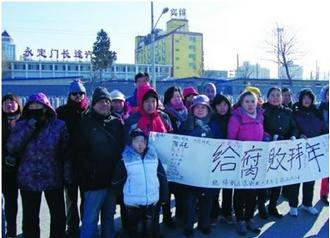

# 第七十期：信访制度

**词条简介：******

信访最初是用来处理人民群众来信来访、解决人民内部矛盾的渠道，随着时代的变迁，信访逐渐制度化，形成了一套自上而下处理民众诉求的制度，但由此也暴露了效率低下、消解司法权威等问题。

**目录******

1 信访制度的发展历史

2 信访制度遭遇的困境

3 对信访制度的评价取向

4 信访制度的改革方向

5 参考文献

6 延伸阅读

**1.****信访制度的发展历史******

** 1.1 ****早期信访制度的发展（****1949-1994****）******

信访制度的正式确立是**1949****年****8****月，成立中央书记处政治秘书室**，任弼时被任命为该室主任，**其主要任务是处理人民群众来信来访**。中国信访制度设计的指导思想是毛泽东的《关于正确处理人民内部矛盾的问题》。

文革期间，信访制度遭到破坏。

1978年9月18日，第二次全国信访工作会议在北京召开。会议的主要成果是对一些政策问题进行深入研究。1980年8月，国务院颁布《关于维护信访工作秩序的几项规定》，要求来访人必须遵守国家法令政策和信访的规章，对于说服教育无效的“缠访”人员要交民政部门进行收容遣送，对已伪造材料、冲击机关等闹事人员由公安机关依法处理。

1982年，第三次全国信访工作会议在北京召开，会议通过《党政机关信访工作暂行条例》，公分六章二十一条，包括总则、机构的基本设置和基本任务，信访的管理原则、方法、步骤及信访工作人员守则等。这一条例是从1982到1994年间支撑整个信访工作的重要制度框架，具有过渡性的特征。

** 1.2 ****信访制度步入法制化阶段（****1995-2004****）******

**1995****年****10****月****28****日，国务院总理签署****185****号国务院令，颁布新中国成立以来第一部严格意义上的《信访条例》。******

《信访条例》是一部行政法规，不是全国人大颁布的国家法律，属于规定信访活动的程序法，它明确了行政机关受理的信访范围：（1）对行政机关及其工作人员的批评、建议、要求；（2）检举、揭发行政机关工作人员的违法失职行为；（3）控告侵害自己合法权益的行为；（4）其他信访事项。

信访制度除了在国家层面得到发展之外，在地方的法律体系的建设中也十分迅速。截止2003年止，全国共有25个省、自治直辖市出台了地方性的信访法规。

2004年8月，中央建立中央集中处理信访突出问题及群众性事件联席会议制度，包括了28个部门和单位。随后地方纷纷建立了信访联席会议制度。这种制度对于协调解决信访问题提供了一个快捷的制度通道。

** 1.3 ****信访制度发展完善时期（****2005****至今）******

**修订后的《信访条例》与****2005****年****1****月****10****日公布并与同年****5****月****1****日起正式实施。**条例的实施促使信访部门进一步改变秘书身份，促进各级政府向法治、服务、责任、有限、效能、阳光政府转变。

新条例明确规定县级以上信访制度的设置、性质、职责，要求县级以上人民政府建立“统一领导、部门协调，统筹兼顾、标本兼治，各负其责、齐抓共管”的信访工作格局，规定信访工作实行领导负责制。

新条例规定，信访机构是本级政府负责信访工作的行政机构，在赋予信访机构受理、交办、转送、承办、协调、督查、调研的指导等基本职权的前提下，明确赋予提出改进建议权、行政处分建议权、完善政策和解决问题建议权三项职权。明确信访人针对行政机关及其工作人员等五类组织、人员的职务行为反映情况，提出建议、意见，或者不服其职务行为的，属于行政机构信访的受理范围。这与先行的行政复议、行政诉讼制度进一步衔接。

在京上访人士合影

**2.****信访制度遭遇的困境******

我国信访制度自1951年正式成立以来，历经50余年，其在特定历史时期对缓和社会矛盾、保障社会稳定团结局面起到过至关重要的作用。但伴随着中国经济迅速发展所带来的利益冲突加剧、体制转型时期所特有的规则缺失所引发的腐败以及社会不公现象等问题的出现，全国信访数量连续高涨，“信访洪峰”成为形容信访形势不断严峻的一个专有名词。信访制度面临四大困境。

困境一是信访部门权力有限，但职责重大、繁杂。从法律上看，信访工作机构并不具备行政的职能和权力，也不是单独序列的国家机构，其处理信访事项的权力，不可能去解决本应由行政机关和司法部门处理的事务，但信访工作部门在实际工作中却被要求践行多方面、多层次的工作内容。这种“责重权轻”的反差使得信访工作部门承受着巨大的压力。

困境二是意在解决、疏导矛盾的信访制度，却成为矛盾急剧上升的通道。信访制度的一个重要功能就是权利救济功能，然而，在实践中作为补充性救济方式的信访补救不仅在解决、疏导矛盾方面效率奇低，而且更为令人吊诡的是，化解矛盾效率奇低的信访救济却吸引大量社会矛盾，民众对信访救济乐此不疲。

困境三是作为补充性救济的信访制度，消解了国家司法机关的权威。在实践中作为补充性救济的信访制度已经超越其他行政救济途径，并在民众心中逐渐成为优于司法救济的一种特殊权利。“信‘访’不信‘法’”成为时下民众比较流行的话语。目前信访案件的大量涌入已经严重干扰了法院正常的司法审判工作，民众不再相信司法审判是解决纠纷的终局性有效手段，更多地通过行政手段寻求信访救助。****

困境四是旨在解决信访问题的创新办法，却进一步异化信访制度。为了应对连续12年连续高涨的“信访洪峰”以及矛盾焦点不断向中央聚集的现状，一系列旨在解决信访问题的创新性举措应运而生。中央政府先是通过2005年新的《信访条例》，将“分级负责，归口管理”的信访工作原则，修改为“属地管理、分级负责”。接着，2009年中共中央办公厅、国务院办公厅提出中央对解决信访问题的新思路、新方案。然而实践中这些旨在解决信访问题的创新性方法却进一步异化了信访制度。

**3.****对信访制度的评价取向******

由于对现行信访制度存在的问题及根源有着不同的认识，对信访制度何去何从也有不同的主张。学界和政界主要有三种不同的评价取向。

第一种取向是，认为要**重新构建信访体系框架，整合信访信息资源，探索“大信访”格局**，**强化信访制度**，例如通过立法统一规范信访工作，建立高效的信访监督监察机制，扩大信访机构权力，使之具有调查、督办甚至弹劾、提议罢免等权力。

持这一观点的人认为，**信访机构权力有限、缺乏权威是导致信访效率低下的主要原因**。他们认为，现行制度下信访部门和其他部门一样，只是政府之下的一个普通机构，但实际上信访部门是在代表一级政府行使权力。因此，必须要强化信访在政府中的地位，信访部门的领导应该是政府的主要领导才行。他们还认为，在中国这样一个行政主导的国家，在司法难以真正独立的情况下，需要信访制度这样一套没有门坎的反馈系统来了解社会存在的问题，了解民众的需要，并通过赋予信访机构更大的权力、树立信访机构权威来解决社会问题。这一观点的核心是扩大信访部门权力，而信访系统内部人员往往是这一观点的最坚定支持者。

第二种取向是，认为要**从国家宪政建设的高度来认识信访制度改革问题**。持这一观点的人认为，要从政治体制现代化的视野来重新确定信访功能目标。一方面要**强化和程序化信访制度作为公民政治参与的渠道功能，**另一方面要**把公民权利救济方面的功能从信访制度中分离出去，以确立司法救济的权威。**为此，必须要改革目前的信访体制，撤销各部门的信访机构，**把信访全部集中到各级人民代表大会**，通过人民代表来监督一府两院的工作，以加强系统性和协调性。最为重要的是，要切实保障信访人的合法权益，坚决查处少数地方党政迫害信访者的案件。长期从事信访工作人士如周梅燕等大多持此观点，认为对信访制度的改革应与整个社会体制改革联系起来，通过扩大公民的有序的政治参与，理顺各种信访的处理渠道，树立司法的最终裁判权威，采取渐进方式实现以法治为内容的信访制度改革。

第三种取向是，应该**站在政治现代化的大局高度，来看待信访制度的存废问题**。持这一观点的人认为，现行信访制度的许多规定，其实是直接与宪法或法律相抵触的，出现了行政权僭越立法权或者司法权的现象。这既体现在行政法规和地方性法规或者政策中，也体现在具体的实践里。这些都有悖于建设法治国家的大方向，**信访制度应该废除**。他们还认为，进一步来说，在现行宪法和法律框架之外所设计的叠床架屋且等级森严的信访机构，是诱导本国公民跪着请愿甚至于跪着造反的永无出头之日的制度陷阱。而置本国公民于极权之下的层层上访，本身就是对于中国公民自由平等的合法人权的公开亵渎和肆意践踏，因此《信访条例》可以休矣。

释放被非法拘禁的在京上访人员

**4.****信访制度的改革方向******

目前信访制度的主要改革方向，首先是**加强信访制度的程序性和规范性**。现实情况表明，无论对于公民权利救济，还是对于维护安定团结的局面，信访制度在目前都是不可或缺的。因此我国在一定时期内还不能废除信访制度，而是要针对信访制度的弊端，积极完善，以使信访制度的收益最大化，实现制度均衡。信访制度的根本弊端是不讲程序、缺乏规范、充满恣意，而要克服这一弊端，就必须加强其程序性和规范性。第一种方式，制定《信访法》，提高信访立法的层次。第二种方式，修改现行的《国务院信访条例》。第三种方式，具体制度的改革。

其次，目前信访制度的改革还应**确立司法救济的权威性和有效性**。依法治国是我国的大方向，在加强信访制度的程序性和规范性的同时，必须确立司法救济的权威性和有效性。无论是作为司法救济的行政诉讼，还是作为准司法救济的行政复议，都由于特殊的社会环境和制度固有的弊端，没有形成最大收益。那么如何才能形成司法救济的最大收益呢？可以从以下三个方面着手：其一，节省诉讼成本。其二，扩大受案范围。其三，提高办案效率。

**5.****参考文献******

[1] 政治文明建设30年(下).人民代表大会制度研究所，北京市政治文明建设研究中心编.北京：中国社会科学出版社.

[2] 涉农信访与社会稳定研究.陈小君,张红,李栋等.北京：中国政法大学出版社.

[3] 于建嵘：中国信访制度的困境和出路.

[4] 李俊.我国信访制度的成本收益分析.南京社会科学,2005(05).

**6.****延伸阅读******

1、《信访制度的法理研究》，肖萍、刘冬京著，群众出版社

2、《中国信访制度的困境与出路》，于建嵘

（助理：张涛 编辑：戴青 责编：戴青）
