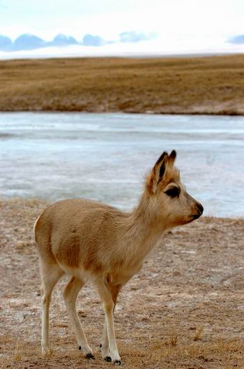

# 第一次听说玉树的时候

**美的东西转瞬即逝，像一个人的生命之于整个人类的历史，有那么多美好的景致没有看过，那么多美好的思想没有读过，有那么多想要改变的东西，竟然一丝一毫都不能摇撼。触不到，抓不住，来不及，停不住。“以有涯求无涯，殆矣”，庄子的时代可能没有如此频密的灾害和严重污染，人祸却是一样的。窃钩者诛，窃国者为诸侯，这愤激之语倒是早就撂下了。**

# 第一次听说玉树的时候

## 文/卢然（香港浸会大学）

还是初一时迷上可可西里和藏羚羊保护的日子。 作为多年来形形色色的奇怪爱好之一，为了它们，我总是愿意付出与年龄和实际不相称的狂热。出于所谓的“可可西里情结”，我中午刷过北大顶楼五毛（真的是这个价）一场的机房，研究过自然之友绿色江河第一批环保类NGO的页面，蹲过三联地下一层及其台阶（或许是《2013》那本书带给人的唯一亲切感），泡过海图的二手书店，吃过那里六块钱一碗的牛肉面，加肉一块钱，辣椒酱随便添。那是2001年，海图到中关村一带还是毫不起眼的黯淡马路，没有崭新的图书大厦，没有第三极，没有豆瓣网，没有形形色色的文艺青年聚集地，没有浮华到刺眼的灯火辉煌，只有老麦叔叔国林风卖数学教辅的九章书店和做不完的黄冈习题。第一次用电脑从Win98和word开始，第一次上网从搜狐新浪第九城市开始。六年级升初一的暑假，我写过一篇文章，陈述了一个要去长江源和可可西里的伟大梦想，把它投给了新浪某作文大赛，获奖的是另一篇。后来给新概念，入选的也是另一篇。你最看好的东西往往不会被他人看好，这是真的。 那时候好像一切概念都不普及，大概是信息流通缓慢的缘故。譬如某奖提名人胡同学，曾经是著名的环保志愿者，而我当年还是看了北青报一篇关于十佳青年的报道才知道他。也没有多少人对那些地名感兴趣——长江源到玉树之前称沱沱河，从玉树往下称通天河，这个名字曾多么使人心驰神往。没有青藏铁路，没有名叫《可可西里》的电影，没有炒得过热的生态旅游，生活像一条缓慢得将要流动的河，下游是虚无缥缈的柯罗连科式的火光，盛着一个人在紧密得喘不过气来的小升初初升高流水线上偶然抬头瞥见的青春梦想。 后来？我看了那场电影，但从未去过可可西里。 说起可可西里情结，放到现在，可是个恶俗的名词，简直可以与无数号称的“托斯卡纳情结”“巴黎情结”“佛罗伦萨情结”放到一起大批特批，作为装X的典范。但当年却是纯粹自发的存在：作为一个先天体质诡异+体育无能的火星人，竟然幻想着自己能通过索南达杰站志愿者的选拔，只待年满十八岁这一条。梦想啊，幻想吧你。 昨天哲学课上放文艺复兴的短片，令我想起高中迷恋的NDP中Florence一曲，于是IT作业选了这座城市。搜集资料、路线、行程，Online applications,今日的世界如此方便快捷，似乎近在眼前…… 而我们却不能伸出手去够到它。 今天没来由地感到悲伤，不仅仅是地震的缘故。曾经迷恋的美好的东西被毁灭了，理想的可能性一点点变得稀薄，我们却被晾在一边，无能为力。这可能是因为：1）这种愿望并非如同我们相信的那么强烈；2）不可改变的现实的残酷；3）你所执着的东西很有可能只是一个幻影而已。去到了，就不美好了。 星星之所以美，是因为它们在千万光年以外的地方，连发出的光都是死去的。 美的东西转瞬即逝，像一个人的生命之于整个人类的历史，有那么多美好的景致没有看过，那么多美好的思想没有读过，有那么多想要改变的东西，竟然一丝一毫都不能摇撼。触不到，抓不住，来不及，停不住。“以有涯求无涯，殆矣”，庄子的时代可能没有如此频密的灾害和严重污染，人祸却是一样的。窃钩者诛，窃国者为诸侯，这愤激之语倒是早就撂下了。 就像我们今日为玉树的灾难而惋惜，到明日就可能将其抛诸脑后，回到自己的轨道上去。还有现在我（为了作业）所搜寻的佛罗伦萨：或许终其一生，我都不会去这个地方，或是到了那里，又将它忘记，如同从未听过那首歌，从未走过那条鲜花广场上的小路一样。 
