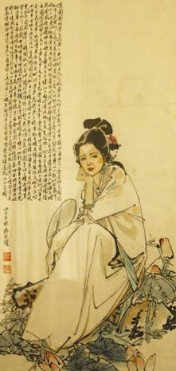

# 由《赵夫人歌》引出的

# 由《赵夫人歌》引出的 

## 文/迦南

前几日偶然读了邝露的《赵夫人歌》，所述的是李成栋及其爱妾的事。清军南侵时，明将李成栋降清后一路勤勤恳恳，下江南，取广东，陷城无数，几乎将南明逼入死境。然后鬼使神差般地在此时反正了，以广东全境及手下十余万精兵附明。被永历拜为大将，随后提师北上，誓为明廷复汉地。结果不幸屡战屡败，最后单枪匹马直冲清军大营，途中坠马落水溺死（是不是想起了同样悲剧的腓特烈一世？）。 当然，在此想谈的并不是李成栋，而是他身边的那个女人——赵氏。李成栋是否长存附明之心及何时才起的附明之心，实难确定。不过，这女人的所为无疑坚定了其反正的决心，并且从此不再反复（此君原是明末义军，后附明，之后附清，之后又附明）。 赵氏苦劝李成栋割辫复明，最后竟以死谏。李成栋自然痛苦得无以复加，更痛苦的是，其实他正在密谋反正，为防事泄，故不曾让赵氏知晓。不想此女竟如此刚烈。 类似赵氏这样的故事（明末题材，女性救亡），在抗日初期被一再演绎，搬上舞台，大受欢迎。 男人在这样的故事中往往欲罢不能，动辄泪下。当然，我也逃不脱。私以为，美人喋血确实是最能令男人触动的事（其次是美人落泪）。一切威加海内的英雄情结在这样的场景面前往往要碎作粉末。须知，男人对美的最初认识往往来自女人，而这种认识很有可能在内心伴随着男人一生。女人在男人心中常是一切美好事物的象征。这也便可以想象何以美人喋血能带给男人如此之大的冲击。 善用美人喋血题材的艺术家们显然抓住了男性心理上的这个脆弱部位。将亡国之痛以美人香消玉殒的形式表现出来，比起丧师、失地、易号，乃至披发左衽，仁义充塞的亡天下，一个鲜活的美丽瞬间消逝，对男人而言，显然是要残酷得多。 无论男人表情、言语上如何掩饰，内心终不免要发出“大丈夫在世不能保一女子,有何面目立于世上”的叫喊。就如今天多数男人可以容忍他人对自己的侮辱，却无法容得对其女人的侮辱。因为对自己女人的侮辱，往往被男人视为最大的侮辱。 一面是出于对美好事物的怜惜，一面是男权社会里形成的所谓自尊。驱使着男人去牺牲整个世界，去以“壮士全师”的代价换得“峨眉匹马”。 但是在对这一问题的价值判断上，我们总是不能避免双重标准。故而李成栋一死以报赵氏可传为佳话，而吴三桂的冲冠一怒却总要被后人所迁怒（当然李成栋反正和吴三桂附清肯定不是只为女人，很可能主要原因也不是女人，在此不进行史料的分析和考据，仅对基于这种印象所产生的两种价值判断闲扯一番）。 我常同人说，谈历史人物的时候切忌以其人的主观意志（往往是后人猜测的）作为价值判断的标准，因为那无从确切地考证，故我们所遵循的标准应是其言其行其果。然而，当我想风月的时候，又恨不得都从善意出发去假设历史人物的在当时的主观意志。我总愿相信汪兆铭投日是为了曲线救国，太祖文革是为终止中国历史的王朝周期率，诶提乌斯在沙隆不搞死阿提拉是念及二人情义（当然，我是不经常风月的）。 

故而，只要不是正正经经的与人谈历史，我也愿相信吴三桂引清军入关是为了“借虏平寇”，可惜不是每个申包胥都能遇上秦哀公，申包胥若是遇上多尔衮，那楚国恐怕也难免如南明一般。 

同样，我也愿意相信吴三桂的所为尽是为了陈圆圆。想来，少有男人能容忍自己所恋的美人为一帮农民军所糟蹋。吴三桂的“借虏平寇”不过是多数男人的正常反应。其所为，至少在入京前，于忠于义于情并无不适之处（主子被逼上吊，老子被寸磔，女人被抢，这么多不幸的事居然在短时间内发生在同一个人身上，真是不可思议）。当然，如果有人非要从历史的宏观角度来看待此事的话，那我也没什么好说的了。 于我看来，“不负红颜负汗青”实在不比“留取丹心照汗青”更容易。吴三桂的牺牲，未必见得比李成栋小。我们无从得知当时陈圆圆是何反应（若是换作我，我一定泪流满面），但我总认为女人是极容易被小小的温情所感动，何况是以整个江山作为代价。 常有些人引用鲁迅的这段话：“**_我一向不相信昭君出塞会安汉，木兰从军就可以保隋；也不信妲己亡殷，西施沼吴，杨妃乱唐的那些古老话。我以为在男权社会里，女人是决不会有这种大力量的，兴亡的责任，都应该男的负。但向来的男性的作者，大抵将败亡的大罪，推在女性身上，这真是一钱不值的没有出息的男人_**。” 诚然，在读史时，我也认为，在一个男权社会中，将兴亡功过归于女人是极其荒唐的。 只不过呢，鲁迅在上述那段话后还有这样一段：“_**殊不料现在阿金却以一个貌不出众，才不惊人的娘姨，不用一个月，就在我眼前搅乱了四分之一里，假使她是一个女王，或者是皇后，皇太后，那么，其影响也就可以推见了：足够闹出大大的乱子来。昔者孔子“五十而知天命”，我却为了区区一个阿金，连对于人事也从新疑惑起来了，虽然圣人和凡人不能相比，但也可见阿金的伟力，和我的满不行。我不想将我的文章的退步，归罪于阿金的嚷嚷，而且以上的一通议论，也很近于迁怒，但是，近几时我最讨厌阿金，仿佛她塞住了我的一条路，却是的确的**_。”（阿金是鲁迅街坊洋人家的一女仆，似乎是风流的，故而闹得得周边鸡犬不宁，详细可参阅鲁迅的《阿金》） 这和我风月时的想法颇有些相同，女人在很大程度上左右着男人，而左右了男人，也就左右了这个世界。男权的世界存在一日，男人便要多为自己所恋的女人去搏死一回。 附上《赵夫人歌》 赵夫人歌（并序） 夫人神明之胤，食氏广陵，敦说诗雅，明古今治乱之数，歌舞独步一时，非天朝将相，莫币蹇修。时督院李公，镇抚三吴，感夷吾白水之辨，杂佩以要之，素琴以友之，不啻青鸟翡翠之婉娈矣！毋何两都沦陷，公胡服受事，系粤宅交，潜运忠谟，效狄梁公反周为唐故事。机会辐辏，乃遣使迎夫人。夫人至，脱珈捐佩，扬衡古烈，劝公迎驾邕宜，为诸侯帅，言："由长江过彭蠡，讴吟思汉，不谋同声。天脱有微风，义旗将集君所矣。"君筹画已定，不肯少泄。翌日，设醴寿公，跽申前请。公惧壁间有人，叱曰："军国大事，出于司马；牝鸡之晨，将就（足桀）矣！"夫人谢罪归官，卒以尸谏。血书藏于衵服。浃旬之间，西迓乘舆，复我汉官，如运诸掌。香山何夫子传记其事，命露作歌。盖王化始于闺门，俟采风者择焉。歌曰： **琼花一枝天下无，新妆绝胜秦罗敷。掌中学得平阳舞，赵璧堪偿十五都。 自矜娇艳无双质，嫁与将军北射胡。胡骑凭陵风雨急，金陵铁锁何嗟及！ 都尉惭恩夜受降，桃根感义春相泣。感义惭恩春复秋，汉家宫阙水东流。 高台爱妾魂将断，南雁方过翡翠楼。翡翠楼前月如练，二十四桥花似霰， 鼓吹云旗锦浪堆，牵牛织女重相见。相见相欢无几何，蓬莱清浅近无波。 泰山东倾作平地，日南铜柱高巍峨。将军高阁临江起，湘帘一派珠江水。 羌笛胡笳沸绮城，美人一见心先死！婉转蛾眉毳幕边，霜吹杨柳风打莲。 李陵胡服不报汉，申胥泪出玉婵娟。脱簪解佩重乌邑，哀鸾半映菱花立。 就桀阿衡负鼎干，兴周吉甫山龙缉。自古英雄畏失时，将兴将废女红知。 奉春既衍留侯策，陶侃休回温峤旗。将军沉吟目如电，手捉长戈日轮变。 讵肯阴谋及妇人？任他死后开生面。闺中春暖草初薰，白水歌通管细君。 鹣鹣飞上凌烟阁，双兔雌雄世莫分。**
