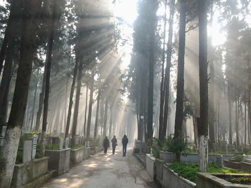

# 与君生别离

<small>一</small>

那时我小学四年级，杨约五年级。我俩在同一个作文兴趣小组，我叫他小哥哥。杨约一头卷发，眼睛大大的，很秀气。我注意到，他的嘴唇是紫红色的，像一嘟噜桑葚，嘴角有颗痣。

杨约作文写得好，还去市里参加过比赛。是他跟我讲回文诗；是他让我读“石室诗士施氏”；他会用“青翠欲滴”形容天空，用“葱管”形容女孩的手，用“三十如狼四十如虎”形容凶巴巴的女老师。我很崇拜他。

有一回，兴趣小组的老师读了我的一篇作文，里面写到一个“瓜子脸”的女孩。下课后，杨约严肃地跟我讲，女孩应该是“鹅蛋脸”，那些妖里妖气的女人才是“瓜子脸”。

还有一回，小伙伴们在踢球，他独自坐在操场边，神情落寞。看见我，他好像高兴了一些，指指胸口，笑着说，这里动力不足。

后来我才知道，杨约有先天心脏病，不能上体育课。

那天下午，校园里响起了刺耳的鸣笛。我无心上课，隐隐觉得不安。那天放学我没见到杨约的身影。他在班上突然昏倒，老师赶紧叫救护车送医院，已经来不及了。

过了几天，学校来了一对中年夫妻。他们走进五年级一班的教室，收拾杨约留下的课本和文具。女人一边整理一边抹眼泪。男人眼睛血红，凶巴巴地对我们说，看什么看？

他们走了。女人好像不肯走，好几次一屁股坐在地上。男人用力拉扯着她。那么大的男人，背个那么小的书包，我们都觉得很好笑。

那天，路过五一班教室。阳光依旧明媚，角落里，有个课桌空空荡荡。

这是我第一次感受到死亡。

死亡，永远停留在那里。停在五年级，停在11岁。

乌黑的卷发，大大的眼睛，紫红的嘴唇，嘴角有一颗痣。

很多年后的一天，街上走来一群小学生，叽叽喳喳的，好幼稚。我猛然想起，杨约走的时候，也是这个年龄。

可为什么每次想起他，总是小哥哥的模样。 

<small>二</small>

他是个混混。

可即使班上最正派的姑娘，也不得不承认，他是个好看的混混。

我们这帮男生，还整天沾着自来水把头发弄成郭富城样的中分，他第一个剃了板寸。走在校园里，青皮刺眼，英气逼人。

我们敞开校服双手脱把骑自行车，自以为帅得很，他已经跨着摩托风驰电掣，后座是一个戴墨镜、永远不笑的姑娘。

我们偷偷研究生理卫生课本，揣测祥林嫂“第二天没起来”的道理，他已经弄来成套的港版《肉蒲团》、《绣榻野史》、《巫山艳史》。

真教人丧气，怎么玩都是人家玩剩下的。

同样的墨镜，同样的牛仔服，穿戴在他身上，就是比别人有款有型。

他是全校的反面典型。旷课，作弊，抽烟，打架，门门功课不及格，身边的女孩走马灯似的换。好多家长不许子女跟他有来往，老师也不管他，让他一个人坐在最后一排。

我们那个学校体罚风气严重，老师唯独不敢对他动手。每次他犯了事，只能把他爹叫来。

他娘身体不好，常年卧床在家。他爹是个满身酒气的工人，到了办公室一言不发，解下皮带就抽。

他用手护着脸，一声不吭，任凭皮带一下下落在手上、身上。他爹还不解气，一脚把他揣在地上。他翻身爬起来，擦一把鼻血，斜着眼看他爹。

有一天，听人说，不好了，×× 和他爹打起来了。等我赶到时，办公室里里外外已是人山人海。挤进去，见到两人在地上扭作一团。

好不容易把两人分开。他爹气喘吁吁，骂骂咧咧，扬言要回家拿刀捅了这个不肖子。他一脸血污，还是那样冷冷的表情，死盯着他爹。

那时，我们才发现，他的个子已经超过他爹了。从此，我再没在学校见过他爹。

那天我踢完球，看见他一个人坐在高高的看台上，抽着烟。过了一会，他的头深深埋了下去，开始抽搐。我犹豫了一下，走到他身边。

他抬起头，满脸的泪水。

他说，我娘死了。

我看见他用夹着烟的手捂着嘴，无声地颤抖。我伸出手，放在他的肩头。

好一会，他抹了抹眼睛，对我笑笑说，你走吧。别让班主任看见你和我在一起。

从此，我和他有了微妙的默契。眼神交汇，无言一笑。放学后，他让我抽他的烟，骑他的摩托，看他的《肉蒲团》。他向那帮混混朋友介绍，这是我兄弟。人家读书好，跟我们不一样。

我也知道了许多猛料，比方上个月那场斗殴是谁挑起的；比方高中部某某女生，其实是黑社会老大的女人；比方班上最一本正经、最嫉恶如仇的团支书，去年给他塞过情书。

初中毕业，我离开了小镇。那时日子过得慢，车马邮件都慢。起初几年，还能听到一些他的传闻——如何在镇上称王称霸；如何出面摆平了一场厮斗；如何搞了黑社会老大的女人，被打得死去活来；如何拖着一条伤腿，远走他乡。往后的日子，渐渐没了他的音过年回家的时候，团支书告诉我，他死了。

我愣了。怎么会？

唉，他爹后来中风，半身不遂。他回来一边打工，一边照顾他爹，还谈了个女朋友，比我们小一届的师妹。谈了两年，差不多该谈婚论嫁了。

这小子光要钱，不要命。在那个喷漆车间，没日没夜地加班，也不好好吃饭。年底查出胃癌晚期，一个月不到就走了。太惨了，小师妹哭到不行…我不敢相信，即使团支书的眼中有泪光闪烁。

这么彪悍的一个人，怎么说没就没了？跟老爹对打，跟老大抢女人，天不怕地不怕。在我们那压抑漫长的青春期，他是一尊邪神。不是说大反派都不容易死吗？不是坏人的生命力特别旺盛吗？

我忘不了那个逃课的午后，他向那帮混混朋友介绍我，一脸骄傲的表情——这是我兄弟。

<small>三</small>

初七的早晨，接到一个陌生号码的电话，是小豆的妈妈。小豆死了。

几年前我做过一阵临终关怀志愿者，在第六人民医院的骨癌病房。我们的社团起步不久，所谓临终关怀，主要是陪绝症病人聊聊天，逗逗乐子，找机会鼓励几句。

第一次踏进骨癌病房，四张病床一字排开，几位老人躺着输液或是睡觉发呆，露出的一截手臂像风干的木头。家属低着头坐在床边。空气里弥漫着药水的味道。静悄悄的，没有一个人说话。

那种安静叫绝望。

仿佛来到了噩梦里，又像闯进了墓地。

我们懵了，茫然不知所措，说话都结结巴巴的。准备好的话题完全不起作用，从病人到家属，没有一个人愿意搭理你。随便应付了两句，便把头扭过去。

我们落荒而逃。护士叹了一口气，你们去找小豆吧。

小豆在隔壁病房，正靠着床看一本《读者》。刚见到我们有一点害羞，聊着聊着就热络起来。

小豆很开朗，也很爱笑，笑着笑着主动把鸭舌帽摘下来，给我们看他的光头。

那年他14岁，皮肤很白。他不好意思地说，因为老憋在病房里，晒不到太阳。

小豆家在安徽农村，一年前查出了骨癌，几经辗转来到了六院。做了手术，取出一段骨髓。目前在接受化疗。总共十次，已经做完了八次。

问小豆，化疗疼不疼。他做了一个龇牙咧嘴的表情，说疼啊，每次化疗结束，麻药一点点退去，疼，撕心裂肺的疼，疼得想死，马上死。可那时连爬到窗口的力气都没有。过了两天，等有了力气，也就不那么疼了，不想死了。

他又笑，仿佛在说别的事，或是别的人。他一笑，旁边的病友也跟着笑。小豆的妈妈别过脸去，把削好的苹果浸在温水里。

我们聊了很久，聊小豆的老家，聊上海的物价，聊大学生活。我们添油加醋地说起大学里的奇闻轶事，小豆的嘴都合不拢了，啊真的假的，啊怎么会这样的。我们说小豆你要快点好起来哦，你肯定会好起来的，以后来上海上大学，还要在上海的大学里谈恋爱。

说这话的时候，我觉得有一点残忍。然而这样的念头一闪而过。我们的职责就是鼓励病人，哪怕是虚妄的鼓励。

临走前，小豆问我要号码，一笔一划地记在了本子上。他说，我好想看看大学的样子。

我花了一礼拜时间，拍遍了上海的大学，还拍了好多校园情侣。当我拿着洗好照片来到病房，小豆的床已经空了。

护士说，小豆回安徽老家了。

从此以后，再也没有小豆的消息。我不知道小豆为什么没有做完剩下的两次化疗，他不是一个怕疼的孩子。小豆有我的号码，却从没来过一个电话或是短信。或许，他已经好了吧?

在宇宙中，漂浮着无数黑洞。它们是巨大恒星坍塌的产物。引力之强，连光都无法逃脱，所谓“黑”，吞噬一切物质；所谓“洞”，在黑洞的附近，时空被强大的引力场扭曲，那里，是时间的尽头。

霍金讲过一个故事，Bob和Alice是两名宇航员，他们接近了一个黑洞。Alice不小心越过了临界点，被黑洞吸引。Bob看到，Alice正飞向黑洞的视界，时间的终点。她的动作越来越慢，最后完全停滞了，她的微笑慢慢凝固、定格，像一张照片。

而Alice面临的却是另一番景象。在强大引力的作用下，她感觉自己飞向黑洞的速度越来越快，最终被巨大的引力差撕裂。每一个原子都被撕裂，消失在永恒的黑暗中。

这就是生死悖论。Alice死了，可在Bob眼中，她永远活着。

其生若浮，其死若休。浮生若梦，为欢几何？

终有一天，Bob会明白，Alice是那么勇敢。她忍受着身体的剧痛，为了在失去知觉前，在被黑暗吞噬前，给心爱的人留下一个微笑。

<small>四</small>

许先生70岁时，在校方的邀请下重新出山，给我们这些本科生上《量子力学》。

许先生一头白发，总是穿一件灰色的夹克衫，朴素干净，夏天则是灰色短袖衬衫。《量子力学》是物理系公认最难的课程，许先生讲课不用投影，不用幻灯，坚持写板书。从普朗克到薛定谔，从海森堡到狄拉克，涉及无数抽象的演绎与推导。先生每次上课都密密麻麻写满四大块黑板，擦掉，再写满。逻辑清晰，一丝不乱。

被问起缘何选择研究量子，许先生笑言，当年他在南开读研究生时，学校组织批判“资产阶级学术理论”，分配给许先生的任务是批判狄拉克的量子学说。乱世中，这却是一个可以静心读书的难得机会。许先生借“批判”之名，系统钻研了狄拉克的理论，大为叹服，从此与量子结缘，始终不渝。

1970年，“东方红”卫星上天时，先生正下放甘肃农村劳动，身边没有任何资料，硬是从牛顿定律出发，推导出整个力学体系，进而计算出“东方红”的轨道参数。与官方公布的数据比较，几乎丝毫不差。先生说，当时那种喜悦之情，溢于言表。回头想，多少岁月蹉跎，情何以堪。

许先生给我们上课的那个学期，正值“本科教学评估团”前来视察，学校极为重视。系里召开大会，反复教导我们，万一遇上专家私访，该如何作答。此外，为展示我校学子积极向上的精神面貌，各宿舍摊派一人，每天早上六点钟去体育馆打乒乓。

教务处也不闲着，派出人手在各教学楼蹲守，专抓那些迟到、早退等“学风不正”的学生。抓到就记过，取消奖学金及保研资格。

一时间人心惶惶。那天上午，许先生正上着课，一位教务处的领导冲进教室，揪住一位正趴着睡觉的学生，要记他的名。

我听见许先生的声音——请你出去。

领导愣了。这不，我给你整顿课堂纪律呢。

那么，请您尊重我的课堂。许先生顿了顿，一个字一个字地说，我不希望学生上课睡觉，但我捍卫他们睡觉的权利。

现在，请你出去。

领导脸憋得通红，犹豫了一下，怏怏走了。掌声雷鸣，经久不息。

今天想起这段话，依然抑制不住的热泪。

没错，我就是那个上课睡觉的本科生。从那天起，我没在许先生的课上开过一分钟小差。期末成绩98，是我四年本科的最高分。

我们是许先生教的最后一届学生。一年后，我直升本校研究生，后来又读了博，成为一名高校教师。在我的课上，我坚持不点名。我对每一届学生说着许先生的话——我不希望你们翘课，但我捍卫你们翘课的权利。

2007年4月29日，许先生因病去世。按先生遗愿，丧事从简，谢绝吊唁。噩耗传来，好多老师学生都哭了。

记得有一节课，讲到电子轨道的角动量，先生仿佛在无意中谈及生死——

一个人的死，对宇宙而言，真的不算什么。总质量守恒，总能量守恒，角动量守恒。生命不过是一个熵减到熵增的过程。始于尘土，终于尘土。

在键盘上胡乱敲打，打出一首情诗；随意洗牌，洗出一手同花顺。生命是偶然。遇见另一个生命，是偶然中的偶然。

同花顺被打乱，字母组合成墓志铭。生命的消解，如潮生潮灭，是最自然不过的事情，不该有太多悲伤。然而司马春衫，吾不能学太上之忘情。

我不知道，一个生命对于另一个生命，究竟意味着什么。一个粒子轰击了另一个粒子，一个波经过了另一个波，抑或是一个量子态纠缠着另一个量子态？我只知道，在那样一个时刻，有一个人、一句话击中了我，照亮了我，改变了我的前行的方向。

永远怀念您。许先生。 

<small>五</small>

外婆老说她小时候的事——家里穷，她父亲又嗜赌，寒冬腊月，输掉了家里最后一床棉被。外婆那时还是个小姑娘，她穿上所有能穿的衣服，盖着仅剩的两床被面，蜷成一团，瑟瑟发抖。

从小到大，外婆给我做了无数的棉衣棉被。一次次，她去店里挑棉花，选布料，送到她放心的老师傅手上。长大后，我不愿意盖她做的被子，太沉，压得透不过气，哪有羽绒被轻软舒服；也不愿意穿她做的棉袄，活像个土财主。这时外婆又开始唠叨她小时候的事，我不耐烦地打断她，烦死啦，耳朵要起茧子啦。

外婆越来越糊涂。她已经不会用手机接电话，时常忘了怎样用遥控器开电视。一个大热天，我推开门，家里跟蒸笼似的，她满头大汗地摆弄着空调遥控器，吹的是热风。还有一次，她半夜起床，穿戴整齐。过了好久才反应过来，哦，看错时间了。

一开始，家人还以为她只是老糊涂。后来情况愈发不对，拖着她去医院检查。很快确诊——阿尔茨海默症，俗称的老年痴呆。

一天，外婆神秘地拉着我，小声讲，明明啊，樟木箱里还有一床被子，外婆帮你藏好的。不要嫌重，冬天盖了暖和。

我眼泪快掉下来。那床被子，去年起她已经交待过我五遍了。

人的记忆是一座废墟，新的遗址覆盖了旧的。大脑的退化，是一个加速的不可逆过程。她先是忘了前一分钟有没有锁门，忘了早上有没有吃药，接着忘了昨天买的报纸，忘了上个月做过的检查，忘了去年的春节聚会，忘了外公去世在哪一年。

终于，她睁着困惑的眼睛，问我，你是谁呀？

那一刻，我觉得天塌地陷。从前的外婆已经不在了。

我回到房间，大哭了一场。我这才明白，在她最后一次认出我，最后一次唤我名字的时候，我亲爱的外婆，正在和我告别。

人不是一下子死的。人是慢慢地死的。

现在，她还记得我妈、两个舅舅，也还认识照片里的外公。往后，这些全都会忘记。医学对此无能为力，我们能做的，就是眼睁睁地看着她，一点一点，忘了自己。

像一场交响乐的最后乐章，乐手们在黑暗中依次谢幕。到后来，舞台上只剩下一把孤独演奏的小提琴，如泣如诉。

是那个冻得瑟瑟发抖的小姑娘。

来时是个孩子，走时也还是个孩子。

我一直在等，等待奇迹发生，等外婆再清醒一次，叫我明明。一次就好。我一定会拥抱她，告诉她，被子我都收好了，会好好照顾自己。还有，我是多么爱她。 

<small>六</small>

早年看韩剧，老有这样的情节，女主角查出绝症，男主角追悔莫及。

我在心里骂，呆子，好像你不知道她会死一样。

每个人都是身患绝症的病人。不是吗，在我们抵达世界的那一刻，结局已先于我们抵达。

一辈子，会遇见那么多人。有些人刻骨铭心，仿佛命中注定；有些人只是萍水相逢，后会无期。

我们相信有下一次，相信永恒，相信天长地久，却忘了，生命是一场接一场的离别。过了长亭，还有短亭，出了阳关，还是阳关。

却还是有，潦草的告别，胡乱的分开，不经意的走散。

行行重行行，与君生别离。

所有的人都会离开你，就像你会离开所有的人。从无尽的黑暗中来，又回到无尽的黑暗中去。在这转瞬即逝的光阴里，谢谢你走过我的生命。

（作者路明，大学教师，微博@坐后排的兄弟）

（采编：张蔚涵；责编：刘铮）