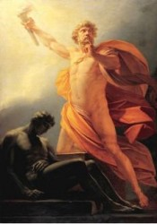
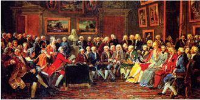

# 普罗米修斯：民主或民粹的启蒙

《被缚的普罗米修斯》相传为古希腊悲剧作家埃斯库罗斯的作品，不过大多数现代学者认为其为托名伪作，原作人另有其人，实际年代可能晚至公元前4世纪。然而，大多数的埃斯库罗斯作品集还是将其收入。有证据表明它是三部曲中的一部（第一部或者是第二部），而其余两部：《解放的普罗米修斯》和《盗火者普罗米修斯》仅有残片存世。

与《尚书》、《韩非子》中的某些章节一样，《被缚的普罗米修斯》被质疑为伪作，其论据大体不出考据学一流。因为该作的语言特点、句式结构不符合埃斯库罗斯的创作特点，甚至出现了部分埃斯库罗斯时代不存在的话语，所以其应为伪作无疑。虽然并非埃斯库罗斯之作，剧中依然富于高超的诗歌语言技巧和紧凑的剧情冲突，无疑是一部佳作。

普罗米修斯之所以家喻户晓，是因为他盗火并身受酷刑的事迹。实际上，在希腊神话中，人类是普罗米修斯创造的，他也是人类的导师，凡是对人有用的，能够使人类满意和幸福的，他都教给人类。同样的，人们也用爱和忠诚来感谢他，报答他。普罗米修斯从天上盗来火种，使人类有了火，不再茹毛饮血，也正是由于火焰，使得一切技术文明的发展成为可能，甚至因为有了火，出现了数学、哲学，开启了人类思考的空间。“盗火”这一行为本身，就具备很强烈的启蒙意味，所谓启蒙，就是启迪蒙昧，看见以前就存在，但没被看见的东西。

在希腊神话中，神与人有明确的界限，与之相类似，自古希腊直至文艺复兴时期，贵族与平民同样有着不可逾越的鸿沟。在一段时间内，智识是上流社会的专利，而启蒙，正是使智识从精英扩散到普罗的不可逆过程。往往是某些具有同情心的贵族，主动或无意的承担教化的工作，正如普罗米修斯是具有同情心的神，主动去教化人，是有智识者的自觉。启蒙使原先“高雅”的流俗化，使专有的普及化，使人皆有智。

《被缚的普罗米修斯》一剧中，主要有两组戏剧冲突，一是普罗米修斯与执行刑罚的强力神、威力神、赫菲斯托斯以及宙斯说客赫尔墨斯之间的斗争，二是普罗米修斯对自己的妻妹——海洋神女们以及因被宙斯垂涎而遭到赫拉迫害的伊娥的启蒙。虽然宙斯在剧中从未出现，但他是两组戏剧冲突的“幕后冲突”，所以两组冲突的实质是普罗米修斯与宙斯不同方面的冲突。

第一组冲突，普罗米修斯因同情人类，破坏了“人神有别”的秩序，犯了“政治错误”，而同情普罗米修斯的赫菲斯托斯差点也因为下不去手“站错队”，这一组，实则表现了政治主张的差异，是民主共和还是贵族专制？第二组冲突，伊娥因美貌引起宙斯的贪欲，招致赫拉的嫉妒，普罗米修斯揭示她的命运，鼓励她勇敢追逐自己的爱情，哪怕这爱情不容于世，这一组，则是对个人自由的主张，一个自由人对自己的肉体享有绝对的支配权，不为任何权力所左右。而宙斯，则是这一切的反面，他否定人类有掌握智识的权利，也侵犯了伊娥的个人自由。而启蒙者，一方面主张的是庶民参与政治事务的权利，另一方面则讴歌每个人对爱情的向往，反对旧道德对人的禁锢，这二者是息息相关的，没有对自己身体和智识的绝对支配，又何谈参与民主政治？所以弗洛伊德的意义等同于卢梭，而薄伽丘不输于但丁。

文艺复兴时期的启蒙，带来了三大产物：基于宪法的民主政治，走向市场的现代企业，消灭阶级的自由恋爱。而在《被缚的普罗米修斯》中，除去企业这一元素，其余两点都有所体现。所以文艺复兴虽然有托古言志之嫌，但“复兴”所言不虚。

所谓自由恋爱，即为了纯粹的爱情，可以挑战宗法秩序，甚至置禁忌于不顾。所以自由恋爱不是感性的盲目，而是理性的反抗，刻意的反抗旧秩序。自由恋爱实现了肉体的支配权与所有权合二为一，谁拥有谁支配，谁掌握谁主张。在此基础上结成的婚姻关系是社会元素而非肉体规训，是吸引，而非占有。是感情与欲望不完全同一化的事件，从这个意义上，金岳霖与秦丽莲同居，与他是否对林徽因痴情不具有逻辑上的必然联系。对真正的启蒙者来说，婚姻更依靠心灵魅力维系而非肉体枷锁禁锢。从另一方面讲，启蒙自然会造成道德的瓦解——旧道德秩序的瓦解，并以契约意识确立权利义务关系，而非动用道德他律，过分强调义务。所以启蒙招致的肉体解放必然会导致肉体的袒露和展示性的表演，甚至多元化感情关系的正当化，这却是真正的民主政治——少数也可以主张自己的权利——的发轫。当涵盖爱情、性爱、异性恋、同性恋的爱若斯神受到人们的普遍祭拜尤其是哲人们的敬慕，民主政治就此发端。

所以启蒙者的第一要义是自由，其次才是民主，没有自由，何谈民主？没有基于自由的契约精神、规则意识何谈宪法政治、法治制度？当普罗米修斯盗来火焰给凡人，有了理性的凡人自然会摆脱神的指示自行决定发展道路，当启蒙者给普罗大众以赛先生德先生，民众自然会决定自己的道路，与素质高低无关。

只是我们的诗人又给我们提了个醒，普罗米修斯为何启蒙？剧中告诉我们，普罗米修斯是为了终结宙斯的统治，至于宙斯下台之后怎么办？诗人借赫尔墨斯之口表明了自己的担忧：“普罗米修斯统治的世界，会比宙斯的统治还坏。”很多人之所以舍得一身剐，敢把皇帝拉下马，是因为之后自己可以当皇帝，而推翻僭主的往往是另一个僭主。之后普罗米修斯对海洋神女们和伊娥的启蒙，有很多暗示性的成分，让人不禁怀疑，普罗米修斯的启蒙，到底是为了真正的民主，还是一种发动群众的民粹，进而实现自己推翻宙斯的目标？

从这个意义上说，普罗米修斯有罪，但这并非对不公正秩序的挑战，而是在启蒙之中掺杂了自己的野心。对于启蒙者，往往民主民粹兼而有之，不必要忖度人心，还是留观后效，以实际结果考评。

（采编：杨修；责编：杨修）

[【所闻所见】德与才的精神战争：现代艺术与政治的目的化陷阱](/archives/42326)----文学性的作品阐释与德性关注并非老欧洲过时的文化霸权，而是不断展开对艺术中幽微真理“开而弗达”的思考，对永远在途中自足奋进的非目的性的生活进行塑造。

[【所闻所见】从媒介环境学视角看国内摇滚音乐节对青年群体的影响](/archives/42465)----当所有乐队和乐迷汇集在一起时，他们共同产生的那一股强力的气流，似乎达成了人们对乌托邦的所有想象：人与人之间自由平等，没有身份和社会地位的差别，没有迥异价值观的冲突，只有最原始的冲动与渴望。
