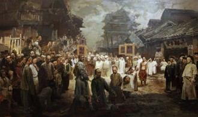
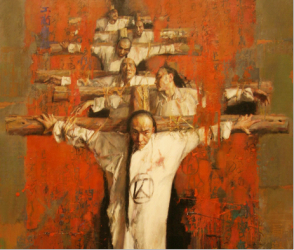

# 为什么是谭嗣同？

端午节到了，又到了纪念屈原的时候。巧合的是，屈原投水的的湘江两岸自古多俊杰。但还是有一些不同，毕竟有的人留在了湘江，有的人却离开了……

菜市口1898

几百年了，自侯门相府里的达官显贵，到市井胡同中的升斗小民，谭嗣同始终以舍生取义的“烈士”形象而存在。但众人在敬佩之余，也有一些惋惜：能逃跑不逃跑，何必呢？若是当初谭嗣同不死，日后史书里指不定要丰富几分呢。但回头看看历史后发现，谭嗣同之所以选择死，其原因之复杂，因素之众多，却是难以以一言以蔽之的……

中国历朝的官员里都有武死战，文死谏的观念。“武死战”大家都明白，李陵和司马迁就是这一理念典型的牺牲者。而“文死谏”更是中国历史上一种典型而意义复杂的现象：“有些文官熟读诗书，深知百世流芳之说。他们可以找到一个题目，宁可在御前犯不敬之罪，今日受刑，明日名扬史册。”简单来说，就是：身虽死，名可垂于青史也。古代儒士多有“立德立功立言”的理想，为什么将立言放在最后最显要的位置？正是因为这些儒生思想里坚定地认为生死是不为惧的，但死的有没有骨气，有没有重于泰山，他至死坚持的言论能否流传千古才是最该考虑的问题。于是历史上历朝历代从来不缺乏冒着杀头的危险给皇帝提建议的大臣，唐朝的魏征、明朝的于谦、清康熙时期的郭琇、乾隆年间的窦光鼐……而在“文死谏“这一理念下，历史中每逢遇到昏君之时，便常有朝堂之上人头滚滚的景象。尤其到了宋朝以后，“四书五经所倡导的便是多数文官标榜的宗旨，也许并不完全是口头禅。如导之以诚意，一些责任感的年轻人又真能不顾一己之安危荣辱，为仁民爱物的宗旨拼命。这种自我牺牲的精神，能在存亡于肤发之间击退北方游牧民族的内犯，也能在万苦千辛中修复黄河的决堤。他们经常批评皇帝，其用心也未必真实‘沽名钓誉’，而是深知自我牺牲，必须得到皇帝的肯定与合作，才能使亿万百姓沾惠受益。

谭嗣同作为一个熟读四书五经的儒者，这种“文死谏”的观念应该同样为他所效颦。基于这点考虑，大多历史学者皆能推出谭嗣同是为了改良而死这一结果。但谭嗣同在成为军机四卿前经世韬用多年，更是“以日新为宗旨”、“善舍己从人”。难道新学熏陶下的谭嗣同在国难当头之时也完全信奉这一“陈旧”观念？在我看来更深层次的原因在于谭嗣同的政治道路并不同于史上大多数文官，除却“文死谏”的因素，谭嗣同之死也是历史规律使然。

谭嗣同走的是历史上少有人走的变革之路，在中国人“祖宗之法不可变”的观念里，改革者面临的压力与困阻往往是难以想象的，而其下场也是惊人的一致：商鞅变法二十二年，他治下的秦国用短短几十年成为战国诸侯中的佼佼者，却终遭车裂极刑；桑弘羊改革汉朝经济政策，汉武一朝的国库因此前所未有的充实，却也难逃满门抄斩的命运；范仲淹、王安石的结果也是众人皆知，而张居正更是惨遭鞭尸。中国历史中的变革者的命运似乎有了一种确定的规律。在这一背景下，维新变法的发动者应该同样抱着变法面前“人命不足惜”的信念。这也难怪谭嗣同在生死关头选择“慷慨以殉道，忠骨筑事功”了。并且在谭嗣同说服梁启超的论述中，还提到一种死易生难的观点：谭嗣同认为在戊戌政变中，活下来的人仍要毕终生精力进行改良运动，其以后所面临的磨难要比引头一刀痛苦的多。但我们也可以理解为这只是谭嗣同想说服梁启超的托词罢了，其真实想法仍待考究。 

除上述历史观念、规律原因之外，在个人方面谭嗣同之所以不逃跑同样有出于道德、精神力量方面的考虑。谭嗣同被捕的前几天，面对络绎不绝的来劝他出逃日本的人，始终以程婴杵臼、月照西乡为例，论证他““各国变法，无不从流血而成，今中国未闻有因变法而流血者，此国之所以不昌也。有之，请自嗣同始。”的观点。其实聪明如谭嗣同者一定也看到了此时牺牲的意义是巨大的，他更想将他的死转化为一种精神力量，激励更多的人走上变法救国之路。在历史中，崇拜这种以死来感念他人的高尚者不在少数，典型者如《史记·刺客列传》中的田光。据《史记·刺客列传》记载，田光“为人智深而勇沉”，太子丹有了刺秦的计划时最先找到的便是田光。但田光已“不复盛壮，精已消亡矣”。于是田光给太子丹推荐了荆轲。之后田光在说服荆轲刺秦后，因“夫为行而使人疑之，非节侠也”自杀了。但在后世的研究中，对田光之死赋予了更深刻的原因：第一，士为知己者死，田光有报国之心，但是太老了不能成刺秦之命，如果当初他答应下来了，理论上就应该他去死。第二，田光向太子丹推荐了荆轲，让荆轲去玩儿命，田光自己却安然无恙，田光自己也过意不去，所以出于情谊考虑他要死。第三，壮士一去能不能复还还不确定，但田光想用自己的死来刺激荆轲。所以我们综合田光的故事来看，谭嗣同甘愿赴死一定也有“精神意义重大”这一原因，化凡身为尘土，留精神感世人，足以。

戊戌六君子：谭嗣同、康广仁、林旭、杨深秀、杨锐、刘光第

在中学的历史课本中，儒家的核心概念是“仁”。其实到孟子之后，儒家的核心概念已经进一步扩大为“仁义”。而“义”的概念在中国平民百姓中一直极受推崇，甚至成为普罗大众在血缘宗族之外维系人际关系的重要纽带。而在法治不健全中国封建时期，替天行道仅靠官府还远远不够，于是民间的“义”又衍生出“侠”的概念。而谭嗣同在慷慨赴死时，便相当有侠义风范：

谭嗣同在他的《仁学》中提出了“死事”和“死君”的区别，认为“死君”多是愚忠的表现。梁启超后来也提出“晏子哭庄公”的故事作为佐证。但在戊戌政变后，谭嗣同却认为“不行有者，无以图将来；不有死者，无以酬圣主”。梁启超这时便用谭嗣同自己的“死君”理念来劝服他。但在我看来，谭嗣同“酬圣主”的原因并不是忠，而是“义”：此时谭嗣同并不把光绪作为高高在上的皇帝来看待，而是改良路上的挚友。他认为光绪本可以尽享荣华富贵，却选择了与汉人一同艰难的改良，不惜背上“满奸”的称号，光绪这种品格足以让他义气相待。其实客观来看，生活在封建时代的谭嗣同其内心的帝制思维必定是难以摒弃的。但无论如何，谭嗣同的思想已经超前于那个时代的绝大多数人了。

在儒家的理念中，中庸是个重要概念：其兼济天下与独善其身的折中、舍生取义与忍辱负重的矛盾，不偏不倚，不左不右，在中国民族文化的话语体系下，更成为了务实的代名词。在戊戌政变中，谭嗣同慨然赴死的做法也极具务实色彩。

其一，谭嗣同并不是茫然赴死，他是在康有为成功南渡，梁启超已受日本使馆保护的情况下才愿意去死，是“保存了变法的火种”后才“抱着已无事可办，惟期待死耳”的念头赴死的。

其二，谭嗣同饱读诗书，不可能不知道改良成功的几率极小，但他却是知其不可而为之。他并不是想去实现那一丁点成功的可能性，而是想要“取乎上者，得其中”：变法不为变法的成功，只为宣传变法，他认为维新变法虽然失败，但却是“救中国”不得不走的一步。不走这一步，思想难以启蒙，而世人更不可能觉醒。如果这一步必须要鲜血来铸就的话，他谭嗣同愿意。

其三，谭嗣同更认为他不得不死。他希望他的死不仅是为了向世人证明改良的重要性，更是向天下人说明革命的必要性。谭嗣同是想用他横死在改良路上的尸体向“救中国”的仁人志士表明，改良这条路走不通，要革命！更想用他的鲜血来换得改良派的“猛回头”。这时谭嗣同已顾不得被南方的革命派当作“改良无用”的典型教材了，他摒弃了生前身后名，只希望救中国的步伐走的更快些；他抛却了教条与规则，只求“救中国”伟大事功之达成。其实到这里我们才能真正领悟到谭嗣同之伟大：其认识已远远超出了“文死谏”后名垂青史的层面，更希冀他的死得以让“救中国”的目标最终实现。尽显一代志士之高格。

望门投宿思张俭，

忍死须臾待杜根。

我自横刀向天笑，

去留肝胆两昆仑。

——嗣同绝命书

1898年，这一年北京城入冬的第一场雪落得格外早

附：嗣同之死，其因众多，难以一一。此文仅以个人拙见管窥其慷慨赴死之因，他因则难以顾言。嗣同一生笃信佛法，于卓如公看来其舍身更是出自佛家大无畏及普度众生之思想，而历代史学家灼见更多，实难尽言。若此文有史实不当等谬误，还望指出，感激不尽。

①引自《万历十五年》 黄仁宇·著

②同上  参考书目： 1、《万历十五年》 黄仁宇·著 2、《戊戌政变记》 梁启超·著 3、《史记》 司马迁·著 4、《北京法源寺》 李敖 ·著 5、《仁学》 谭嗣同·著 6、《浩荡两千年》 吴晓波·著
