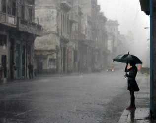

# 一条路

通往《新闻调查》是怎样一条路。

难以丈量，只知道每天背着16寸笔记本、坐一小时地铁从军博站钻出来的我，走起来并不那么容易。

那条路叫羊坊店路，终点在北京西站，斜对着央视大楼，中间地段有中国网络电视台，深处小巷是南院。路上充斥着背着一捆捆蛇皮袋的农民工，背山寨LV包的女青年，乞讨者，各类公职人员，当然还有央视传媒人。去《调查》，还有一条必经的地下通道。每天路过这儿，都要东张西望一番。

有一位乞讨者的目光吸引了我。和其他乞讨者一样，他衣衫褴褛，显露出古铜色晒伤的皮肤。摊位就在快拐到地下通道的地方，只摆着一个碗，碗里装了少许零钱。所不同的是，这个乞丐已然满面皱纹，蓄着长须，拄着拐杖。仔细看，他的碗前面立着木牌，这木牌并不像其他乞讨者一样写着凄风苦雨的故事，只写着："残疾老人八十岁，无儿无女"。

这样的乞讨方式引起了我的兴趣。于是每天观察。我发现了他就把床安在那条地下通道里。几块厚木板上面垫着一张破凉席，看起来是捡来的超大容量可乐瓶，还有一麻袋的杂货，组成了他的家。还发现，他有看报纸的习惯，每天乞讨的时候，自顾地举着放大镜，今天看《北京晚报》，明天看《环球时报》。也不知报纸哪来的，只觉得气场颇足，路人倒也从未理睬。

每天上班，走进《调查》办公室，虽然南院很陈旧，《调查》办公室到底宽敞明亮。每天和和蔼的郑老师和说话很萌的责编翠翠姐说早上好，时不时听到儿子已经工作的办公室主任姚大姐又一声惊呼“哇塞”。在充满青春和生活气息的办公室里，脑袋像是装了个过滤器，完全能

忘掉那条路，那个老乞丐。只有当每天背着装着电脑的大包走过那儿看到他的时候，才觉得这样的对应很玄幻。

北京暴雨那天，我在五道口等男朋友。倾注一夜的暴雨和涨潮的道路，让人焦躁不已。没想到第二天就雨过天晴，天蓝的跟个没事儿人一样。

又去上班，走到羊坊店路，这才想起，那个老人，“残疾老人八十岁，无儿无女”，昨晚又在哪里？

走过快拐到地下通道的地儿找，但人不在。在通道里，看见他的床，才惊觉，这床昨晚竟是怎么度过的！

不能想象。然后又惊觉，原来暴雨真的可以如此残酷，它能让有身份的人在轿车里淹死，却更能让无法证明身份的人轻易就无处安生。

那一整天，接连好几天，我都再没看见他。

我坐不住了，开始每天祈祷能见到老人，许诺自己，如果还能再见到他，就给他钱，听他说会儿话。

那条路，还是每天挤满了背着蛇皮袋赶火车的人群，背山寨LV包的女青年，乞讨者，各类公职人员，央视传媒人。8月初，不知往火车站去的人怎么越来越多。那天人群异常拥挤，就在我不耐烦地想飞快穿过他们的时候，最后，我瞥见了一块牌子。

“残疾老人八十岁，无儿无女。”

他来了，还活着？！

他还是那副模样，长胡子，古铜色晒伤的皮肤，满面皱纹，用放大镜看着报纸。只是面容憔悴些。我一激动，告诉自己

要兑现承诺，于是快步走过去，佯装不去看他，迅速在那碗里放了些零钱。

他听到声音，看着我一愣，马上又大声说了句：“谢谢！”。那声音和我想象的很不同，沙哑却觉得洪亮。嘴咧得很开，牙齿齐全。

他还在看着我，我想攀谈，却迟疑了，心想，他会不会认得我，那个每天定时背着大包甩着辫子走过他面前的小姑娘？我还是没有鼓起勇气开口。

到了办公室，我照例马上放下背包和郑老师翠翠姚大姐问好，和同事侃大山，只是还一直在想，为什么会觉得那句“谢谢”和自己想象的不一样。

再后来，张晓楠记者问我们为什么来到《调查》，再后来的后来，实习报告敦促我回忆在《调查》的事儿，我都模糊，却最先想到“残疾老人八十岁”，想到那声“谢谢”。

新闻系的学生，常爱漫谈新闻理想，或者望新闻理想而兴叹。我也觉得这个词不会有答案。我也不知道怎样才能做到老有所养。但是现在想起这些话题，自己的心却默默地给自己划出一条羊坊店路，路上住着一位老人，名叫"残疾老人八十岁”。

注：本文写于2012年9月8日

（采编：佛冉，责编：佛冉）

[【路】一次伪支教后的反思](/archives/40123)——在一天的“伪支教”后，作者反思到，城乡儿童的教育质量差距巨大，但短期支教的方式难以给他们带来改善，反而容易成为孩子们的负担及某些机构盈利的手段。

[【路】五道口盘踞着名叫青春的怪物](/archives/40285)——五道口在不同人眼中，有着不同的意义。它是很难考的研究院，是各色人群的交流平台，是林立的酒吧，是嘈杂、或是孤寂。在作者眼中，五道口是一个庞大的怪物，吞噬着无数人的青春。
