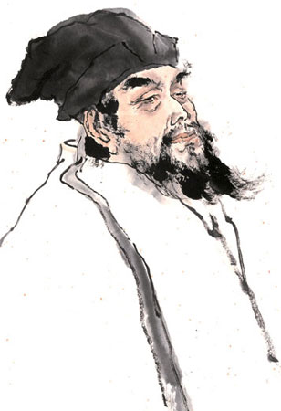

# 公知冯梦龙

官方所谓“半殖民地半封建”史观，强调西人东来给中国带来的苦难。但不得不承认的是，近代史同样也是一部西学东渐的历史，更是中国向西方学习现代化的历史。为了灌输民族主义观念的政治需要，将近代史定义为“屈辱史”、“苦难史”显然更为有利，因此产生了一种新的观点，认为中国自有其近代化乃至现代化进程，只是这一过程被数次打断，最终让中国掉了队。于是乎，明朝中期至清初的江南成为关注焦点，苏杭的商品经济被视为“资本主义萌芽”，而泰州学派对下层民众的浸染也被视为“早期启蒙运动”，至于江南士子的狂狷放浪、离经叛道，则被捧为“人的意识的觉醒”，仿佛要不是清朝入关，中国就一定能平稳完成近代化最终过渡到现代社会。

小子无知，不揣浅陋，对此却有所怀疑。在我看来，所谓明末“人的觉醒”的确有启蒙意味，但和西方启蒙运动的实质内涵还是存在较大差异。正如沟口雄三先生所言，中国人和日本人的“公”、“私”观念有很大差异，日本人所谓“公”是朝廷、社会的公共事务，朝臣也被称为“公家”（与武士阶层的“武家”相对），而“私”则是个人、家庭的私有领域，大正年间，孤立地描写个人琐事和心理活动的小说，就被称为“私”小说，“公”与“私”更多的是群己界分，而无语义褒贬。中国所谓的“私”同样与“公”相对，但是却有所褒贬，私是与公平、公正相对的“偏私”、“自私”，大体是贬义。中国人所说的公平、公正，更多的是一种平均主义，即“均贫富”，体现为抑豪强、仇富。比如深受中国人颂扬的明朝清官海瑞，其断案法则就是宁屈大户，不屈小民，也就是说，富户和贫户打官司，甭管有理没理，他海青天都要倾向于“无产阶级”。这种“公”，毫无程序正义可言，更体现出对私有财产的不尊重。自古以来，土地兼并就被视为非正义，不管是否自由买卖，为富自然不仁，穷自然就占了几分理。这些观念和行为，都与现代社会所必需的契约精神、市场法则完全背离。

从李卓吾到戴东原，明末清初的思想家都对私有观念有所论述。但究其核心，根本上是对皇权、政府权力极度膨胀的对抗，即强调“万民之私”与皇权“一己之私”的对抗，其实质仍然是“天下为公”，并没有关注个体化的“私利”或是个人权利的获取。（杨念群，2012）这种对“私”的追求，和“个人自由”、“个人主义”的观念大相径庭，本质上仍然是将“大公”放在“小私”之前，并不能为资本主义萌芽张本，反倒为社会主义革命提供了思想土壤。

不妨抛开“资本主义萌芽”、“早期启蒙运动”的标签，不要带有“被打断”的先入为主观念，回望1644甲申国变那一年的江南乃至中国，去追寻前人的脚步，或许对于那个时代，我们都会得出自己的答案。

嫁了罢，嫁了罢，怎么不嫁？说许他，定许他，怎能勾见他？秋到冬，东到春，春又到夏，咬得牙根疼，掐得指尖麻。真不得真来也，假又不得假。

——苏州民歌《想嫁》

   

明朝的吴中，似乎与淮右布衣朱元璋总不太对付，这里曾经是张士诚的地盘，百姓们不忘故主。街头巷尾，三五成群的黎民聚在一起聊天，聊天在苏州话里，叫做“讲张”，讲的呢，是张士诚的好。吴中的名士，如高青丘、倪云林辈，虽然对明朝表示了恭顺，却也惨遭报复。高青丘惨遭腰斩，而有洁癖的倪云林据说被朱元璋扔进粪坑淹死。可能金粉繁华之地的子民，对怎么也洗不掉屌丝气的小心眼朱元璋，真的很难喜欢。

到了明朝中后期，苏州先后爆发过两次大的民变。一次在万历二十一年，起因是因为万历要攒私房钱，任用宦官作为税吏，四处征收，不仅民怨沸腾，也与官僚集团产生了很大冲突，皇帝老儿手伸得太长，无视政府职能，是很荒唐的举动。因此，这次民变背后有官府的纵容，罢织的机户推机工葛诚为领袖，葛诚被捕之后，送酒食慰劳者络绎不绝。第二次便是天启六年，魏忠贤及其党羽诬陷周顺昌，逮捕周顺昌时遭遇了苏州人民的强烈反抗，城乡数万人云集，为之呼冤，愤怒的人群当场打死了两名“执法人员”——缇骑。最终官府出动军队，才平息了这次群体性事件，为首的颜佩韦、杨念如、马杰、沈扬、周文元慷慨就义，是为“匹夫之有重于社稷”的彼五人者。到了清朝初年，苏州吴县（今苏州市吴中区）还爆发过一次骚动，即顺治十八年“哭庙案”，金圣叹在此次事件中死难。

从卷首那支吴歌《想嫁》不难看出，由于经济的繁荣和王学分支泰州学派的浸润，吴中的社会风气较为开放，有谈情之风。这些文采风流，可从张岱《陶庵梦忆》一窥究竟。从上述民变也不难看出，吴中也有自己的坚守和反抗精神。原因很简单，社会风气的开化是与经济发展分不开的，往往越贫穷的地方，人性的牢笼越严苛，而正因为城郭富庶，自然会有相应的政治诉求，对触及自己根本利益的强加之事，不惜以死抗争。正因为以上两大原因，吴中有着当时规模最大的“公知”群体，先是以无锡东林书院为主阵地的东林党，再是吴江的复社，还有大量的东林、复社“外围”读书人。这群“外围”中有一位不入流的士子，却做到了很多东林党人、复社才子做不到的事情，他就是三流的官员、一流的小说家、伟大的出版家——冯梦龙。

与东林诸生相比，冯梦龙的履历简直惨的可怜，最高的功名是个贡生，到六十多岁才做了一任知县，也找不到什么政绩的记载。与做官相比，冯梦龙更大的事业是编书、出书，说他是明代民间出版业的集大成者，似乎不为过。

明朝中后期的江南，经济水平上来了，人民对业余生活的要求也有所提高，也希望看到高质量、有情节的读物。这一时期，民间出版业得到了极大的发展，但产品良莠不齐，生吞活剥、东拼西凑、抄袭篡改等现象屡见不鲜。当时也没有什么知识产权的观念，被盗印了只能算你倒霉，虽然出版商绞尽脑汁防“盗版”，但是道高一尺魔高一丈，正版和盗版的博弈那时已经开始。出身名门的冯梦龙，一生追逐科举仕途，却阴差阳错，在商业领域取得了莫大成就，幸乎？不幸乎？

我一直以为，冯梦龙在当时的作用极其对后世的影响，从来被严重低估。小说家“稗官野史”者流，不登大雅之堂，而冯又参与商业，更是属于“士农工商”的末位。但有多少中国人读过东林诸生的著作，又有多少中国人读过冯梦龙的作品或“产品”？《东周列国志》十分普及，《三言》更是家喻户晓，甚至高中语文课本都编入了《杜十娘怒沉百宝箱》。作为编辑家、出版家，冯梦龙思路灵活，十分了解市井百姓、普通读书人的口味，编选的作品可以说是“劳动人民喜闻乐见”，因此极为畅销，除了大名鼎鼎的《三言》之外，还有专收情爱故事的《情史》、专讲智慧小故事的《智囊》等，冯在这些书中，借他人故事，针砭时弊，讽刺魏忠贤一党，却又不落把柄，堪称是明末的“公知”、“段子手”。

除去编故事之外，冯梦龙将吴中民歌纂为一集，名为《民歌时调集》，集子里的民歌，很多都是讴歌感情的情歌，卷首的《想嫁》便是出自这部集子。冯梦龙对“情”之一字，尤为赞赏，否定汉儒注《诗经》对郑卫之音的否定，认为桑间濮上是人间真情，何错之有？因此他要大胆谈情，“借男女之真情，发名教之伪药。”弘扬真性情，反抗名教对人的禁锢。

冯梦龙的观点，和时代有很大关系，明朝中后期，随着王学的发达，文坛上竟陵派、公安派也提倡“性灵”、“真气”，反对一味泥古，社会风气有所开放。冯梦龙更是跨时代的提出“情教”，视情为教，认为六经皆为情所系，一切事物，根源是情，忠臣、孝子，无不是因为“有情”。且不论冯的论断是否偏颇，但敢于挣脱“天理人欲”说的樊笼，独创情教一说，足见其人真气。冯梦龙不仅讴歌真情，而且以此抒发政治思想，比如《民歌时调集》里的一首字谜歌：三皇是我兄，五帝是我弟，欲罢而不能，因非而得罪。谜底是个四字。对三皇五帝称兄道弟，而不是采用神格化的称谓，赤裸裸的要求平等的诉求，并没有出现在庙堂之高，而出现在了江湖之远。

不要小看冯梦龙及其市井文学，认为“不入流”。现在被推为“启蒙”重镇的梨洲先生黄宗羲，其《明夷待访录》历经三百余年，才被人重新认识。而冯梦龙的作品及产品，却一直流传下来，让人们可以看见那时节的江南，到底是个什么模样。我们从冯梦龙的作品里，惊讶当时社会的开放、经济的繁荣、情爱的大胆，也嗟叹个人在时代大潮中的无能为力。

又是一个春夏之交，这一年，是崇祯十七年，公元1644。大明朝在这一年陷入了危机，崇祯帝煤山自缢，福王南京称帝，弘光政权不思进取，四镇总兵拥兵自重，烟雨江南一派风雨欲来的景象。冯梦龙70高龄，毅然投入了抗清斗争。关于冯的结局，只知道他死于甲申之后两年，公元1646年，一说绝食而死，一说被清军所杀，总之，他是殉了国。按他的“情教”说法，殉国也是人间钟情者吧。

冯梦龙死了，他的墨憨斋也被付之一炬。他的事业戛然而止，他的作品泽被后世。

大约情之一字，所以维持世界。才之一字，所以粉饰乾坤。

(采编：薛晨如；责编：刘铮；)