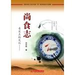

# 北斗荐书：《尚食志》：筷子夹起故事来

 

# 本期主题：《尚食志》：筷子夹起故事来

## 荐书人/谷卿（暨南大学）

 

我的朋友中，许石林算是一个不因我清瘦的外形而难以认清我吃货本质的家伙。每次吃饭，从落座后点餐一直到完事后揩嘴，他总会给我介绍各种菜食汤酒背后的典故和讲究。惜哉我一见到食物听力就开始下降，苦了他一次次地讲解，我脑子里的收获依旧不如肚腹。可喜的是，他关于饮食文化的随笔和评论集《尚食志》终于出版了，一册在手，趣味与文化并存，历史与当下毕现，徜徉文字中，如在酒池肉林间过，真是欢乐无比。

《尚食志》的编辑在封面上打出了一行字——“探索中国人无处不在的‘吃’背后深层的文化隐情”。我觉得这个总结是很准的，石林一贯好读古人书，脑子里的史料和掌故多得不得了，同样是一盘菜一碗饭，他能看到司马子期怎么因食生恨（《一碗羊肉泡馍引发的战争》）、寇准怎么撤销筵席（《罢宴》）、米芾怎么以饼论书（《字字如蒸饼》）、乔仲山怎么授法烹饪（《馄饨》）、张大千怎么学得厨艺（《土匪菜》）等等。只要是史上世上关于吃的那些事儿，石林无不如数家珍，在书中娓娓道来，更以俏皮恶搞的文风突然点醒读者，饮食背后的大伦究竟在于何处。

书中有篇《葵》，是我之前就已经在石林博客上读过的，印象特别深，文章原题叫做“葵之沦落——古代当官的耻于与民争利”，用春秋时鲁国国相公仪休的故事来说明中国古代的官员怎么样和为什么不与民争利。其实，传统中国社会中的官商是分别存在于两个系统的，他们有各自不同的价值背景与目的，官员自得于世俗的等级地位与尊贵，商人虽能得大富而难贵，政治地位与财富实力根本不画等号。但是，自上世纪中国的改革开放以后，这两个系统的独立性消失了，富、贵的差别也不存在了，遂直接带来政治资源与经济利益互通互化的可能。石林正是看到和深刻地感知到了社会的这一变化，才会有借助一种植物（食物）来寄托思想、表达观点、讽喻时政的想法和做法。如果真的以为石林只是满脑子肉汁鱼油津津乐道地告诉你如何刺激自己的味蕾、撑爆自己的肠胃的话，那只能说明这样的读者缺筋少弦。

石林将文章结集成书时，曾征询大家的意见，该取个什么样的书名儿。我说现成的“食货志”多好呀！石林不置可否。直到封面设计出来后，我才知道叫“尚食志”。回头想想，这个“尚”字用得还是蛮好的：吃货们也不能光吃，好赖也要超越一下，总该有点“尚”什么的精神才好。

与石林认识不少时候了，我们见面和打电话聊得最多的大约都是关于书画古琴和文坛掌故一类的闲事，他给我的印象是身型胖胖的，动作慢慢的，说话时嘴里也好像在品咂着什么，一看就知道是个资深的吃货；但见闻不平之事，他也常作激愤之语，一反往常的憨态。了解他的人又读过他的文的朋友，一定都觉察出了他厚道为人、刻薄为文的本性，这是一个讲究吃喝、敬畏文化、珍视朋友的家伙，更是一个热爱生活、懂得生活、善于生活的观察者和批评者。《尚食志》这样的书，你值得阅读；许石林这样的朋友，你值得拥有。

亚马逊购书链接：[舌尖上的文化:尚食志](http://www.amazon.cn/gp/product/B009CRHGPE/ref=as_li_tf_tl?ie=UTF8&camp=536&creative=3200&creativeASIN=B009CRHGPE&linkCode=as2&tag=ibeidou-23)

（采编：李冰心；责编：陈芝）

 
