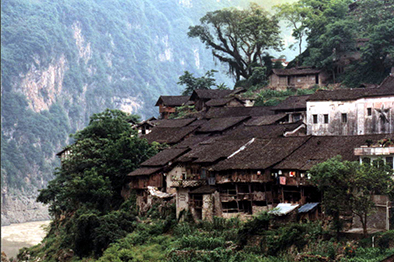

# 我叔

我叔总是给我讲从前的事。有一种说法叫做人老了总爱回忆，而我认定我叔之所以总是回忆起从前，真正原因并不在于他的正在老去。我们每个人都在成长苍老，向死而生，生命并不是生活的借口，于是我认定我叔的回忆其实是出于一种情结。这种情结我并不能口述，其中之一的原因在于我并没有亲身经历过我叔的那个年代。关于这个情结，它自是来源于我叔，我坚信一种说法，人会不自觉将以往的东西美化，筛选，最后值得肯定、赞美的事会像咸鱼干一样被暴于太阳底下，一日一日被人触摸览阅，直至一天其中的水份消失殆尽，风一吹便崩裂碎尽，漂灭于尘。所以我无从考证我叔的说法，我只能真实地记录，记录的一切动力来源于我叔的情结，这种情结在叔的血脉里奔腾跳动，驱使叔一遍一遍把他的故事讲给我听，我接收到来自叔血液的灼热温度，随后清楚地听到这种情结在我体内跳动其力度与节奏与我叔的并无二致。这一切也许源于遗传，于是我愿意将这一切称为，我的情结。

我叔小的时候很少吃饱肚子，饥饿与饥荒是田野里随处可见的马芷苋草，清凉而苦涩。我们的记忆只有一九五八与一九六零，三年自然灾害，于我们而言这不过是三个连续的数字，作为一个旁观者，我们付出我们认为足够多的怜悯于这个衣食富足的年代——悲天悯人，可怜而又虚伪。

我叔小的时候长得又瘦又结实，他讲的所有故事都来源于他发育之前，我无从知晓他的意图，但叔告诉我那个年代是纯真的，“之前”和“之后”的差别在我看来只有一样东西，那就是女人。也许叔认为女人不应属于纯真的范围所以自动将“之后”的一切忽略，但据我所听到的版本，叔显然不是一个纯真的人。

叔喜欢一个女孩，她叫培玲。

在我叔的那个年代，人们总是吃不饱饭，小孩对肉的憧憬是塘里狂长的芦苇。孩子们很少有什么事，我叔有一个爱好就是喜欢对着天喊：“饿啊！没饭吃！”我叔说这话的时候喜欢站在田野的尽头的一座小桥上，小桥连接着村子与田，我叔就站在桥头对着天憋足了劲大喊：“饿啊！饿啊！没饭吃！”声音震得村子里被关在圈里的狗都附和起来，芦荡里放养的鸭子都受不住惊地游。其实我叔这么做一点好处都没有，他这么喊除了能喊得自己更饿外天上也不会真掉吃的，偶尔叫声被我爷爷奶奶也就是我叔他爹妈听见他们还要把我叔痛揍一顿，骂他不会帮活只会瞎叫唤，还不如猪圈里乖乖长膘的猪。

但我叔仍喜欢叫，他叫得一天比一天响，等到他长身体营养跟不上的时候，他的叫声中便压满了无奈与愤怒，雷声一样隆隆滚过刚插好秧的稻田。

我说过了，我叔有一种情结，这种情结让我叔有一种无法解释的情绪与无法解释的行为，这种情结在他的血液里奔腾跳动，炽热滚烫。

我爷爷奶奶在我叔小的时候就对他没什么指望，我叔的诞生纯属一个让人不高兴的意外，至少在我叔自立之前是这样。

到我叔十三四岁的时候，我叔的爷爷也就是我太爷爷已经老得额头碰着阎王爷了，我奶奶指派给我叔喂太爷爷吃饭的任务，我叔端着碗极不情愿地走到我太爷爷的那间小房间里，那里面充满了死亡将至的气息，房间朝北，光线暗淡，我叔那一把蓬勃的火焰一到这里就像被一盆洗脚水泼了一样迅速地黯淡了下去，只惨淡地发着微弱的光。这里到处漂浮着干脆的皮肤碎片，长时间未洗过的身体与破旧的衣物粘连在一起让我的叔一阵阵颤栗与反胃。

我叔走到我太爷爷床边，把碗和筷放在我太爷爷的竹制床上，喝了一句：“喂，老不死，起来吃饭了！”

我的太爷爷从被褥中睁开了眼睛，我叔松了一口气，他对我太爷爷的生深深松了口气。正当我叔准备走时我的太爷爷却突然精神矍铄地一把抓住我叔的胳膊，我的叔被拽得生痛，也许我叔压根就没有感到痛，他那刻感到的，只有彻骨的寒冷从抓住他的那段枯枝朽木上传来，深深泌入他的骨髓，我的叔感觉自己的心被谁牢牢地捏住了，将要拉向一个不见底的黑洞。

我的叔叔咽了咽干涸的喉头慢慢转过头，我的太爷爷紧紧盯着我的叔，我的叔并不明白为什么我的太爷爷眼神中蕴含着无辜与哀求，他的恐惧盖过了一切，客观上来说我的太爷爷对我的叔构成不了任何威胁，我甚至怀疑我的叔能将那时的太爷爷折成两段，但人总是对未知的事物与未来的世界充满恐惧。老去与死亡并不属于那时的叔的世界，他的未来于他而言是明亮的甚至是耀眼的，他的思想使他无法想象自己与眼前的这个人相联系。

我的太爷爷嚅嚅嘴唇，缓缓地转向枕边的一包东西，示意我叔，我叔走过去，我的太爷爷竟然用一种孩童一样的口气说道：“帮我拿走……”我的叔拿起那一包东西，那包东西拈起来有那么些份量，又微微透着热，泛着潮，我的叔打开那一包东西，里面竟是一坨的屎橛子，我的叔惊叫了一声，那包东西便掉落在地上，我的太爷爷伸出右手，就是那只没抓住我叔的手，那只手上也沾满了暗棕色的屎，我的太爷爷对我叔无辜地说：“让我擦擦……”

我的叔夺门而出，恐惧与羞辱占满了他的内心写满了他的脸，他不顾一切地狂奔起来，迎面撞上了他的父亲。我的爷爷曾经是个酒鬼，家中病重的父亲与成堆的孩子让他无时不刻充满了愤怒，如同被当作皮球的猪尿泡。我的爷爷一把拎住我叔满脸酒气地问他：“你小子跑什么跑！”我的叔忍不住就哭了，泪水从他不大的眼睛中滚出来啪嗒啪嗒地掉出来，他哽咽着说：“那个老不死的……他把屎包……他挖屎啊……”我的爷爷听见这句话就朝我叔一个巴掌：“谁教你的老不死啊？！”我的叔被这一巴掌扇得哭得更凶：“是你啊，是你啊！”我的爷爷听了更是气红了全身像只煮熟的龙虾：“说什么呀！说什么呀你！你小子是活得不耐烦了吧！”我爷爷说着又是两个巴掌，我叔的脸就像烙饼一样被人拍来拍去。

哭声和骂声就这样混杂在一起，在午后的阳光下洋洋洒洒地飘满整个老屋，没有人对此惊讶也没有人因此痛心，一切不过无关痛痒。

我的爷爷打累了就把我叔往地上一扔，摇摇晃晃走开了，嘴里还骂着：“你小子别给我走开，等老子撒完尿再来教训你！”说着走向米缸就松开了裤腰带。

我叔一着地就一溜烟跑了，他冲向田野，对着天空不停地呐喊，我的奶奶从田里直起腰望了望他的满脸泪痕的小儿子后又默不作声地弯下了腰。

我的叔跑到河滩边一把把自己的头埋进河里，他就像一只没见过沙漠的驼鸟一般。当我的叔抬起头时，他看到了一只船，撑船人唱着船歌悠悠地从他面前漂过，船上一个小女孩专心地在刚捞起来的河泥里寻找活物。

我说过，我叔喜欢一个女孩，这个女孩叫培玲。

小船是沈家的，培玲是这家的唯一一个女孩，她的父亲是这最好的船夫，唱最好的歌，有最漂亮的船娘。

我的叔朝船上大喊：“培玲！培玲！泥里有没有鱼！”

培玲抬起头朝我叔看了一眼，阳光停在她的睫毛上好像和她的父亲一样在唱长长的船歌。

培玲什么也没说又低下了头专心掏着泥，她的父亲从船上抛来一条小鱼，对我的叔喊：“回家做鱼吃吧！”可我的叔却连话都没有回，他还是朝船上喊：“培玲！培玲！你在找什么！”

培玲又抬起头：“我在找蚌壳，做一个胭脂盒！”

我的叔捡起那条鱼。

小船划开波浪，向芦荡深处划去。

我的叔在那个纯真的年代总填不饱肚子。他的胃口在那个年代得到了极大的锻炼，食物的匮乏让我的叔变成了一台粮食碾磨机，他最喜爱的动作便是向嘴中塞食食物，肠胃的拥堵让他有一种生命的饱食感，我的叔他是这样热爱这种感觉。

我的叔从小就会一些有关偷摸的勾当，比方他会从家里的粮袋子里偷晒干的黄豆，黄豆在我们这并不是主粮也因为土质不合而质量不佳，但我的叔却学会了生吃黄豆，他从家中摸出成把的黄豆装在口袋里然后把它们咬得嘎嘣嘎嘣响，我的叔从早吃到晚，烹煮对他来说毫无意义，我的叔用唾沫把他们咬混，直至后来他连咀嚼都觉得厌烦，他开始大口大口地吞食，喉咙变得开阔无比仿佛能开一辆拖拉机。然而黄豆让他的身体巨响连连，他变成了活的拖拉机“突突”地冒气，他在老屋的场院上憋足了气想把屁都放光结果却拉出一坨屎，连那屎橛子都是一粒粒囫囵的黄豆。

我的叔对庄稼而害是一个祸害，他比蝗虫好不了多少。我的叔匍匐在田里，爬进别家的莴苣田摘新莴苣的头吃，那是莴苣的命根啊，我的叔在田里呼啦呼啦地吃，他的手灵巧地掰断莴苣的头随手放进水渠里一淘洗，莴苣头就成了他的口中餐，他趴低了身子活像一台机器掠过田地，他吃着吃着听到一个脆生生的声音问他：“好吃么？”

我的叔抬起头，女孩培玲站在他面前，拎着一筐水葫芦的嫩根。我的叔猛地嚼烂了脆绿的莴苣吞进嘴里响亮地回答女孩培玲：“好吃！”

培玲像他撒谎一样地看着我叔。

我叔看看培玲的眼睛，比新莴苣头还水灵，我的叔想，原来这个世上还有更好吃的东西。

我的叔问培玲：“你挑水葫芦的根干嘛？”

培玲说：“挑回去揉沙出来做饼。”

我叔问：“好吃吗？”

培玲说：“好吃，凉凉的，有点苦。”

我叔说：“呸，这都给猪吃的。”

女孩培玲涨红了脸说“真的，比龙糠饼好吃多了。”

我叔又说：“龙糠也不好吃，卡喉咙，糙得很……”

培玲说：“是好吃，不信做好了给你吃！”

我叔又说：“谁稀罕！我爹今晚上要煮蛋给我们吃！”

女孩培玲的眼里进而升起一层光却又迅速黯了下去：“真好。”女孩培玲小声地说，低下头去看自己小小的脚尖：“我们家从来就吃鱼，过节才有蛋有肉。”

我的叔看看培玲又看看她筐里的水葫芦又说：“鱼有什么好吃的？我没什么吃才吃鱼呢！蛋有什么稀奇，我们天天吃，明天拿一个给你就是！”

女孩培玲猛地抬起头，她的发辫随即在她的肩上甩了甩：“真的？”

培玲眼中真切的光照射着我的叔，烤得我的叔脸红起来：“真的！我说过的当然是真的！”

女孩培玲伸出小手指。

我的叔也伸出小手指。

拉勾上吊，一百年不许变。

我的叔吃饱了莴苣又转去偷蕃薯。冬天埋下的蕃薯上面都盖了一薄薄的老牛粪，种的人以为这样能防得了馋嘴的人却防不了我叔这样馋的，冬天的雪往粪上盖，春光一晒南风一吹，老牛粪变成了薄薄的一层衣，我的叔用手一揭就露出一大片蕃薯田，我的叔像刨土机一样从土里把蕃薯一个个从泥里拎出来。

正当我叔挖得开心的时候远处跑来两个人，手里拿着锄头，其中一个是我奶奶。

我的叔撒腿就跑，一直奔向田野尽头那条窄窄的桥，不料正面迎上一辆谷车，我的叔见无路可退便向桥下一跳，“扑嗵”一声跳进河里顺着河水鱼一样游走了。

我的叔回去的时候天已经黑了，我爷爷又喝得烂醉拎着酒坛子准备揍我叔，我奶奶黑着脸坐在一旁，我大伯、二伯、大姨坐在旁边静静地等着一切开始，我二伯的眼里甚至闪出迫不及待的光芒。

不出所料我爷低声对我叔吼了一声：“你过来。”我叔提着湿哒哒的鞋子走向我爷爷，我爷爷看见我叔一副落水狗的样子就猛把手里的酒坛子朝我叔砸去，坛子在我叔的脚边壮烈地碎了，随即我叔的哭声也一并爆发了出来，场面由冷迅速转向热，我奶奶的劝阻声，我爷爷的咒骂声，我二伯的喝彩声，我大伯的叹息声，我大姨同样因为恐惧而发出的哭声混杂在一起，上演着一出精彩的闹剧。

我的叔在这混乱中独立哭着，他的悲伤旁若无人，深沉而深刻，没人知道他的哭泣其实并非来自恐惧，而是来自饥饿。

争吵最终以一切争吵结束的方式结束了。

我的叔很难过，因为他错过了今天的晚饭与今天晚饭上颁发的那只鸡蛋。我的叔他并没有骗人，今天的晚餐桌上确实有蛋出现，但是只有一只蛋，这只蛋只给今天表现最好的那个人，我的二伯今天一早就跟着我的奶奶进田里去了，为她倒水揉背，扇汗挑水，浇粪拔草，我的二伯是一个懂得世俗法则的人。

我叔渴望着那只蛋，那只因为长期没卖出去而几乎臭掉才决定颁出的蛋，我的叔渴望那只蛋，不，我的叔他必须拿到那只蛋。

然而，蛋在我二伯的手里。

我的叔偷偷溜进后院，摘下门槛上挂的那串大蒜，剥了皮一个个生吞进肚子里，我的叔吃了一个又一个大蒜，直到我的叔舌头都麻木，自己都无法忍受这个气味。

我的叔吃完蒜又溜回房里，大伯和二伯已经睡着，二伯死死地睡着，我的叔爬过去，对着我的二伯不停呼气，我的二伯被大蒜的臭味生生惊醒，我的叔又假装睡去，我的二伯见没什么动静又躺下，我的叔又起来朝二伯那边的地下撒了泡尿，尿里混满了大蒜的臭与尿的骚，我的二伯又一次惊醒，这次，连同大伯。我的叔又立马躺下。

二伯看见我的叔裤裆上的一点湿立马发起火来，一脚踹上我叔的肚子。我的叔跳起来指着我二伯说：“你干什么？”

我二伯捏起鼻子气到了极点说：“你干什么？想把这弄成猪窝吗？”二伯说着又向我叔拳打脚踢。

我的叔“哇”一声哭了出来：“你再打！我告诉娘！”

我的二伯更加愤怒：“你去啊！你去啊！让娘看看谁不对！你个小偷，偷别人家东西不够还要在家里发疯！”

我的大伯喝了起来：“老二，够了！就事论事啊，什么小偷不小偷！”

我的叔干脆整个趴地上打着地说：“二哥打我呀！二哥打我呀！我可怜饭也没吃，二哥拿了蛋还要欺负我啊！”

我二伯听了这话脸上红一阵白一阵的，手不自觉地向屁股边一个地方摸了摸，大伯看看我叔对二伯说：“老二，把蛋给老么吧。”

二伯大叫起来：“凭什么！”

我叔看看大伯，在地上滚得更厉害了。“唉呀唉呀！饿死了呀！二哥拿了蛋不可怜我还要欺负我呀！”

大伯皱皱眉头对二伯说：“老二，你就给了他吧，他饭也没吃，你不给他们准要闹一宿了。”

二伯也气得红了眼眶：“凭什么！凭什么！”这时侯我叔从地上一个激灵跳起来：“你再不给我就一晚上朝你哈气，往你头上尿！”

我的二伯自始至终没明白一件事，那就是，无赖总是一切世俗准则的最高准则。

于是我的二伯乖乖交出了在被子底下的蛋，我的叔抱着蛋安安稳稳地睡了一夜，只有我二伯因为丢失了那快要臭掉的鸡蛋抽抽嗒嗒了一夜。

我的叔带着一身一夜未消的蒜味把蛋交到了女孩培玲的手里，女孩培玲欣喜若狂冲上去就抱紧了我叔，在那个纯真的时代里我的叔臊红了整张脸，就像他前些天偷的红萝卜。

培玲从篮里拿出一沓手帕从中间打开，里面裹着一块小小的葱绿色的饼，饼的边缘煎得金黄，我叔接过饼狠狠撕咬了一口，饼的苦涩味充满了口中，我的叔整口整口地吞下，饼沿着食道缓缓下落，最后跌进我叔身体中的深渊发出沉闷的声音。

我的叔一把抓过女孩培玲的手冲向田野，我的叔又清晰地感到了那种情结、那种无法言说在他的血液里奔腾跳动，滚烫灼热。

那个下午我的叔给女孩培玲摘了南瓜藤，摘了油菜花，摘了桑葚，摘了萝卜新叶。培玲说她爱吃这些，我叔怀疑她是否是一只绵羊。然而培玲着实像绵羊一样温驯地跟在我叔后面的行为让我的叔倍感快乐。我的叔与女孩培玲分别在温暖的夕阳下，女孩培玲低着头笑，我的叔温柔地问她：“你还想要什么？我都帮你找来”。女孩培玲脚尖玩着泥说：“我想找一只蚌壳，做一只胭脂盒。”

我的叔从此为胭脂盒而疯狂，他不再对天呐喊饿，女孩培玲代替了他在那个纯真年代中的饥饿。我的叔像一条鱼一样在水里蹿行，偶尔蜇伏于浅滩的湖底，他的皮肤被泡得白而胀，像一只底朝天的青蛙。夏天到了我的叔也没有去河滩钓龙虾，他的专用工具被二伯偷偷拿去换了吃的，我的叔也没有拿粘着米粒的竹扁去捞小虾了，我的叔也没有去抓青蛙、夏蝉烤起来吃了。

我的叔渐渐分清了河蚌的大小与种类，色泽与软硬。我的叔决定在稻子收割前找到最合适的那只，他与培玲潜入了一家养蚌的蚌塘，在那个纯真的年代里并没有什么铁丝网来阻碍我叔，只有塘里插入湖面的木棒与网兜。我的叔不顾女孩培玲的担心扎下水去，塘底的泥很快被掀起来，我的叔专心寻找着最美最适合的那只蚌。他在塘底游戈，潜伏，他大口换着气，他仿佛成了一只蚌，在心中藏着一颗珠，在疼痛与热烈中获得回报。

他很快找到了中意的那只，他极度的喜悦向他池的深处游去，在他的猛进中，他的脚被网兜缠住，我的叔像美人鱼一样的那只蚌游去，网兜缠得愈紧，我的叔在冰冷的湖底又一次听到了来自己体内的沸腾，他突然渴望呐喊，喊得整个池水荡漾，喊得整个世界振动。我的叔猛地回头，将缠绕住自己的网兜狠狠撕开，大口的水呛进我的叔的口鼻，水面上溅起水花，水纹不安地舞动着。

那个时候，死亡还不属于我叔的世界，我叔像英雄一样从塘底游出，塘水其实并不深，我的叔高举那只胜利的蚌向培玲狂喊：“培玲！培玲！”

女孩培玲望向远方，一轮太阳正在缓缓下落，掉入地平线，火红的光染尽了一切，田野里一阵风掠过，作物浪一般地翻滚，卷起那个夏日最后一抹的夕阳。

女孩培玲转过头对我的叔说：“稻子熟了。”

是啊，稻子熟了，稻子总有一天会熟的。

这就是我叔和他的故事。

(采稿：朱燚；编辑：薛晨如；责编：刘铮)