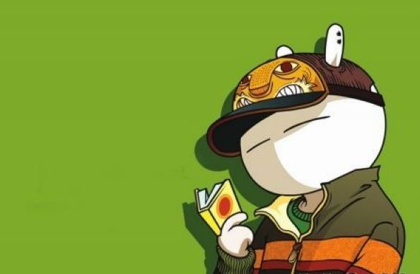

# 江湖

** **

老范写《岳阳楼记》，“居庙堂之高则忧其民；处江湖之远则忧其君”。

某家幼时觉得老范真是“古仁人”，为劳苦大众操碎了心，“是进亦忧，退亦忧”，如今某家心智渐开，长成一条葫芦屯金链汉子，顿时就看不上老范这愁眉苦脸的样子。

老范在文章最后说了一句“微斯人，吾谁与归”某家觉得老范的忧伤，大约就源于这种找不到好基友的司马牛之叹。孤独时写出来的文章才能流传千古，此乃作文之要义。老范他和中国其他数以万计的读书人一样，都自觉孑然一身，平时总爱抒发绝世而独立的感慨，却又决不敢失掉这赖以为生的清高，不上不下，真叫人为他们捉急。

江湖中人心忧庙堂，你忧的着么？你知道个屁！

从前，叔孙通给刘邦这个泥腿子制了朝仪，江湖和庙堂之间隔着一张很厚的帘子。皇帝在祭祀出游的时候坐着辇，踩一踩黄土道，在重重护卫中接受一下万民敬仰，小燕子估计在嚎出那句“大明湖畔的夏雨荷”之前就已经被射成了刺猬，庙堂神秘感重重。老农多收了三斗谷，在傍晚时候要喝两盅酒，神清气爽，唯我独尊，继而意淫庙堂的生活，“你说皇帝老儿每天都做什么呀？我要是当皇帝，就顿顿吃油货，在龙床头上支起油锅，炸果子，炸油条，炸白薯，爷不耐烦吃糙米棒子面。”

后来，江湖中人舞刀弄枪，流氓无产者翻身做了主人，茶馆里不挂“莫谈国事”的木头牌子了，缭绕的烟雾间是各种关于庙堂的小道消息，“吃着火锅唱着歌，就是要出事”。可最终，江湖还是江湖，庙堂还是庙堂。读书人的位置依旧尴尬，高级点儿的能看到各色封皮的内参，看完了赶紧站队，低级的就只能被打成“臭老九”，卷入文字狱，死无葬身之地。

偏偏读书人还有一个嗜好，就是做庙堂和江湖之间的纽带，以匡扶社稷为己任，关心民之疾苦，关键时候还要跳出来振臂一呼，结果往往发现自己被当成小傻子练了，有为名教得罪庙堂的，那叫诤谏，也有因得罪名教倒霉的，那叫二百五。“今之所谓大夫，古之所谓民贼”，李贽活着的时候说冯道的好话，乱骂孔夫子，结果死的很惨。谁曾想千年之后，批孔批林的革命小将们又把李贽挖出来捧成了法家的典型，著作还被印成了大字报广为流传。

读书人围绕在庙堂周围，本来就是件挺奇怪的事，文字是祸端，割了舌头折了笔，方有天下太平。可总有人前赴后继，想做清流，想学老范体会一下“忧谗畏讥”的快感，千年来的文官思想作祟，读书人总想凭道德文章点个翰林坐个老虎班，中国的职业政治家还未出生。

某家前些天听说一件事，说北京一名出租司机对梁晓声说，“现在的社会太糟了，不如回到从前。”梁遂问：“你知道60年饿死多少人吗？知道文革整死多少人吗？”司机答，“不过整了你们这样的知识分子。”梁晓声说，“我当时浑身发冷。在政协拍桌子争取来的那些权利，结果是为了这样的人，心里真想骂娘。”某家顿悟，这估计就是梁晓声在小说上无甚作为的缘故，屁股决定大脑，谁为谁争权利那都是谎话，那都是自作多情。王朔骂池莉，说她有一块“遮羞布”，总是从资产阶级的角度关心劳苦大众。李绅写《悯农》，“谁知盘中餐，粒粒皆辛苦”，写完了毛笔一丢，照样叫人杀三百只鸡，炒一碟鸡舌来吃。

史铁生讲过一句话，“每个人都是一部好小说，自己写完就得了。”

从此以后，对于所有企图救赎众生的人，怀有深深的不信任感。

互联网的出现无疑捅破了江湖和庙堂之间的那层处女膜。

人们广为传诵网络带来的“平等”的福利，传输信息和公开言论的成本越来越低，手写的经卷被印刷品替代之后，教皇顿时显得不再那么至高无上。一个完整的信息市场，消费的是民众歇斯底里的情绪和隐私，以自由为名的网络正在展现其阴暗的一面，这让许多人忧心忡忡。社交网络刚出现的时候，网络社会的样子就像Edmund Burke对于现实社会的描述。作为一个反社会契约论者，他将人类活动描述为依赖于地理位置的熟人间的互动。不久之后，网络城邦逐渐形成，各种活动都带上了明显的政治色彩。

江湖中人捅破了膜一看，嚯，原来皇帝老儿不吃油货，皇帝老儿吃燕窝，爷还在吃糙米棒子面呢，你们这帮贪官污吏，该死。庙堂中人捅破了膜一看，嚯，这么些污言秽语，原来劳苦大众们这么苦大仇深啊，真吓人。

沧海桑田，世事变迁，橄榄型的社会组成其实并没有太大的改变，橄榄的两端分别是高到看不见的玉帛子女和低到看不见的饥馑赤贫，中间是所谓“多数派”的江湖。Hobbes和Locke这对好基友为人性是善还是恶吵了一辈子，某家瞧着眼红心热，悄悄站到了Hobbes的身后。活着的生物在这个星球上永远在为有限的资源互相攻伐，为食物，为领土，为虚拟世界的话语权。

读书人深处其中，并无什么特别之处，但他们却总觉得自己特别。公知意领们各立山头，党同伐异，用新的宗教笼络崇拜者，从前有红灯照，小刀会，如今有民主，环保主义。江湖中人连消极权力和积极权力都没分清楚，就已经做好了为自由和信仰牺牲的准备，说不准又被谁当小傻子练了。“缺什么装什么”，信仰是一种对于未来的储蓄，江湖中人要自由民主，庙堂中人要歌舞升平，想来对于信仰还是少一些利己主义的好，丰子恺说过一个意思，自己吃素，并不觉得比不吃素的人有丝毫了不起，靠吃素和佛做生意，拿来自傲的，他耻于与之为伍。

求学的年轻人无辜横死异乡，却引来桀桀的笑声，这叫人瞠目结舌的场景逼使“有识”之人对于“乌合之众”的批判，继而是对于民主的质疑。这质疑大可不必，“国家是阶级矛盾不可调和的产物”，这是人人会背的高中思想政治考点。民主不可能解决一切问题，尤其不可能改变“感同身受”的无理性，这是两个范畴的事情。有人不能理解在烈日下拌水泥的苦，有人不能理解凌晨四点在实验室跑电泳的苦，“亲戚或余悲，他人歌已散”，人生在这世上，修自己的业，偿自己的债，不必去向别人诉说。

后现代主义者认为人不具有客观思考的能力，某家对此深信不疑，因而鲜少在网路上与他人争论。长了二十年，站队二十年，只要暴露于互联网这么一个地方，无论站在哪里，都是错的，哪怕学谭延闿做文甘草，还是要被别人骂，“操你的麻木，宁做愤怒的人，不做麻木的狗”。某家管不住别人的嘴，挡不住别人在思想和语言中操某家的妈。其实这又有什么呢，拔掉网线，那些路人甲乙丙，谁记得谁，仇恨不是贞子，它爬不出显示屏。

描写人性的作品常受人追捧，“世风日下”这四个字的考语却给的太重。

关于江湖，某家扭捏，能说的，敢说的，也只有这模模糊糊的一堆淡话，仿佛隔靴搔痒，诸君不看也罢。

阳春三月，应该拔了网线，关了手机，江湖中人吃一张烙饼，庙堂中人吃一盅佛跳墙，看一看莺飞草长，杂树生花。

然后继续互相指责，直到地老天荒。

 

（采编：董一儒；责编：佛冉）

 
