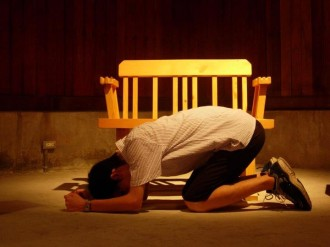

# 自信信什麼？（上）

兩年前系上聘了一個「即將」拿到博士的助理教授，這位新老師是台大學士、台大碩士、美國碩士、美國博士。人還沒來，全系學生就要瘋了，除了江湖盛傳貌美外，更重要的是，這位教授的年紀比很多博士生還小……

事隔沒幾年，竟出現新的挑戰者──新聞系的助理教授康庭瑜。任誰都沒辦法在一口氣內誦讀完她的學歷：台大法律學士、台大社會學碩士、牛津大學社會學碩士、倫敦政經學院性別研究碩士、倫敦大學皇后瑪莉學院媒體法碩士、牛津大學地理學博士。

她，現年31歲。

專訪康庭瑜的校園新聞，內附兩張如花似玉的少女照，在臉書上被轉來轉去，我從沒看過校園新聞點閱率這麼高的。（http://comm.nccu.edu.tw/02_list_detail.php?sn=690）

看看這則報導，光前言就氣勢磅礡：

「在求學的旅程上，七年可以完成什麼？

七年可以讓一個天真無憂的孩童順利讀完小學，也可以讓一個青少年在抑鬱苦悶的青春期完成國中與高中；又或者，讓大學生在延畢兩年之後，還能獲得一紙文憑……

有這麼一個人，她憑著秀異的天賦與不懈的努力，能夠在七年時間內，分別在四所一流名校，完成四個碩士學位，一個博士學位。雖未必空前絕後，但已令人瞠目結舌。

她是康庭瑜，傳播學院新進助理教授。」

讀到這裡，電腦螢幕前的15萬讀者都要跪下來，好好反省自己花了幾個七年做什麼去了？想來想去，大概只有一個結論：我們根本就是生來消耗地球資源的啊！

這種「人生勝利組」跟「表特」的組合，最讓Ptt鄉民五味雜陳了，酸也不是，不酸也不是。有人大呼：「庭瑜我愛妳！我要娶妳！（大啾啾）」也有人說：「這個用錢堆出來的無誤，幾個家庭可以這樣丟出去負擔7年。」

歸納來去，不出兩種反應：「人正真好」、「有錢真好」。

雖說尖酸刻薄是Ptt的特性，但很多時候蠻好笑的，甚至很多新詞彙都從這裡來的。然而，這種非主流智慧的累積，多半來自集體焦慮，人們舉頭艷羨鳳凰，低頭顧影自憐，除了在虛擬空間打打嘴砲，別無他法。

把不滿意的現況推給我們無力改變的，是抒發情緒最快、最直接的方式。當然也有人很理性的為她捍衛道：「給你相同的錢，鄉民也是去買PS3，你又真的念得出來嗎？」也有人分析，她利用豐厚的經濟資本累積教育資本，再回到國內複製階級差異。

康庭瑜有錢又有能力，這無庸置疑，又假設她真吃飽回來階級複製好了，也是她的選擇，我們無權要求她不這麼做。

真正強化階級差異的，其實是這則報導。它一開頭就充分流露對「量」與「速」的崇拜，這正是廣大鄉民的焦慮感來源。

報導者可以不看她的教學表現、不看她的研究貢獻，也不知其人品，就對她膜拜有加，只因為七個名校學位。那報導者尊敬的，到底是她的人，還是她的學歷？

康庭瑜滿腹經綸回來，已經是神人無誤，不太需要旁人敲鑼打鼓，但這篇報導仍為她塑造神格形象。或許康庭瑜主觀上沒有階級複製的意願，但新聞刻意營造出的樂隊花車效應，引得人們紛紛跳上車向她叩頭，司儀則在一旁吶喊：「這就叫做優秀，快拜快拜！」於是，信眾愈拜愈自卑。

當然，報導者沒有義務先去審核受訪者的人格，但通常「前言」就會為一篇文章定調，後面堆砌再多文字介紹康庭瑜的研究，都已經超過賞味期限了。

### 

### ＊ 你為什麼脆弱？

即便如此，其實我還是有些酸葡萄心理──為什麼我們都在政大，卻差那麼多……

前陣子很常在臉書貼喪氣文，另一位跟我一樣落魄的人跟我說：「我真不懂你在緊張什麼耶，明明一直都有工作接續，就算現在沒有正職，接稿也沒斷過，已經算厲害了。」他接著問我：「是不是因為你身邊的人都太優秀了？」

我把頭轉了三百六十度，看看身邊的同儕，不外乎上榜的狂喜、升官的威風、經商的有成、留學的耀眼、外派的勇猛、旅遊的壯闊、結婚的燕爾等等。

那位友人繼續說：「如果你這麼愛比，那看看我啊。」

大抵他的求職目標跟我頗像，但他贏在科班出身，所以要進哪一家公司隨他選，不像我連邊都沾不上。不過他去過幾家公司後，通通理念不合，最後只好出來自己「微創業」。不過，狀況似乎更慘了。

人們總說，比好不比壞，加上我的眼光還不夠遠，所以只跟身邊的人比。例如研究所時期，我算是書讀得蠻起勁的，也不時萌生深造的念頭。不過一加與同年紀的「強者我朋友」比，就打退堂鼓了。

強者我朋友大學畢業、當完兵後，就直接申請美國博班，目前就讀該領域全美排名第一的學校，但在這之前不小心揀了個常春藤名校碩士。假設他兩年內畢業的話，總計花七年拿了兩個碩士、一個博士。比康庭瑜少一點，但還是收穫頗豐。

不過打從他出國後，就一直嚷嚷「念超久還不能畢業」；資格考成績公布前，他自言自語「教授們正在討論該怎麼跟我說下學期不用註冊了」；甚至在104網站上看到英文家教職缺時，欣慰的手舞足蹈。

我向來都以為他是開玩笑的，人遇上挫折，總會有些言語上的小排遣，而且他絕非賤人，一點都不矯情，所以我總當他謙虛。

某次我老調重彈說他讓我很有「同儕壓力」時，他突然嚴肅起來：「玩樂上我自信心應該破表了吧，而且還是出國玩，花我爸的退休金毫不手軟……所以我唯一可以給你壓力的，大概就是敗家的程度吧……我想在這方面我有絕對優勢，你應該輸我一大截。」

接著又說道：「你真的可以想一想：研究所念五年一篇paper也沒有，這樣子真的厲害嗎？你摸著良心說一下。」

我摸著良心想了想，他似乎是認真的。

他常周遊美、加、中等地，有時候純玩樂，有時候是研討會，看起來不全然是不事生產。但對學術界來說，沒有journal paper，確實等同一事無成。

他自認是學術界追求「量」與「速」的「朝聖者＋受害者＋加害者三位一體」，還說，要玩算論文點數的遊戲，台灣玩不過美國的。

「我原本以為只有亞洲國家在算IF值，沒想到兩個星期前我的美國老闆也在跟我講這個……他說因為大家都在看，我們社科的也被逼著要開始數P還有數IF。

我能改變什麼呢？沒有。假如我真的好狗運當了教授，我也會這樣子跟我的博士生說，然後瞬間從『受害者』變成『加害者』。

而且自以為是為他好。」

任何東西，只要有辦法量化，就可以比較。聽了這一番自我揭露，我才發現他沒自信的程度，就跟我這平凡人一般。

原來，比較會讓一個人的心這麼脆弱。

### 

### ＊ 什麼都比、什麼都敗、什麼都不奇怪

其實，不能量化的，人們也要設法比較。

我們從小就習慣比較，比段考分數、比聯考成績、比考上的大學、比任職的行業、比賺到第一桶金的時間； 

接著，比誰結婚了、誰生了幾個孩子了、誰當上科長處長了、誰當上總經理了；

然後，誰的小孩在班上排第幾名了、誰的小孩考上哪所高中大學了、誰的小孩出國留學了、誰的小孩在哪間公司上班了、誰的小孩娶媳婦嫁好尪了；

最後，誰退休了、誰生病了，誰往生了……

除了這種個人層次的比較，還因為世界是平的，所以地球任一個角落都可以拿來跟另一個角落比，像是：

棒球可以排名（如自由時報報導〈棒球世界排名 台灣升第四〉，2013.3.22）

身價可以排名（如中央社報導〈富比世富豪榜 香港稱霸亞洲〉，2013.3.5）

學術可以排名（如蘋果日報報導〈全球頂尖100大學 台大進60強〉，2013.3.06）

旅遊可以排名（如中國時報報導〈台灣觀光競爭力 全球第33名〉，2013.3.23）

閱讀可以排名（如聯合影音報導〈國人1年只讀2本書 遠落後鄰國〉，2013.3.21）

美麗可以排名（如聯合報報導〈全球前50美女 章子怡登華裔最美〉，2013.3.21）

接下來，人格也可以排名了。當媒體連續幾天對著馬駙馬三跪九叩，頻頻稱頌「高」、「帥」、「富」時，我在餐廳吃著飯，放眼望去一廂盯著電視機發楞的人，彷彿全都化為一隻隻的螻蟻，被踏死也不足惜。

現在最流行的「競爭力」之說，就是把一堆很難比的東西放在一起比。通常，在國際排名中，台灣很少進入個位數，因此這座島上的人似乎都沒什麼民族自信心。加上一些縱橫全球的企業鋸子們分享其「國際經驗」，都如下這麼說。

有大銀行家附和華爾街日報道：「如果你年輕又有才華，千萬別留在台北」，他慨嘆：「你幾乎可以確定，台灣夢會變成torn dream，因為沒有建設性，因為各持己見。一個作家可以為了保護濕地請命而進入立法院，卻又因為不習慣政治生態而辭職。世界不是完美的，每個人若只做自己喜歡的事，台灣夢不會實現。」（http://www.businessweekly.com.tw/blog/article.php?id=3277&p=3）

還有一位操盤公司執行長，他說最近在上海面試了幾位「履歷滿滿是求學時期做了哪些志工、哪些校園服務」、「手上滿滿的獲得獎學金記錄與各式獎狀；大學起實習過的工作有可口可樂、哈佛商業評論以及英特爾；法學院的她還有Excel、PowerPoint、VBA專業證書」。最後他重重嘆了一口氣：「我已經深深為台灣年輕人的競爭力擔憂……別沉迷於電玩了、別費盡心思美妝打扮了，多讀點書吧！」

（https://www.facebook.com/notes/%E9%82%B1%E6%96%AF%E8%8F%AF/%E5%AF%AB%E7%B5%A6%E5%8F%B0%E7%81%A3%E5%9C%A8%E6%A0%A1%E7%94%9F/10151522552849074）

或者跳槽到北京大學的財金教授言道：「本土化對台灣的副作用，就是陷在自己的桃花源裡。」他回想幾年前在北京參加研討會時，來自麻省理工學院、芝加哥大學、史丹佛大學的學者們共聚一堂，討論如何讓專業經理人的財務訓練符合世界趨勢。但台灣教授討論的是，EMBA學程該修多少學分、哪位老師該教什麼課？最優秀的學生，畢業後只找糊口的工作。他說：「即便北京有霧霾，但空氣仍是廣闊的。」

（http://udn.com/NEWS/MAINLAND/MAI1/7801342.shtml）

類似的話語，早一點還有〈還能嘲笑大陸幾年？友達中國台幹的省思〉，以及十年前商業周刊的〈大陸勤奮潮會不會淹沒富裕台灣的下一代？〉等等。

仔細想想，上面這些人所定義的「年輕又有才華」、「競爭力」、「勤奮」、「優秀」究竟是什麼？或者，台灣的「優秀」人才，到底跑到哪裡去了？

上個月採訪一個人，北一女、台大財金系畢業，後來進入外商公司，上班地點就在一零一大樓裡。每天操作的資金，就像窗外不斷飄過的雲朵；累了，就望望雲朵下的芸芸眾生。

在準備出國留學之前，因為生性愛吃，加上外食已久，她開始思考，人活著就是要吃，但為什麼大家對食材來源都不太重視？

她分析，消費者不知市面上的蔬菜是誰種的，也分不出好壞，因此只願意用便宜的價格買；生產者如果不使用農藥、化肥，消費者也看不出來，多出的成本都要自己吸收。一旦消費者與生產者脫鉤，就很難建立安全又穩定的食材供應來源。

她想來想去，只有一個辦法──品牌。

品牌就像識別證一樣，「讓消費者願意相信，這個牌子種的可以吃、做的是安全的，當他看到這個品牌就安心。

品牌不一定來自公司，也可能來自一個農友，消費者會開始辨認，我就是要吃誰種的蘋果，不像現在因為不知道產品差異，消費者就一定要挑一斤最便宜的。」

於是，她跟幾個大學同學拋棄金融業、科技業的工作，一起創業、一起下凡到農場孵豆芽，工作瞬間從「資金密集」變成「勞力密集」。還有一位擱下已經申請到的麻省理工學院MBA。 

她們不用藥、不用土（因為台灣的土壤也都汙染了），而且新鮮到送進你家冰箱，豆芽還會繼續長。「以前你做的東西老闆不滿意，你頂多再修改一下就OK了；可是農作物是個生命，如果你不懂他，永遠都做不了朋友。」

對於過去的經歷，她也不謙虛，「我的人生太順了，以求學階段來講，年輕人最大的痛苦就是考試嘛，又或者喜歡男生啊，或是嫌自己長得不好看或胖啊，就這些。

可是我們比較幸運，雖然不是帥哥美女，但至少都長得方方正正。而且我們比較幸運，花很少的時間就知道怎麼把書讀好，所以這種東西對我們來講都不是問題。」

創業之後，經歷一堆瑣瑣碎碎的農業技術難關，這裡就不贅述了，總之她認為，種菜比賺錢難太多。

我又問：「你們算不算社會企業？」

她說：「我們成立的時候就叫做股份有限公司，倒不太會去強調社會企業。公司存在就是要賺錢，不過『要賺錢』跟『以賺錢為第一目標』是兩回事，當你以股東利益最大化、以賺錢為首要目標時，做任何事情一定考量成本跟收入的結構。

譬如做紅豆麵包，食品大廠不會管紅豆有沒有農藥、是不是天然的，他一定用最便宜的，就像打果汁的水果一定是最糟的那樣。

但如果你是真的要解決某個社會問題時，那個成本跟收入結構一定不是傳統經濟學的『最適』概念。」

我又問她創業有沒有什麼代價，她說：「代價喔，沒有吧，因為代價是指你無法預測會發生的事，但是收入變少、物質少享受一點、工作量多一點，都是原本就知道的啊。」

「至於現在這個生活型態是不是我想要的，我還不知道，只是覺得跟以前比起來，人生沒意義的時間是比較少的。但並不代表這個生活型態是無憂無慮的，每天都很快樂這樣。」

關鍵就在這，每個人對「意義」的定義不同，她們轉換跑道，除了實驗豆芽的生長方式，也實驗自己的人生。

你確實可以說她們錢賺夠了、賺膩了，但如果她們也愛環顧台大財金系同學的成就，可能就會停不下原本的金錢遊戲，趕著投資、趕著買鞋買包、趕著搶攻國外MBA、趕著當經理、趕著嫁人娶妻、趕著買房買車、趕著作育下一代菁英……最後就來不及過自己想過的生活了。 

這幾位有機豆芽的創辦人，都是七年級生（除了一位是69年次），如果拿去給大老闆們面試，應該也算稱頭了，但他們往哪裡去了？

類似的例子還很多，不管是不是讀金融的，就市面上的「競爭力」定義，像賴青松（[商業周刊報導](http://www.businessweekly.com.tw/webarticle.php?id=19680))

林以涵([經濟日報報導](http://www.udn.com/2013/2/26/NEWS/FINANCE/FIN11/7720301.shtml))的學經歷應該還算上得了檯面，且看看他們往哪裡去了？

**請期待下篇。**

(採編:Vanessa 責編:余澤霖)
