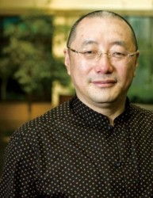

# 落花鸣剑录（二）书生无奈是多情

“书生”在中国从来都是一个特殊的群体，说他们特殊，是因为要承担责任，又要背负争议。上马杀贼，下马也要杀贼，既要能杀山中贼，也要能杀心中贼。书生谁都能做，书生谁也未必能做好。

传统的中国社会，以乡村经济为纲，城乡二元为范，在宗法族权与王法皇权的双重约束下，书生作为有知识的读书人受人尊敬，也被赋予了近似神圣的意义。一家有人考取功名那绝对是光宗耀祖的事情，而耕读传家学而优则仕也是读书人的自我期许。多少人一条路走到黑，经商是被人看不起的，所谓“斯文扫地”。义利之辨并没有错，但只逐利和不允许人逐利都是走极端，是一枚硬币的两面。不允许人逐利的“义”，难免是种枷锁，于是伪道学酸穷儒横行，缺乏商业精神，也不可能发展出契约意识。

与此同时，书生尤其是不得志的书生又成为稗官野史嘲讽的对象。所谓“书生造反，十年不成。”包括黄景仁自己，也不免喟叹书生百无一用。书生的迂腐，也许是名利羁绊，更多的是一种朝闻夕死的理想主义情怀。身为书生，在讲目的之同时也要讲手段，手段腌臜，难免让人不齿。有学有术的书生，可能成绩斐然，但多半风评受损。多少人心目中的书生，就应该是有学无术的模样。

中国的书生，不仅仅是读书做学问，更是一个高危群体。文死谏武死战自不必说，由于重文轻武文人治军的传统，“临难一死报君王”，士人难免要上马破敌下马露布。王朝覆亡，老百姓可以跟随新主子，读书人哪怕只有秀才功名，也忽然有了组织抵抗甚至以身殉国的责任。

书生和鸟一样，鸣叫是其天性，说话是其本能。书生不怕国家沦亡，我等纾难便是，书生怕的是文字狱，是不让说话的万马齐喑。就算书生放下了笔拿起了算盘，也不可能真正的在商言商，做生意永远只是手段，绝非目的。

或许书生正如萨义德所言，其宿命便是流亡，未必是去国怀乡，也可能是在不同的领域间迁跃，当流亡到来时，它或许是一场私奔。

第一篇写了我的乡党，第二篇写写我的学长。我不想过多从商业角度入手，去描述他们事业的成败，更想诉说他们的故事，我不希望把他们写成财富英雄，他们只是大时代中有鲜活特点的人，比起众人眼里的成功，他们也有许多常人一样的烦恼和缺憾。

第一次听说王功权这个名字是我大二那年，我们学院的团委书记送给我一本《庶之诗选》，书记告诉我这是我们学院一位很出色的毕业生的自选诗集，因为我喜欢诗词，所以送我一本。当时我对王毫无概念，对万通也无甚了解。坦率的说，我一直不是一名合格的商科学生，我对财富传奇不感兴趣，也不关注商业模式，与其让我看充斥着成功学气息的财富英雄传记，我更喜欢就二两酒来半斤猪头肉，诌几句歪诗。他的诗的确比校报上某些“前年神五刚落地，今年神六又腾空。”之类的名句出彩，但也不过尔尔，只是现代人都写不好旧诗了，于是就显了出来。那段时间我喜欢陈散原，他的诗选翻了两次，就扔到一边去了。

大约一年之后，我们有门系主任的课，当年这位系主任和王功权是室友，人嘛总喜欢说一些“我一朋友”、“我一同学”的故事，他上课总说王功权。后来有次吃饭，系主任说我性格和他有些相似，不喜欢被规矩束缚，不按常理出牌，经常想到哪干到哪，但骨子里还是有很强烈的温情和不忍人之心。这时，我才对他感兴趣，找了很多他的资料，也问过当年人他的故事。王功权的父亲是小学老师，他的父亲是一个朴实的普通知识分子，正直而严谨，不投机取巧，也不阿谀奉承，做事凭良心。虽然对无神论有自己的坚持，王父对王功权的思想却也颇能包容，有争论，却不横加干涉。

人有了点成绩之后，会莫名其妙多出很多故事和传说。本校区有很多王的传闻，也未经王本人验证。我听说的事情是王功权上学时候不算是个成绩拔尖的学生，但绝对是小圈子里的核心，他对时局都有自己的理解。八十年代初中期的大学生，风行的是尼采和萨特，王功权也参与过这样的讨论，但并不热衷。他“总是有自己的想法”，似乎在周边人眼中，王是个若即若离，能融入圈子却又保持一定距离的人。

在商界，王的名头自是不小，但凡从业人士包括进行相关研究的学者，没有不知道他的。但这位“万通六君子”中的大哥近些年似乎一直不显山不露水，比起当年的小兄弟冯仑、潘石屹，知名度要小了许多。真正让其进入更多公众视野的，是2011年的私奔事件。那一年，王功权发了条微博，高调宣布自己私奔了，一时间“私奔体”风行。

我无意臧否我这位学长的私生活，但就此还是可以说一说。在这个功利时代，当某个有钱人或有权人兼而有些文艺范，会吟几句古诗，他的很多行为，以至于许多在普罗大众看来很了不得的东西，便会在古典文学所特有的夸张性叙事中被弃如敝屣。王师兄的行为，我实在不认为风流。放弃一切，可以是不为世俗和物质所羁绊，追寻心灵和精神的自由，也可以是撂挑子，拒绝履行责任和义务。王功权私奔后二度发布微博称“被大家谩骂谴责致身败名裂，我无所谓”，但就他玩“消失”给鼎晖投资造成的不良影响以及引发的委托代理真空，他的“无所谓”显得过于托大。我当然无法赞同对王师兄的个人行为横加道德审判，上纲上线，但我也无法苟同将其拔高，视之为真爱楷模、名士风流。

对这桩公案，一些了解他的人并不感到奇怪。我想，这是因为王功权是一个有名的性情中人，私奔于他，如雪夜访戴，乘兴而来，兴尽而归。他之所以私奔，更多的出于那种多情的侠气，即所谓大哥气质。这种侠气，在万通草创之时闪光过，在分道扬镳互道珍重之后闪光过，在数年风投中也闪光过。

1988年春天，27岁的王功权离开吉林省委机关宣传部，选择“下海”。一个体制内的小公务员按部就班的人生故事宣告结束，他是吉林省改革开放以来正式辞去职务的第一人。此后，在那个象征着权力、年轻人光鲜仕途的大院里，再也看不到王的身影。究其原因，多数人认为，那是风起云涌的几年，神州大地仿佛处处是机会，所以王也是去找寻机会。那时节，一夜之间，无数人南下，与其说是全民创业浪潮，不如说是一窝蜂的投机。那个时代，是李经纬和他的“东方魔水”、褚时健和他的红塔神话的时代，还没有聚到一起的“万通六君子”，不过是无名小卒。我并不完全赞成王是去找机会发财的观点，王功权的性格，在体制内尤其是最讲政治的宣传口，尤不适合，他自己也不舒坦，不论有没有海南“淘金热”，王最终都会辞职，以他的脾气，是不可能在体制内默而生进而蹭蹬一辈子的。

那时候的王功权，读了很多书，比如马克斯韦伯的《新教伦理与资本主义》以及影响了一代青年的《走向世界》丛书。有着非常强的分析和思考能力的王功权，26岁那年就动笔写出了他自己的《中国社会各阶层分析》，提出中国的权力阶层将分化成官僚权力阶层和富民阶层。但在那个年代，在他的职场，他写的东西被视为不合时宜的存在。在那些关心中国命运的人心中，无论是做生意，还是做学问，都要为国家服务、为民族奉献，每个有点知识的中国人，可能对中国问题，都有自己的药方。中国向何处去？这个问题困扰了一代又一代人。同样以《中国向何处去？》为题写作，并因此被判刑的人有两位，一位是伟大的经济学家杨小凯，另一位就是当过王功权老板的南德狂人牟其中。

王功权在海南两年，小有建树。1990年3月，王功权经冯仑介绍，进入牟其中的南德集团，王功权由业务经理一直升到南德集团天津投资公司副总经理。但一年之后，王功权与冯仑一同退出南德，重新回到海南。其间的原委我们不得而知，但可以肯定，以王冯二人之眼力，对牟其中的过于大胆想必是有所警惕。回到海南之后，王功权曾考虑找个学校教书算了。此时，冯仑找到王功权，希望王能与其他几人共同创办一家新公司。出于兄弟情义，王功权和冯仑、王启富、易小迪、刘军、潘石屹六个人凑了三万块钱，搞了个公司——海南农业高科技投资公司，这就是万通之前身。

一度，冯仑和王功权“空手套白狼”，作为谈判高手，王功权干成过这样一笔生意，建议人合作，万通出1300万，合作方出500万，合作方信以为真，出了500万，随即冯王二人拿这500万又从银行贷了1300万。通过炒地皮，万通很快赚到了3000万以上。“实际点说，我们是当时泡沫经济的一个受益者，”王功权如是说，“连当时给我们做饭的小女孩炒房地产都赚到了200万元。”那是个疯狂的时代，仿佛纸可成金，只是一朝风起，多少人倾家荡产，我们不禁佩服万通的眼光，及时从海南泡沫中抽身。

1995年，万通集团通过迅速的发展已达到48亿元的规模，万通集团亦发展到了一个高点。在万通最初创业时，6个人股份均等，没哪个人有最终决定权，而6个人不同的性格和价値观致使分手不可避免。1995年，“六君子”分家。之后王去了斯坦福，在那里接受了风投理念。不论怎么说，在无数兄弟裂穴甚至祸起萧墙的商业界，“万通六君子”还算和平的分手，之后还能保持私交，已属难得。

当初的选择决定了王只能以商业为职业，去当一个商人，而在商业当中，以王功权的性格，实业他已不会选择，倒是自由度较大的风投更得其欢心。至少，他可以选择自己的投资对象，也不用被社交圈过多的牵扯精力。王功权和以他为代表的鼎晖，成功案例有很多无需赘言，比如互联网独狼周鸿祎和他的360，首笔投资便来自鼎晖。在中国这样一个官本位社会里做创业也好、做风投也好，政策往往是最大的市场机会，不知道出身于体制内的王功权，对这一点又作何感想呢？

王功权说过希望有一天能退出投资业，专心从事诗词创作，我相信此言是他的心声。王功权在商界是一个异类，少了点冷血，多了些感情用事。王功权的性格，在中国社会，很容易被边缘化，所谓儒以文乱法，侠以武犯禁，儒与侠，都是被严密监控的群体。作为知识分子，王喜欢说话，还总说一些人不爱听的话；作为江湖大佬，王行不由径，不遵常理，不循常情。归根结底，他还是一名心底滚烫的书生。

对于我的这位师兄准确说该是师叔的王功权先生，他并不喜欢商人这个身份，众所周知，相比商人，他更喜欢当个诗人。但即使他不愿意，想必也无法否认的一点是：江湖所承认的，不是诗人王功权，依旧是商人王功权。

（采编：孙晓天，责编：佛冉）

[落花鸣剑录（一）瓜子大王傻子](/archives/38935)
