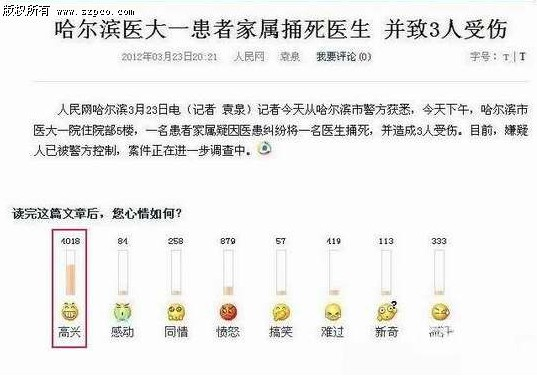
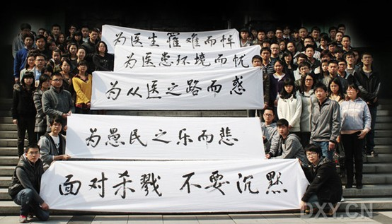

# ＜七星说法＞第二十一期：医事关系诸多法律问题探讨 （下）

**本期导读：要说这个星期里，最为震惊中国的事情，哈尔滨医生遭弑无疑可以算上。这一让人大骇的事件，将我国潜伏多时的医患关系的紧张状况赤裸裸的展示在了世人面前。对于医患关系之间众多的法律问题的探讨也随之被摆上了台面。因此本期的说法，从一个医科生的视角出发，对这一在中国已经存在多年，且大有愈演愈烈之势的问题——医患关系，展开讨论。**  

# ＜七星说法＞第二十一期：

# 医事关系诸多法律问题探讨 （下）

## 文/刘步筑（北京大学）

（编者按：本期的说法，采稿自北京大学刘步筑同学的文章[《医事关系诸多法律问题探讨》](http://blog.renren.com/blog/248926174/763957687)，文章篇幅对于说法而言，十分巨大，达一万两千字有余。因此在征得刘步筑同学同意的前提下，我们将文章稍加修改，分为两部分于本期内全文放出。望各位读者能不厌其长，也望各位读者在坚持不懈的读完此长文后，能真正有所收获。） 

**总启**

共和国历史上，医患纠纷偶有发生，但频率较低，性质也不如今日这般严重。虽有纠纷但往往不会影响到医院正常的医疗工作，人们当然也不会给予过多的关注。近年来，国内医患纠纷呈现高发态势。本世纪初，其经年数量曾经指数级增长，目前每年的医患纠纷形成诉讼的数量约以10%-20%的速度增长着。以北京为例，2004年，北京市各级法院受理的一审医疗损害赔偿纠纷案件678件，2006年为862件，2008年则上升到1020件，近两年的情况并未找到相应数据，但依当年西城区受理医疗案件的数量来看，2009年（前十月198例，估计全年225-230例之间）比2008年（171例）增长的幅度超过了20%。经观察，外省市的案例数量除少数省份之外，均呈较稳定增长态势。 

目前，医患纠纷演变成冲突的案例如月经一般呈现在网络上，每个月大概都会有患者与医院发生带有人身伤害性质的暴力冲突，医生遭受轻重伤的现象频频发生，这间接导致了去年夏天在南昌市第一医院一场黑社会性质的医闹遭遇了黑社会性质的医院武装抵抗的人间喜剧。另一方面，媒体报导的医疗事件也愈发耸人听闻，从“等我下班再死”到“医跑跑”，从“八毛钱的手术”到“坐视上吊”，媒体不恰当的大肆渲染和煽风点火造成了民间对于医疗行业的高度不信任，有些患者对医生的一言一行都保持了警惕或挑剔的态度。举个例子，有个大夫开处方时，问“自费还是医保”，患者立马回复一句“怎么？想给我开贵的药么？”将医生置于何等尴尬的境地。 

这样的医疗条件下，医生的困境不仅仅是收入不高这样一个问题了，除面临高赔偿风险之外，人身安全同样得不到保障，在从医环境不断恶化的时候，从医疗行业跳出去，甚至在医学院校学习阶段便向其他专业靠拢，中国就医环境还会变好？当稳定从事医疗事业的群体不复存在时，受害者将会是谁，其道理不言自明。 

这篇文章的目的不是对现存的一切医患纠纷的问题做一个“解决之道”的描绘，因为医疗行业相比其他更加错综复杂，无论从经济上、政策上还是法律上都很难“一言以蔽之”。关于其他一些重大问题，比如医疗系统是否应该完全市场化，医疗保险是否应该完全市场化，我都持有一定意见，这里就不展开了。我这篇文章侧重讲解医患纠纷的诸多法律问题。 

**知情选择权？**

在法制化不断增强的今天，患者的知情选择权已经被提到了相当的高度，在诉讼中几乎每个患者都会提出医院侵犯了知情权选择权的理由。从法学理论上讲，知情权、选择权的地位确实很高，然而我们决不能因此而忽视医学的特性，有时面临病患的安全问题、甚至生命问题时，知情选择权是否应当作出适当让位？ 

以右下腹手术为例。在右下腹部，最常见因症状极类似而容易混淆的疾病有三种：阑尾炎、麦克尔氏憩室炎、回盲肿瘤。一位患者因术前拟诊为阑尾炎，行阑尾切除术，但是探查阑尾时，医生发现回盲部有肿瘤性包块。从患者安全的角度讲，应对病变确诊后同时切除；按知情选择的原则，需要向患者或家属交待清楚。在短时间内或许家属难以作出决定，是任由伤口暴露在空气中渗血、脱水，或者先完成阑尾切除术行缝合，再将选择权抛给患者，还是按照医学的原则跳过患者的知情同意权直接行以切除？由于家属迟迟不能决定，医院只能先行缝合，而确认之时由于处于腹腔粘连的高发期，也不宜进行手术。此时因确认诊断，在医学心理学上讲，诊断为癌症（或其他绝症）的患者大都在经历心里否认期，其心态也不宜手术，于是再往后拖一拖，一期肿瘤变成了二期。医生面对这样的情况，他的良心、他的职业操守很明显就是跟尊重患方知情选择权相悖的。这个案例中，在手术当时，将一期肿瘤直接切除并做适当处理防止粘连，是件非常容易的事，但是既然某些人要强调知情选择权，就硬生生地把这个一期肿瘤强调成了二期肿瘤。 

相似的例子有很多，如皮肤上的变硬变大变粗糙的黑痣，很可能是黑色素瘤的前兆。这是如果医生采取治疗就侵犯了患者知情选择权，如果以知情选择权为重，只是提醒患者发病的可能，而患者可能很不以为然“我身边谁不长颗痣”，而失去了治疗的时机。或者有些意识不清的危重患者，家人提出要出院放弃治疗，但是危重患者本身往往是有强烈的求生意识的，你是以家人的选择权为重，还是以职业的良心为重？再举个例子，如果医生在火车上见一个小孩误吸导致窒息，而没有相应的医疗器械，只有水果刀。医生是及时从患儿的还甲膜刺入，制造气管瘘保证呼吸，还是先跟家长解释一通，你这个孩子啊，它得呼吸畅通，要割开喉咙，以后还可能感染，创伤也可能留疤痕。等他们知情了，权衡了，孩子也不用救了。再如，一个中年女性因子宫肌瘤做子宫切除术，发现其一侧卵巢重大，很可能发生卵巢肿瘤，你是直接给摘除还是等她醒来同意再说？ 

这些例子只是为了说明，人的权利有主次，有先后。在医疗过程中，最重要的，也是医疗行为的根本目的，就是患者的生命权、健康权。在适当的时候，所谓知情选择权，有必要让位于上位的生命权、健康权，这也是医疗行为的意义所在。在对待医学问题上，患者应该相信医生，即便患者未享受到知情同意权，只要没有出现损害实体权利的情况，是应该给予支持和尊重的。同样，如果医患纠纷涉及到知情选择权，在司法审判中，如果法官不考虑具体医疗行为的成因以及医学的特殊性，一味强调下位权利，医务人员干脆不要有什么职业道德和伦理了。 

**从“公平原则”谈起，谈谈卫生行政部门的不作为**

在2002年《医疗事故处理条例》（下称《条例》）颁布之前，法院处理医患诉讼时标准不一，用法混乱尚可理解。在《条例》出台之后，在审判时仍有大量法院用法混乱。由于《民法通则》第132条规定“当事人对造成损害没有过错的，可根据实际情况，由当事人分担民事责任”，这一条被广泛运动到了医事诉讼之中。举个例子，03年的案例，某患者用药产生过敏性休克，医务人员给予及时抗过敏、输氧、缓解休克的抢救措施，但抢救无效，患者死亡。经县市两级医疗事故鉴定均认定患者的过敏系因特殊体质受损，医院诊疗过程符合要求，不存在过错行为。家属不服，向法院起诉。法院判决书是这样的“被告所采取的医疗措施未违规，符合常规。患者抢救无效死亡属于个体差异，因此双方均无过错。根据《民法通则》中的公平原则，被告向原告给予适当的经济补偿”。 

类似的案例举不胜举，客观上经济补偿让医闹的数量和程度减少减轻，一定程度上起到了维护社会稳定的效果。但是这涉及法院判决直接引用《民法通则》是否适当的问题。我们知道，虽然《民法通则》是《条例》的上位法，在发生冲突时应当服从《民法通则》。但是二者未发生冲突时，特别法优于一般法，故此案应以《条例》为依据。从医学的特殊性上讲，医学诊疗具有一定风险性，因为医学不可能穷尽所有的特殊现象，无论治疗方法或药物，都存在着潜在风险。倘若以公平原则来归责，无异于否定了医疗行为的风险性，将医疗行为等同于一般民事行为。在双方都没有过错的情况下，各打五十大板既缺乏法律依据，又显失公平。试想如果法院将所有未查清原因又不可避免的不良后果全部半数归责于医院，恐怕所有医疗瑕疵甚至单纯不能使患方满意的行为都会演变为医事诉讼，医院干脆关门大吉算了。 

从上述这个案例我们看一看适用法律以及部门管辖的问题。这里所讨论的管辖不是民事诉讼意义上的管辖，而是人民法院与行政部门谁掌握初始管辖权。一场交通事故发生后，必须首先经过交警部门事故科立案处理，当事人对处理不服方才提起诉讼，进入审判程序。在民航、铁路、邮政等领域的事故处理中，没听说有哪个审判机关只强调《民法通则》，而不依据专门性法规。为什么在这些领域里不存在因为法规的效力低于《民法通则》而应视为无效的问题呢？为什么最高法对公路、铁路、航空等赔偿的处理，从未做过什么“应当同时依照《民法通则》和公路、铁路、航空事故的《处理办法》或《赔偿规定》进行处理”的解释呢？为什么唯独医患纠纷案件独享此“殊荣”呢？ 

回过头来看，卫生部门本身在行使对医患纠纷的行政职能时，常常有太多的不作为。依《条例》规定，卫生行政部门是唯一有权处理医患纠纷的行政执法机关。但是一旦发生医患纠纷，患方告到主管的卫生行政部门时，往往很难立案。这倒不是部门保护主义，卫生行政部门不予立案的理由是：这并非医疗事故，没有理由立案。实际上在建国后中国一直将对医疗过错责任的赔偿定位在已构成医疗事故这一范围内，这是由于医疗行为既是一项风险性很大的职务行为，又是一项复杂的高科技活动，还要考虑其社会的公益性与福利性。但是卫生行政部门的不立案理由并不成立，只能说在绝大多数情况下，卫生行政部门作出了正确的判断。至于是否成立医疗事故，未经鉴定而只做初步估量，加之患方对医学的无知，很难劝说使其放弃追究医方的责任。这时，审判机关填补了由于卫生行政部门的不作为造成的真空状态。 

在少量卫生行政部门对医患纠纷行使处理权的案例中，一般有三种结果：1.结论“不属事故”，便不做处理了。这很明显是错误的；2.结论“属事故”，若司法机关已立案，消极不处理。为什么消极处理呢？因为卫生行政部门认为，司法机关已立案，后者会做出处理，我们不必处理。3.只给出鉴定结论，干脆不处理。是因为最高法曾规定，只有鉴定结论，没有处理结果是不能向法院起诉的。而一旦给出处理结果，患方八成会不服，这样可以将卫生行政部门当被告提起行政诉讼。无论哪种情况，最终均使属于自己行政管辖的事件拱手让给审判机关，是非常严重的失职行为！ 

这些情况归根结底是因为卫生行政部门不想当被告。看1988卫生部下发的《关于若干问题的说明》，规定“病员方面不服鉴定结论或处理，应诉对象为当事的医疗单位，卫生行政部门和医疗事故鉴定委员会一般不作应诉对象”。这个规定是既违法，又无理。对鉴定不服的起诉，对象只能是鉴定单位；对行政机关处理结果不服的，职能起诉作出处理决定的行政机关。你卫生行政部门和鉴定结论作出机构缩卵了，叫既不是鉴定部门又不是行政机关的医院顶着，算是个什么事？再者，行政诉讼主要是对违法的行政行为实施司法监督，卫生部门如果合法作出处理决定，审判机关裁决你的决定合法，驳回上诉了事；但是一旦你卫生部门放权，患者启动了民事程序，那么审判程序中法院完全可以不给卫生部门任何诉讼地位，案件的实体部分直接改判掉。 

卫生部门本应享有行政解释权，由于社会上对卫生部门、医疗部门的非议颇多，在处理医事纠纷等重大原则性问题上，卫生部门极少行使行政解释职能，反倒是最高法的司法解释颇为活跃。结果就出来了“应当同时依照《民法通则》和《条例》进行处理”的荒唐司法解释。 

**“举证倒置”的异议**

举证责任倒置这一规则源于最高院2001年12月21日出台的《关于民事诉讼证据的若干规定》的司法解释（下称《证据规定》）。该解释第四条规定如下8类案件由侵权方承担举证责任：(一)新产品制造方法发明专利(二)高危作业致害(三)环境污染(四)建筑物或者其他设施以及建筑物上的搁置物、悬挂物发生倒塌、脱落、坠落致人损害(五)饲养动物致人损害(六)因缺陷产品致人损害(七)因共同危险行为致人损害(八)因医疗行为引起的侵权诉讼，由医疗机构就医疗行为与损害结果之间不存在因果关系及不存在医疗过错承担举证责任。其中前五类案件在92年民诉法解释即给出，后三类为新增。 

在医患纠纷实行举证倒置的逻辑是由于医学专业性极强，原告缺乏应有的医学知识和医学信息，让患者掌握其在治疗中的文献资料及治疗方案的理论依据是一件很难的事。从立法原则上讲，举证责任分配是价值的取向，这里面的价值包括了维护社会稳定性、诚实信用和特殊领域的支配能力三条。从“维稳”的角度来讲，由于之前的案例中，患方没有能力举证，甚至无从下手，往往因证据不足而败诉，便失去了对解决问题正当途径的信心，转而走向“私力救济”的极端道路，酿成恶劣的医闹事件。从特殊领域的支配能力来说，如果医院更了解情况，更接近证据，如果医院无法举证，则患方更加无法举证。至此立法者认为由医方自己证明医疗行为的正确性对医生和患者来说都是相对公平。 

笔者对于举证倒置这一过错责任的制度整体上是持否定态度的，理由如下。 

一、《证据规定》中的八类案件，前七类除第五类之外，有一个共同特点，即行为人为了自身的利益而侵犯他人的利益。医疗行为与前几项颇为不同，因为医患关系中，医生们并不是为了自身的利益才去治病救人，而是由于患者发出求救的信号之后便与之呼应的职业操守。上文中已经说到，医疗行为不等同于商业行为，而是具有公益性的社会福利事业，是救死扶伤的人道主义行为。举证责任倒置的提出，实际上意味着医生伸出援手的一刹那，实施救死扶伤的人道主义行为之时，便已经被这个司法解释认定为“有过错的”、“违法”的，经充分的事实方才能够证明自己的行为没有过错，没有违法。至此，救助行为的一方方才胜诉，才可以免责，否则要向被救助者赔付。这是什么道理！ 

二、有人说增加举证倒置的几种情况是与国际接轨的。但是你翻遍全球的法律就会发现，无论大陆法系还是英美法系，只要不是社会主义法系，都适用“专家举证”而非举证倒置，唯独中国的法律是独一份的。 专家举证又称委托举证或嫁接举证，是指对于某些科学性、专业性较强的案件，由原告或原告申请法院指定具有专业性知识的专家进行举证。中国有法定鉴定机构鉴定的详细规定，非经专家举证或由法定鉴定机构鉴定，不得认定医方有过错（和刑诉法第十二条很像有木有）。 

三、立法者之所以如此立法，其逻辑是“患方没有能力举证，甚至无从下手”，他们在拿到病例材料与损害结果证明之后没有做出其是否属因果联系的判断能力。在国外，按照“患方没有能力举证，甚至无从下手”的思路走下去，便是患方要花钱请一个好的律师，帮你把存在因果关系的证据找出来。为什么这种情况在中国就走不顶用了呢？很简单，因为医患纠纷中，中低收入者介入居多（有若干调查为证）。党政干部、富商名企、“先富起来”的个体经营户，都有财力享受较为优质的医疗服务，并且医疗服务者更易于主动向这部分人倾斜。加之经济水平低的患者往往对医务费用的承受力比较弱，而上文已提到，医患纠纷的导火索往往是经济原因。中低收入者的知识水平普遍较低，医学知识上白板的占绝绝绝大多数，又无力高薪聘请对医学有所掌握的律师。立法者考虑到这个因素，于是在举证责任倒置中把医疗行为致损这一项加了进去。 

四、举证倒置有违客观与事实。由于患者在医院的过程少则十几分钟，多则若干天，住院的时间普遍也在三个月之内。医生仅仅通过对患者十几分钟或者几天、一个月的外在观察，怎么可能比患者对于自身疾病的切身了解与感受更具举证优势？医生只能从患者的陈述中获取信息，从而决定治疗方案。如果患者在诊疗期间没有提供准确地信息，作出不真实的描述，对性病、遗传病、家族史等刻意隐瞒，医生从何而知患者的病情，又如何做出正确的判断，提供合理的治疗方案？ 有一个案例，讲的是一个母亲带着孩子看病，说孩子中毒。医生检查后开了瓶抗生素并将孩子治愈。一年后，母亲状告医院一年前使用抗生素致孩子耳聋。其实这个孩子患先天耳聋，就诊时母亲瞒报病情，并且因为听力并非急诊检查项目。结果医院因“对使用抗生素与致聋之间不存在因果关系”举证无能而败诉。 

五、“因为患者不懂医”？按照这个逻辑，因为某原告不懂法，他要是告一个当律师被告，要不要被告负举证责任？因为某原告是文盲，他要告一个当教授的被告，诉讼文书是不是该由对方写？反过来说，如果患者是医生，因在医院诊疗时的致损去告医院，是不是要适合“谁主张，谁举证”的一般规定？还是也适合举证倒置的规定？ 

“因为医院保管病案”？如果这可以成立，那么如果医患诉讼涉及医院保管的住院病案，应由医院方面举证；但是如果诉讼中涉及患者保管的门诊病历，是否应当由患者方面举证？还有，02年的《条例》的第十条规定了患者有权复制病案资料和信息，那么如果患者掌握了复印件，是否负有和医院等同的举证义务？（全文完） 

**后记**

这篇文章写作其实没有什么顺序的规律可言，想到哪里写到哪里，最后拼接起来成了这样一个文章，草草做了些修改，可以说非常不成熟。在写作过程中，我参考了三本医事诉讼的案例书，和一本医患纠纷的理论著作《医患纠纷预防处理学》，可以说这篇文章的素材均出自上述材料。 

本文重要的数据经各种查证基本属实，而论点有论著所提到的，有透视到的，也有我个人提出的，总体来讲我作为一个医学生，是偏向医方的。但这种偏向并非出于情感上的偏向，有些人写文章描述医学生的学习过程多苦。我个人认为，论述一个东西最基本的是摆事实讲道理通过逻辑使人信服，但是有些话题一经提及，便难以搁笔，于是形成了这篇一万多字的长文。 

由于时间原因我并未将这篇文章的重点圈出，并且全篇尽是枯燥的文字，无图无真相，在此表示歉意。希望有兴趣的同学可以看完。 

特别感谢刘雨晴同学、蒋义趋师兄的指正意见。 

**深度阅读**  教授谈哈尔滨医生被杀：应将医院纳入安保重点 [http://health.people.com.cn/h/2012/0328/c226951-1809588524.html](http://health.people.com.cn/h/2012/0328/c226951-1809588524.html) 哈医大实习医生被杀 院方称与医患纠纷无关 [http://www.chinanews.com/shipin/2012/03-26/news62568.shtml](http://www.chinanews.com/shipin/2012/03-26/news62568.shtml) 白岩松谈哈医大一院医生被杀事件：我们也或是“凶手” [http://xinwen.qqyy.com/a/120327/7cb1.html](http://xinwen.qqyy.com/a/120327/7cb1.html) 卫生部长谈哈尔滨医生被杀事件 要求严惩凶手 [http://news.qq.com/a/20120327/001112.htm](http://news.qq.com/a/20120327/001112.htm) 6成民众对哈医大杀医案“高兴” [http://t.sohu.com/huati/9605](http://t.sohu.com/huati/9605) 大国医改很成功，哈尔滨医生被杀要淡定 [http://www.tianya.cn/publicforum/content/free/1/2452049.shtml](http://www.tianya.cn/publicforum/content/free/1/2452049.shtml) 杀医生肯定是错的 医生行业也确实要反省下 [http://bbs.news.163.com/bbs/society/245808198,3.html](http://bbs.news.163.com/bbs/society/245808198,3.html) 哈尔滨患者砍死医生反映出社会服务机构缺陷 [http://blog.sina.com.cn/s/blog_6603226501013wwx.html](http://blog.sina.com.cn/s/blog_6603226501013wwx.html) 面对医生被杀惨案 有种高兴叫没人性 [http://info.china.alibaba.com/news/detail/v0-d1025111610.html](http://info.china.alibaba.com/news/detail/v0-d1025111610.html)   

（编辑：苏扬，纳兰辰瀚）

 
