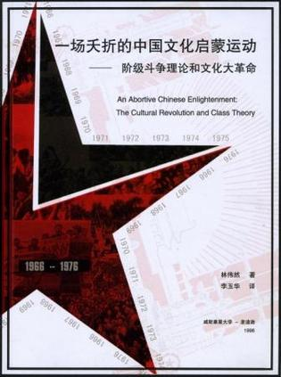
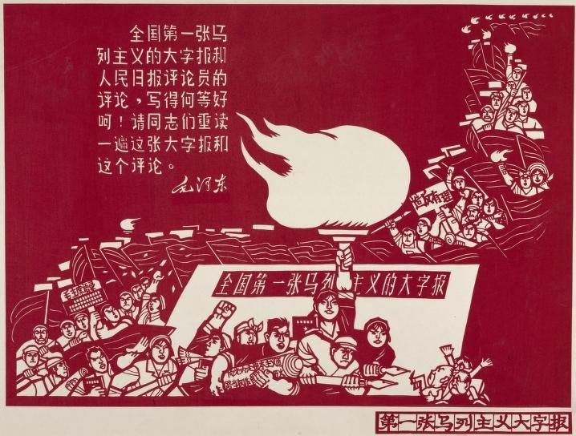
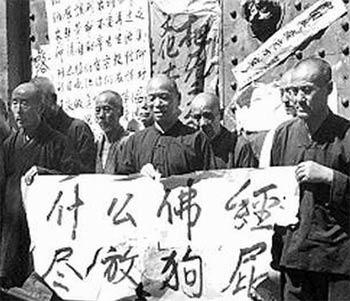

# ＜北斗荐书＞本期主题：“启蒙的文革”：一个造反派对革命理论与运动关系的辩说

**当代中国在后文革时期所进行了一系列改革不断遭到这样或那样的失败，正是由于既乏向外借鉴现代政治文明制度的勇气，又无向内汲取历史和传统文化资源的能力，这才是文化大革命对当代中国社会发展所造成的恶劣影响，而非像林伟然先生所说的那样，文化大革命的悲剧在于通过遗弃毛泽东思想而放弃了追求一个理想社会的希望。**  

# “启蒙的文革”：

# 一个造反派对革命理论与运动关系的辩说

## 荐书人/谷卿（暨南大学）

 

这是一本我与作者的主要论点完全相异但仍以为是值得推荐的书。《一场夭折的中国文化启蒙运动——阶级斗争理论和文化大革命》，作者林伟然作为上世纪那场浩劫的亲身经历者与参与者，坚持认为文化大革命的实质是一场思想意识形态的革命，文革直接引发了中国自从七十年代末开始的一系列社会变革，而“文化大革命夭折的后果构成了中国未来最大的社会危机”。

这本对极权理论和公民社会理论提出直接挑战的专著是林伟然先生在美国威斯康星大学（麦迪逊）历史系随林毓生先生攻读博士学位期间撰写的论文。在获得博士学位后不久，林伟然先生就因癌症病发去世，我们现在能够看到的中译本是由作者遗孀李玉华女士所翻译的，除前言和译后记外，主要内容分为六章：作者首先介绍了思想意识形态在社会主义中国所担当的特别角色，再将文革以前和文革早期、晚期及文革结束后等不同时期阶级斗争理论的发展变化进行了详细的梳理与论述，最终提出核心观点即文革是“一场流产的思想文化启蒙运动”。

林伟然先生在开篇就提出一系列问题，引出大家对文革本质的思考，然后明确地提出以阶级斗争理论作为讨论的焦点，研究的重点“集中在人民群众对这一理论的理解和应用方面，而不是这一理论本身的起源和含义”。他否定了文革的起源和本质是权力之争的观点，否定了着重点放在派性斗争之上的研究方法，详细地分析了社会冲突理论的缺陷，指出存在分歧的派系的分野在于对权威思想理论的接受与否及程度大小。在林伟然先生看来，“由于不重视思想理论的作用，社会冲突理论持有者实际上把文化大革命描述成本质上是不同社会阶层出自于各自不同的利益所进行的一场争斗”；“这场运动本身隐盖了他最重要的方面，思想理论的冲突和变化”。通过对文革前后及文革期间造反派和保守派队伍构成、指导思想、实际冲突等方面变化的分析，林伟然先生引出了其论著的主要观点：“权威的思想理论在文化大革命的整个过程中，经历了根本的转变。这些转变在群众中引起了严重的冲突。群众里受文化大革命前盛行的强调阶级划分思想理论影响最深的人，比较难于接受这些思想理论的新转变，从而成为保守派。群众中对重新定义和强调社会主义社会制度下不平等思想理论感兴趣的人，形成了当时的造反派。这样一来，在划分造反派和保守派之间形成的阶级阵线，也可以在不同偏向的思想理论里表现出来。因此，文化大革命期间群众中不同派别的冲突，很明显地不是社会冲突，而是思想理论上的冲突。”

不得不说，林伟然先生的观察角度十分特别，他也能够从复杂的现象中抓住影响其至深的思想理论本质。他对于思想意识形态的高度敏感和关注使得他将文化大革命清晰地分出若干阶段，并声称直接把握住了这场运动的灵魂而非记载这一运动的实际经过。但是，在论述的过程中，林伟然先生显然过于强调了他关注的那一部分问题，而忽视了许多不该忽视的问题。

在第二章中，林伟然先生选取了文革前的《中国青年》杂志为主要研究对象，发现了阶级斗争理论在1956年以后被再度提上国家政治生活重要议题的必然性。在此，他对1956年到1957年间阶级斗争理论的变化和实际社会影响作了细致的分析和阐述，阶级斗争本来在1956年中共八大以后已经被认为基本结束，但由于中共的领导地位和威信受到威胁（新时期历史任务的转变要求领导核心或领导方式必须改变），他们遂再度抬出阶级斗争理论，于此寻求庇护。在这样的背景下，思想意识形态的讨论逐渐成为一种政治行为，因为共产党权力的增强本来就来自于思想意识形态而非法律和制度。但是，林伟然先生在这里将阶级斗争理论的强化视为一种对生产发展产生积极影响的重大推动力：“阶级斗争理论的重提和强化，为引用和应用新技术和新方法提供了一个良好的环境”；“阶级斗争理论在加强集体经济和支持独立经济政策中所起的作用是非常明显的”；“阶级斗争理论的重提和教育，在中国能取得这些辉煌成就，使理想变为现实起了重要作用”。林伟然先生将这一时期的计划经济称之为“精神激励”经济，透过一系列的数值来臆想经济效益，为当时“超过任何国家”的工业化速度大唱赞歌，这实在是令人感到有些摸不着头脑。

在以文革早期作为时间背景进行讨论的时候，林伟然先生认识到了阶级斗争的内涵从思想到政治的过渡和转变，指出“对阶级斗争的注意力从思想意识形态战线转移到政治战线是形成文化大革命的最重要的第一步”；“人们不再认为阶级斗争如他们在旧阶级斗争理论的影响下所认识的，主要是精神道德上的自我修养。相反，人民被要求以真正的政治观点去看待阶级斗争。因而，在人民的心目中阶级斗争从一种抽象的观念变成了一种有形的实体，从过去、现在到将来，从看不见到看得见。这种变化大大地强化了当时的政治气氛。”面对当时这样全民政治、生活政治化的极端压抑的社会环境，林伟然先生竟仍坚持认为文革起到的是“文化启蒙”的作用，更认为“毛泽东思想适应并成为了最有效的精神工具，引导着中国人民进入了一个思想意识形态的新解放”。很明显，这种所谓的“解放”只能是虚假和虚幻的：歌唱“从来没有救世主”，而言行又必遵毛主义，这是一种什么样的解放？

此外，林伟然先生将文革后的一系列民主运动与文革期间的阶级斗争思想进行联系，认为在思想上这些运动与文革是一脉相承的，由此证明文革中阶级斗争理论与行为的启蒙性。显然这种推证方式是不妥的，立论基础也过于书面化和想象化。他还提出：“那些试图肯定文化大革命重要性的人，则从这场运动中发现了一场真正的群众运动。这一部分人所要肯定的，是文化大革命反官僚政治的方面，因而，他们有意识或无意识地支持了新的阶级斗争理论。”我们在论著中遗憾地看到，林伟然先生总是过于简单和理想化地认为支持和反对文革完全基于某种革命理论，甚至将文革这场运动的失败原因和“意义”完全归结于革命理论的接受和发展程度，而将目光和思维有意地从一些重大而具体的历史现实和基本常识上游移开来。比如第五章中提到，“文化大革命的积极意义正是造反派对官僚主义的冲击”；“文化大革命期间，人们打破了长期存在的，高度官僚主义和非民主的社会秩序。群众运动给官僚主义者应得的打击，同时也打破了套在人民头上的精神枷锁”。此处对“官僚主义”表现出了反感与仇恨，对造反派对之进行的冲击予以赞许，但事实上文革中也有许许多多生活工作均与“官僚主义”无涉的干部因为新阶级斗争理论的运动化而受到冲击和迫害，我们如何界定和判断官僚主义？谁具有界定和判断的权力？这都是当时的社会和作者没有考虑过的，审判者、裁定者和执行者身份的合法性总是被人们所忽视。从“启蒙”的本质上来说，则其必须具有理性和建设性的内涵存在，而文革作为一场对社会经济文化产生极大破坏作用的运动，丝毫不具有这些内涵，我们仅能从当时社会主潮的反对者和抵抗者的身上，看到些许理性与人性的光亮。

最让人感到意外的是，这本名为“一场夭折的中国文化启蒙运动”的专著竟然只字未提文革与文革时期文化状况的关系，似乎那些记录文革对传统文化造成毁灭性打击的事实的资料从未出现在作者的视域中。林伟然先生反复宣称暴力行为和武斗“不是这场运动的主要内容，也不是这场运动的主要特点”，但是，这场运动的主要内容和主要特点在事实上却直接使得文化传统产生巨大的颠覆和断裂：那种在来源上具有殖民性质的斗争的、革命的、破坏的思想意识形态自从建国之后就不断与本土的文化传统发生冲突，最终在全民暴力参与的情境下将精神、道德、思想、器物层面的文化资源全部摧毁殆尽。当代中国在后文革时期所进行了一系列改革不断遭到这样或那样的失败，正是由于既乏向外借鉴现代政治文明制度的勇气，又无向内汲取历史和传统文化资源的能力，这才是文化大革命对当代中国社会发展所造成的恶劣影响，而非像林伟然先生所说的那样，文化大革命的悲剧在于通过遗弃毛泽东思想而放弃了追求一个理想社会的希望。

在这本书正文前的彩页中，作者印上了一张自己手持红宝书站立于天安门广场前的旧照片，上面写着一行字：“献给我属于其中的中国文化大革命的造反派一代”。对于我父辈的这一代人而言，持续十年之久的文化大革命无疑对他们的生活、思想、命运都造成了极大的影响，虽然他们同是“造反派一代”，但他们对文革的感情和理解并不完全一致。在作出最后的结论之前，林伟然先生或许是在用这样一段话来暗示自己之所以从事这一研究的原因：“对于大多数中国人来说，只有一种阶级斗争理论，那就是引导文化大革命的阶级斗争理论；文化大革命也只有一种，那就是给中国人民带来大灾难的文化大革命。这种流行的心态表明了大部分中国人从没有被新阶级斗争理论刺激过。”通过自己独特的观察、思考与研究，林伟然先生向我们提供了一种重新理解阶级斗争理论在不同时期不同内涵的思想理路，也向我们提供了一种重新审视文革本质的视角，这种发自本心和自然研究习惯的存异之说，理当引起我们超越于情感与成见之上的高度重视与关注。

 

（采编：陈芝；责编：陈芝）

 
