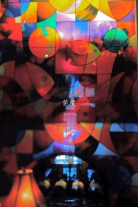

# ＜天权＞情之所钟，正在我辈

**时间似一股静默而强大的力量，带来一切也摧毁一切，“天地无情，视万物为刍狗。”人本是孤独无依的，只能独自面对心灵的空旷和寂静，惟有现世的情感能带给人安慰。但情感往往也是矛盾的，表面看来似乎情感越强烈，人越容易找到依附而逃脱孤独，事实却恰恰相反，情感有时像鸦片，只能带给人短暂的欢愉，它终将要把人生的痛楚变本加厉地还给你。**

### 

### 

# 情之所钟，正在我辈

### 

## 文/柳雨青（复旦大学）

### 

周日的下午，我一边誊抄一边在读余嘉锡先生的《世说新语笺疏》，读完《伤逝篇》的时候，我抬头窗外已然黄昏，二教的小教室里已没有什么人了，只有金色的阳光穿过从茂密的枝叶落在我手边，我合上书放下笔，长久地注视着窗外夕阳照耀下的世界，灿烂的光线把一簇一簇碎花般的叶子照得发亮，如同被阳光宠爱的儿女。世界在这一刻变得无限温柔、安详和宁静，它似乎将某种伟大的难以言喻的力量呈现在眼前，我能够感到它从我的眼睛里一直照到内心里去，照见一种几乎难以承受的悲哀和感动。

我不知道“时光”一词由何而来，但将“时”与“光”摆在一起，显得如此高妙，落在我手边的阳光分明让我感到了时间永恒而人生短暂的巨大落差，在宇宙的无穷之势下，人间一切苦乐都变得渺小和苍白。便连人的生与死都将被时间吞没，而况乎悲欢？

因而，在这种矛盾宿命的背景下，人似乎并不是天之骄子，上帝给予人智慧，情感仿佛是一种酷刑。对于草木而言，兴衰荣枯都只是一种自然的来去，华枝满春，木业飘飞，无所谓悲伤也无所谓恐惧，它们在大地上生根发芽便仿佛与宽广的大地一样融合成自然生长的一部分，由生至死，波澜不惊。人之生死其实与草木无异，无从逃脱与万物共同消长的命运，但是人却偏偏比草木多了情感，多了爱恨，多了在注定的死亡面前的孤独与苦痛。究竟是幸还是不幸？

一个人无论伟大抑或平凡，一生中都必将独自面对生与死的问题，因而，在时光的长久与生命的须臾之间，人们往往会陷入人生终将消逝而无忧价值的挣扎之中。现实终究是残酷的，而人永远无法超越现实而获得永恒的幸福。老子曰：“圣人无情。”那是否说明人若摆脱了现世的情感就能实现精神上的完满？事实是，解脱之法怎么可能如此简单。如果没有了思想与情感，人却也不复人也。佛道两家虽劝解人意识宇宙无常而实现心灵的超脱，达到心境虚空的境界，然而对于真正的人而言，此至善之境界只能不断接近而已。“圣人”若“无情”，那大概只能是“圣”而不能称其为“人”了罢。

孔子曰：“未知生，焉知死。”我想，反过来也亦成立“未知死，焉知生。”我想起史铁生写在《病隙碎笔》中的话：“通常所谓的死，不过是指某一生理现象的中断，但其实，宇宙间无限的消息并不因此而有丝毫减损，所以，死，必牵系着对整个宇宙之奥秘的思悟。”

宇宙的本质与人生的意义，或许离死亡越近的人才越能明白。

王戎丧儿万子，山简往省之，王悲不自胜。简曰：“孩抱中物，何至于此？王曰：“圣人忘情，最下不及情；情之所锺，正在我辈。”简服其言，更为之恸。(《世说新语伤势4》)

刘孝标注引王隐《晋书》曰：“戎子绥，欲取裴遁女。绥既蚤死，戎过伤痛。不许人求之，遂至老无敢取者。”

《世说》的最为动人之处无过于这种真切的情怀毫无保留地表达和释放。“情之所锺，正在我辈！”圣人忘情，那是圣人事，我无法不为与亲生骨肉生死相隔而悲痛，若欲我忘情，我宁愿选择最俗世的心境。如此情真意切，感人至深！于是，我们仿佛也可能理解，王戎为何在儿子死后，不许他人娶走儿子生前未过门的妻子。有时候，固执的行为反而使人物的心灵变得悲壮而可爱，这时一切道德的标准都没有在死亡面前的同情与怜悯来得重要，因为我们都有做出这种行为的可能，古今万变，而情意相通，同样的悲伤而产生的理解之同情能超越时光与生死抵达人的心灵。仅只寥寥数语，无需阐释，无需渲染，言语之空白未尽处，你我都懂。

在死亡面前，对于人而言再没有什么比情感更重要，时过境迁，亡人不复生矣！还有什么不能抛弃？礼数、仇怨、身份、荣辱哪一样胜得过死亡？也只有这种生之终结，能够释放人心底的怜爱与关怀。而生在死的映照下，方显出人之有情的可贵。因而人生既可悲又可爱，既无所谓意义又弥足珍贵。

《世说》的伤逝篇中最感人的仍是“黄公酒垆”的故事。

王浚冲为尚书令，着公服，乘轺车，经黄公酒垆下过，顾谓后车客：“吾昔与嵇叔夜、阮嗣宗共酣饮于此垆，竹林之游，亦预其末。自嵇生夭、阮公亡以来，便为时所羁泄。今日视此虽近，邈若山河。”

骆老师在课上说，黄公酒垆是世说里不断出现的具有象征意义的名词，人生而复死，从前在这里喝酒的人早已离散，往昔欢乐的时光也只能在记忆中追寻，纷乱的世事中一切都在变化惟黄公酒垆在时空中静止不变，似乎永远不会被时间侵吞，因而它强烈地对比出生之脆弱与宇宙之无常。余嘉锡先生则将黄公酒垆解释为黄垆，案曰：“然则黄垆所以喻人死后归土，犹之九京之类也。此疑王戎追念嵇、阮云亡，生死永隔，故有黄垆之叹。传者不解其意，遂附会为黄公酒垆耳。”两种说法尽管不同，各自都有道理，似乎也不必较真，或许两种含义二者皆有之更能接近文的愿意与人的心灵。既有悼亡之念亦有无常之感，而骆老师的说法已然从人的质朴情感上升到宇宙时空“曾不能以一瞬”的哲学高度了，何以见得曲意附会呢？

一千年的言语文字，因为饱含情感而看来并不遥远。“今日视此虽近，邈若山河。”这样的心情不用言说，人生百年回首来时路，谁无此心谁无此叹。刘希夷执笔写道：“年年岁岁花相似，岁岁年年人不同”，李清照临舟忆旧：“物是人非事事休，欲语泪先流。”贺铸雨夜幽思：“空床卧听南窗雨，谁复挑灯夜补衣。”便连通达豪迈的苏东坡也忍不住心伤写下“小轩窗，正梳妆，相顾无言唯有泪千行。”

时间似一股静默而强大的力量，带来一切也摧毁一切，“天地无情，视万物为刍狗。”人本是孤独无依的，只能独自面对心灵的空旷和寂静，惟有现世的情感能带给人安慰。但情感往往也是矛盾的，表面看来似乎情感越强烈，人越容易找到依附而逃脱孤独，事实却恰恰相反，情感有时像鸦片，只能带给人短暂的欢愉，它终将要把人生的痛楚变本加厉地还给你。

我有个在北外念书的同学，有次和我在电话中聊起她最近很喜欢在网上和网络机器人聊天，她说她有一次打了“I fell in love with someone.”发过去，机器人的回复是“Hope you will not be hurt too much.” 她当时就惊呆了，想这机器人还能说出这么有哲理的话来。继而仔细一想又觉得哭笑不得，计算机或许只是理解了“Fall”的含义罢了。哲理不在计算机的回答，而在这句 “Fall in love”的表达。fall的原意即跌倒，摔落，这是何等形象的描述，不论是爱情友情亲情，寄住在他人身上的情感，既不能说是自己有意而为之也不能说是被迫，只是人一失足掉进了爱里，并且随之而来的可能是hurt可能是borken，可能是endless pain。

欢愉也好，苦痛也罢，终究也只能是情感，让死亡不仅仅是生命的消失而已，它让人生有了令人长久地怀想的美丽。

“赌书消得泼茶香，当时只道是寻常。”

诗句背后是什么揪住了你我的心？就不必说了罢。

### 

### 

（采编：安镜轩 责编：刘一舟）

### 

### 
