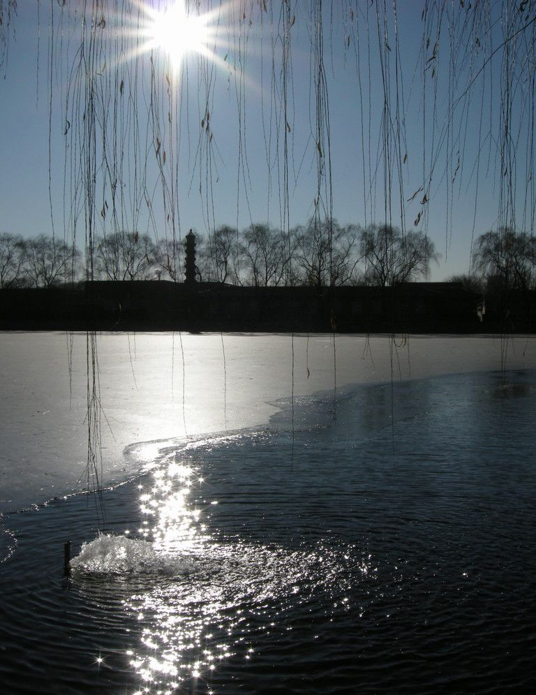
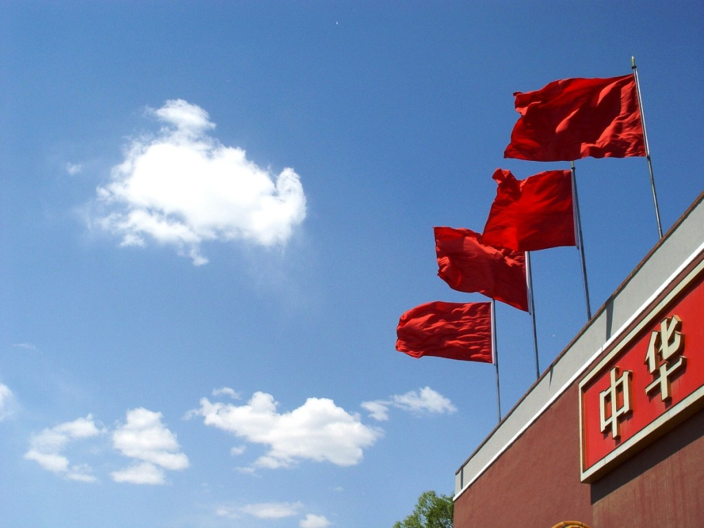
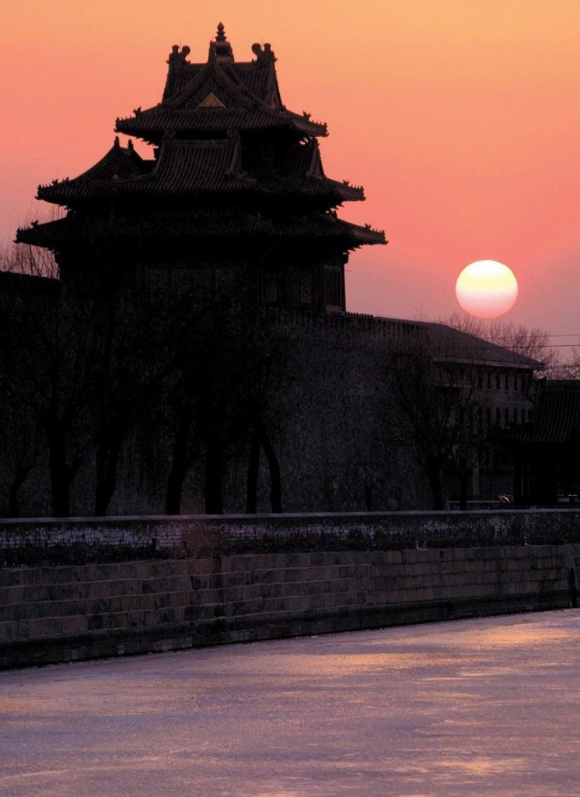
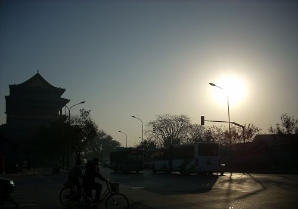

# ＜天玑＞四城记（四）北京

**我的北京之旅，在一个糟糕的开头中走向了一个谜一样的结尾。由始至终，它都没有带给我预想中的陌生感：它的外观和深圳如此相像，它的内核我又没有碰触到；它留着我太多的朋友，比广州还多，我在这片困顿的土地上最想见的人几乎都在那里，我不可能感到陌生。我只是不明白，这样一个最初让我如此受挫的城市，为何在走的时候能带给我如此多的惆怅。广州、潮州和深圳，在这次回忆中让我一个个破解了。唯独北京，让我疑惑难消。**  

# 北京

## 文 / 陈纯（中山大学）

  我在北京的最后一天，一个人坐在大猫家的沙发上把刘宇翔的《自然法》看完。家伟跑了大老远的路过来，我和他吃了顿饭，没聊几句哲学就目送他走了。六点钟我背着大背囊，旁边插着朋友送我的书法卷轴，一个人去安华西里旁边的老北京吃炸酱面，然后转一趟，坐上一辆和我一样伤风未愈的82路，磕磕绊绊的，在最后一刻飞奔上蓄势待发的火车，就这样平静而慌乱地离开我向往了大半年的城市。 在车上的时候我心想，我不应该那么快走的，有的人还没见过，有的人我还想见，提前十天买票这个规定实在是太不体谅旅行者的心情。后来我想清楚了，凡事点到即止，我再呆下去了，北京带给我的意义可能就变了，用韦伯的话来说，再呆着，北京就“祛魅”了。 其实在很长一段时间里，我对这个“伟大祖国的首都”基本没任何空间上和政治上的幻想。从小到大，我们家从来没完整地看过一集《新闻联播》，我看的是翡翠台的《六点半新闻报道》以及接下来的各种港台节目，天安门升旗的场面几乎一次也没从电视里见过；我对明清两朝没有特别的偏好，在太庙散步的时候，她和我说到对乾隆的仇恨和对刺客的憧憬，我只能隐隐约约把这归为皇城根长大的孩子的奇思异想；我对天安门的执念不是来自于文革大串联来到北京跳忠字舞的红卫兵，而是来自《老港正传》里黄秋生饰演的那个倔强而有人情味的老左，他妻子死的时候，儿子揪着他的衣领吼道，你这辈子就想着北京和天安门，你有真正关心过我们吗？漫长时光里我对北京真正有好感是因为郁达夫的《故都的秋》，老舍的《北京的春天》以及汪曾祺的《胡同文化》，我去的时候不是秋天也不是春天，但现在我见过北海的白塔，也知道北京人吃的白菜摞起来有多高了。 

 所以可想而知，当我头两天一直在四环附近打转时，我的心情有多么失望。我觉得这里不是北京，这里的街道，这里的建筑，这里人的打扮和举止，和深圳没有区别。一些站名变得特别好听，处处透露着历史的气息。但历史在哪里？我在四海桥的旅馆看不到，在中关村的大道看不到，在清华和北大交接的路口也一样看不到。这三个地方和桃源村、华强北还有南油大道没有什么不同。北京不叫人宾至如归，但也没有带给我一点久违的陌生感，跑了大老远的路，我发现我又碰到了深圳最让我讨厌的一面。当晚我对同行的人说，我对这里的第一印象十分不好，我从来没见过一个城市可以平庸得如此傲慢。站在北大西门的时候，这种他乡非异乡的感觉强烈得无以复加，差点让我拂袖而去。 当然，它不能就这样把我赶走。来之前我和朋友们说，我是来聊政治哲学的。第二天在居庸关长城，我面对高大的石阶和操持各种口音的人类头昏眼花，老表拍拍我的肩要我给他解释我在状态里提到的各种政治哲学流派，当我讲完社群主义，我们已经呼吸到正常海拔的空气，累的感觉都烟消云散了。晚上我在五道口天桥等曾洲，那些光彩旖旎的店铺没有让我想起所去过的任何一个城市，于是心情大好；在清华晚风悠扬的林荫道上，他不屈不挠地挑战我对道德直觉的论述，而我四处观望，搜寻逸夫楼、校史馆还有单杠上面隐藏的“清华性”，当一群来参加暑期培训的高中生慢悠悠地走过告诉我们夜色已深，我和他握手告别让他自己去找东门，而我跟着他们一直走回老表的宿舍。晾衣服的时候，我对窗外那种依然不存在陌生感的景致有了些许宽容。 五号中午接到李茜的信息，我把全副行装背在身上，走四十分钟的路绕出清华，再坐五十分钟的地铁来到天安门西从北口出来。我不得不说，她是我在北京最尽职的导游，她等了我一个小时而毫无怨言。我们原定的安排是今天去天安门和故宫，改天再去博物馆。故宫门前的汹涌人流让我和她都改变了主意，后来博物馆也被书店和北海挤掉了。在去天安门之前，我和她安静地坐在中南海附近的一家毛氏饭馆，半碗饭都没扒下就开始了经济学与哲学之争，她告诉我，如果我的道德理论不接受实证检验而又包含着逻辑推演（道德推理），那就必须面对哥德尔问题。我对哥德尔定理只是了解一个大概，所以当她认真地陈述定理的内容，我看着她那双犀利而疑惑的眼睛，完全不知说什么才好。我诚实地告诉她，我一定会好好正视这个问题，但目前我回答不了。 

 于是那一个下午天安门完全被学术淹没了，我们在广场附近逛了三个小时，一开始我还说，我们聊点轻松点的话题吧。十分钟后我便讲到新左和施派如何联合来抵制自由派，并且郑重地和她说她看过的某本书铁定是一位左派学者写的，里面有严重的后殖民主义分析痕迹。来之前我还想着替黄秋生和这个帝国都城的中心合个影，这个想法被抛到九霄云后了。我们一直往南走，她在一条和深圳东门完全不同的步行街上告诉我她所熟悉的经济学大师如何精力充沛涉猎广泛，还有她在多伦多的几位同学有着迷一样的学术热情，当我听说其中一位来自深圳，我对深圳的物种生产能力有了进一步的认识。 在接下来的十天里，我的计划安稳地过渡了。当晚我如愿以偿地在大猫楼下的小排档上见到刘宇翔，握手拥抱之后，我们两个都破戒喝酒，聊着我们共同忧心的施派问题，大猫插不上话，跑到一边去调戏老外，彭晨用手机刷人人。在他们家住的那段时间里，晚上大猫玩电脑，我用姜戬送给刘宇翔的ipad上人人，刘宇翔玩手机里的游戏，偶尔他兴致上来，我们继续聊哲学。他坐在我对面的凳子上，抽着烟，而我坐在大猫的床上，喝着从深圳带去的消暑凉茶，一聊就是好几个小时，直到他爬上窗边的那张软垫床，而我坐回门口的那张舒服的灰色沙发。 在面对他的时候，我感到我对他有亏欠感，我想这是所有对他好的人的一种共同心态：他的位置不应该是现在这里，这个时代亏欠了他。我零八年第一次读到他的文章，去年年末才加上他的人人，我当初进泛北斗群的目的我说得很清楚：“我是来找刘宇翔聊政治哲学的。”我对北京的第一次向往是因为他在圣诞节期间开的一个伤感的玩笑，那个玩笑配上他对两个地段的描写，是一个绝妙的北京广告。在人人这个说大不大，说小不小的局域网里，文字和思想让我同时欣赏的只有他一个。他不在的时候我翻着那堆他为之供稿的《第一财经周刊》，看到数码广告后面有一篇思想笔记，我对大猫说：这才是他应该写的东西。于是二人埋头叹气。 七号和海峰兄、老宋和兆坤第一次在北京见面，那种酣畅淋漓的感觉和安华西里的小楼那些断断续续的夜谈形成鲜明对比。海峰兄少年早慧，现象学、后现代和佛学根底深厚，现在以君子之学为安身立命之道，他认为西方哲学，无论柏拉图、康德、海德格尔还是后现代，都逃不出形而上学那种“占有而至衰微”的演变模式，只有融合佛老的儒家所讲的“文质彬彬”、“阴平阳秘”的路径才是天下正道；兆坤一直是倾向施派的现象学家，博士阶段主要在研究海德格尔对亚里士多德《形而上学》的分析，他对海峰兄剑走偏锋的“占有—衰微”分析模式感到十分新鲜，对我的道德直觉是否能还原为“纯粹意识”也有许多颇有助益的提醒；老宋相比三年前我认识他的时候显得有点沉默，他现在并没有像以前那么激烈地抨击自由主义，对我的道德直觉理论的认同程度也出乎我的意料。我和他们说，我确实想提出一种不同于海峰兄所说的“存在论开出的伦理学”的解释框架，因为据我的了解，西方许多哲学家的伦理学理论和他们的存在论并没多大关系，有些甚至没有自己的存在论，强行用“占有—衰微”来批评西方的伦理学（我在某种程度上认可海峰兄对西方形而上学的批判），这个分析模式可能就会变成“普洛克路斯忒斯之床”。当天我们把相识以来萦绕在我们每一场讨论的问题都摊在台面上说，从咖啡馆辗转到烤鸭店，我强忍着喉咙的灼痛和突然发作的鼻炎，觉得今天聊到变成哑巴也是值得的。 在回去的地铁上老宋和我说，北京也不是一块人人都是哲学家的地方，他读研的时候除了一个师兄，在周围几乎找不到什么聊哲学话题的对象，海峰兄当时还笑他有执念，但两天后他又约我再聊，叫上老宋和舒迟，分明是乐此不疲。可知柏拉图说得不错，哲学就是一种难以摆脱的“爱欲”。 

 北京的朋友十分热情，每天我都接到不少邀约。我在北京最想去的地方，都是李茜带我去的，在北海边上，一位留长发的中年男人坐在岸上，把双脚伸进湖里踢水，一面打着电话，而她看着一只燕子在湖面滑翔，惊叹了好久，还问我万一燕子在空中力竭，是不是会掉下来，我又没办法回答，默默地把一片柳叶折下来放进书里，她笑着说，哲学家，你太不正义了，我要揭发你。其余时间，我出门去会从未见过的朋友和多年未见的故人。我见到喜欢露齿笑的回族姑娘刘妍，她送给我一副卷轴，跟辛瑶遥对我的期望一样；我也见到以“声优”闻名的苏媚行，回来的火车票就是她陪我买的；薄然替我和安镜轩安排了一次欢迎会，我有幸见到北斗诸君，酒席上我和吴如加说，斗内我主动加的人寥寥无几，君乃其一，一敬你正直不阿义不赂秦，二敬你不计报酬为公民社会出力，我又一次破戒喝酒，不干不快。 我的生日，却不是在这种气氛中过的。当天我去南站接一个久欲谋面的朋友过来，在清华附近的餐馆吃了一顿，最终不欢而散，那时李茜在北大东门的地铁站，我在清华宽阔漫长的大道上一直想找到出去的路，最后发信息跟她说，我不敢让你等，但我很想见你，我一直在跑，但是路太长了。她安慰我说，长路漫漫，总有相逢。后来我坐在朱自清的荷塘边，看着一群笨拙的鸭子（也可能是鸳鸯）游来游去，一个惠州的女高中生过来搭讪，我倚老卖老地陪她说了几句话就离开。我在北京第一次体会到那种满目苍凉的惆怅，当时我却完全不了解它对我的意义。 走的前一天一直在下雨，黄昏的时候我坐在沙发上，看着厨房里透出的些许微光，看着空荡荡的屋子，所有的离愁别绪一起涌了上来，我受不了这种气氛，就好像我不明白七八年前的周日，我是如何忍受睡醒后发现夕光照在阳台上的感觉。我在楼下吃了碗面，一个人去南锣鼓巷转悠，我在状态里说：如果我没有体验过这座城市没有人情味的一面，我就不算来过这里。我拿起手机，拍了在北京的唯一一段视频，我甚至后悔，那天和她在后海走的时候，为什么不在其中一间唱着歌的酒吧歇一下，那里夜晚的意象可是比阳朔的西街还要丰富。 我走的时候，刘宇翔打了个电话给我，他说他还在上班，不能送我了；在火车上，我收到她写给我的信，里面都是我们见面的细节。我的北京之旅，在一个糟糕的开头中走向了一个谜一样的结尾。由始至终，它都没有带给我预想中的陌生感：它的外观和深圳如此相像，它的内核我又没有碰触到；它留着我太多的朋友，比广州还多，我在这片困顿的土地上最想见的人几乎都在那里，我不可能感到陌生。我只是不明白，这样一个最初让我如此受挫的城市，为何在走的时候能带给我如此多的惆怅。广州、潮州和深圳，在这次回忆中让我一个个破解了。唯独北京，让我疑惑难消。于是我从前天起一直尝试在叙述，我翻来覆去地写，看旅行途中记下的笔记，和北京的朋友联系沟通，在深圳街上找那些我曾经鄙视的相似之处，想从细枝末节中发现什么，最终还是徒劳。 

 我在北京住在鼓楼外大街，我在十三号那天才在李茜的指点下望见鼓楼，它就像一个巨型的龟壳一样，在闹市里完全引不起注意。  （本专栏完）  

（采编：麦静；责编：麦静）

 
