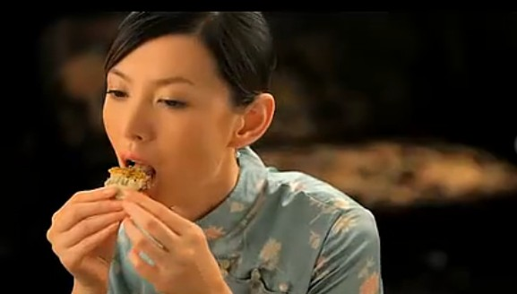

# ＜天玑＞带你进兔子洞，带你磕红药丸（三）：充满悲观色彩的两条路

**如果我们用目的因的角度来审视这个世界，会是很有趣的。万物似乎都有了灵气，如同斯宾诺莎提倡的泛神论一般，小到一粒沙子，大到一个星球，甚至整个所谓的宇宙，都在朝向这属于自己的目标而发展。而万事万物的目标似乎又是交织在一起的，我们都是整个世界的一员，扮演着不同角色，肩负着不同使命，向着一个更大，更终极的目标发展。**  

# 带你进兔子洞，带你磕红药丸（三）：

# 充满悲观色彩的两条路

## 文/ 井越（华中科技大学）

  如果有人问，为什么天会下雨，通常的回答是因为水汽在空中凝结成了大量云，云遇冷转为凝结为液滴下落。但是还有一种答案是：因为万物生长离不开水的滋养，所以地球才需要水循环。 我们之所以首先想到第一种答案，而忽视第二种，是因为我们长期以来接受的初等物理学知识给了我们一种特定的思维，那就是一切事物的发展都是因果性的，而非目的性的。 再举个更贴切的物理学例子：为什么光线通过空气射入水中，再射入空气中，这个过程中光会在水里发生折射现象？我想只要是受过初中物理教育的人都能说出，那是因为水的折射率大于空气。但事实上，有一种更加巧妙的说法，那就是“光总是挑选耗时最短的路程行动”。也就是说，光因为在水里的传播速度较慢，所以它没有挑选普遍意义上的“两点之内路程最短”原则，而是为了节省时间，适当缩短了自己在水中走的路线，而延长了在空气中的路线。 

 刚才所讲的光线传播的第二种解释，便是有名的费马最少时间定律。 为什么费马定理会让我们感觉新奇，是因为它没有建立在我们习以为常的机械的因果意识构成上，而是建立在了目的意识构成上。通常诉诸于后者的原因，我们称之为“目的因”。 如果我们用目的因的角度来审视这个世界，会是很有趣的。万物似乎都有了灵气，如同斯宾诺莎提倡的泛神论一般，小到一粒沙子，大到一个星球，甚至整个所谓的宇宙，都在朝向这属于自己的目标而发展。而万事万物的目标似乎又是交织在一起的，我们都是整个世界的一员，扮演着不同角色，肩负着不同使命，向着一个更大，更终极的目标发展。不过值得提醒的是，我们也许并不知道自己扮演角色的宿命，甚至不知道自己是一个角色，就如同光本身很可能不知道自己的使命（之一）便是走最省时的路线一样。 当有了“目的因”作为视角而感到兴奋之余，我们又不免陷入恐慌，那就是这种意识结构严重地威胁到了大多数人坚信的自由意志。 

 试想在电影里，每一个演员在演戏时其实是明确知道自己以及对方的台词的。他们之间的交谈其实不能算作“交流”，而只能算作“让话语转化为事实”。 当我们用目的因来审视世界时，正如上文所说，我们也在不知不觉地扮演相应的角色。我们说的每句话甚至也是台词，同样你的台词也会招来对方既定的台词。这时，“选择”这种东西也只是你一厢情愿编造出来的东西罢了，你所犹豫的每一件事，其实都是注定好的，只是你自以为你在犹豫不决。 这很荒谬么？其实在日常生活中我们经常用“目的因”的方式来进行自我开脱。迷信星座就是一个很明显的例子。在美国，曾有一位杀人犯甚至在法庭上请来了有名的巫师，占卜师，和星座分析师，来证明自己的宿命决定着他必须杀这个人，换做任何人在他的处境，都会这么干的。 接受全面的目的论解释，让我们的自由意志受到否定的同时，也招来了更多的问题，比如：上文所说的那个世界的终极目的是什么？或者狭义一点：我如果预先知道了自己的归宿（比如用一台时光机偷看未来，或是得到一本预言书），那么我能改变自己的命运么？（比如我用时光机看到自己今后成了亿万富翁，那么是否意味着现在我什么也不做，今后依旧能发财。）或是更极端一些，当我自己知道了未来十年后的生活时，我选择立即自杀，那么我死得了么？ 所以，看来有趣的目的论也会给我们更多的未知和恐慌。那么，还是让我们用传统的因果链条来解释世界，看情况会不会有所好转。 还是以一个问题开始：你会不会时常莫名的觉得大自然很奇妙？比如在吃喜欢的水果时，感慨世上竟有如此美味的天然食品，在郊游时，感慨风景的美丽，花儿的芳香，并赞叹大自然的其夺天工。或是在想到太阳系时，觉得自己生活在唯一一个适合生物生存的星球，自己是有多么幸运…… 可是，对我而言，以上的感慨全都是些无知所造成的无痛呻吟罢了。如果你非要多愁善感的感慨一下自己的幸运，那么我告诉你一个事实，按照现在的理论，在宇宙大爆炸初期，如果奇点的初始温度高于，或低于当时温度，哪怕只有那么0.00000（此处省略近似无数个0）点1摄氏度，那么粒子将不会产生，当然你也就不会存在啦。想想这个，是不是要比一个水果好吃更值得让你觉得世界美妙呢？ 

 不过按照物理学上的“人择原理”，即使是以上事实，也不能证明我们是多么幸运。 下面我来阐释一下人择原理，简言之就是你的存在在先，而思考在后。 比如你认为苹果好吃是很神奇的，但事实是你必须认为它好吃，因为在人类进化的长期过程中，正是我们适应食用大多数天然植物，我们才得以生存下来。你的味蕾，肠胃等器官，都是逐渐适应外界的。同样，我们感到新鲜植物，清水，湛蓝的天空是美丽的，那是因为这些事物都能给生物带来健康。举个更贴切的例子，人们择偶时通常挑长相好看的，这是因为五官，身材呈现“好看”比例的人，通常意味着健康。而选择健康的对象进行交配，才能让后代更有能力适应艰苦的生活环境。我们对好看的认知是建立在繁衍优良后代的基础上的，这就导致了即使我们现在寻找的是一夜情对象，这种进化的惯性仍会不自觉地要求对方好看。 再深一步说，我们在地球上存在不是因为走运，而是正因为你在地球上，才有了生命，才有了你那多愁善感的意识来对这一现象发表无知的感慨。 总的来说，大多数人平时都把因果关系搞反了，以为是无限的宇宙，或大自然在先，而自己意识在后。但事实上是，你的意识是逻辑上先于整个世界的。（注意，这里是逻辑上在先，而非时间上在先） 这样，用逻辑的因果意识结构来解释这个世界时，我们不免感到很无力：整个世界都是一种如同撒骰子一般的随机事件罢了，更令人无比泄气的是：就算这是个随机事件，我们也没有理由为自己的存在而感到丝毫幸运，因为那该死无情的“人择原理”。 看来，用传统的因果意识结构来解释的世界也并未比上文所说的用“目的论”解释的世界美妙到哪儿去！前者带给我毫无依靠的无力感和空虚感，而后者则带来一种被束缚的压迫感。 

 （未完待续）  

（采编：安镜轩；责编：陈锴）

