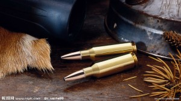
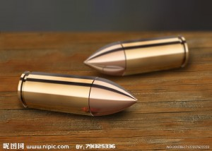

# ＜天璇＞一颗消失的子弹

**那是一颗消失了的子弹，人们回顾尹师一生，往往无法看见。子弹消失了因为融化，子弹融化了并未消失，尹师被击中以后还是尹师，然而将辐射的才情和敏锐的感性压缩进入逼仄的方寸，尹师已非尹师，许多观念，像斯德哥尔摩症候那么简单，许多反弹，又不像斯德哥尔摩症候那么简单。**  

# **一颗消失的子弹**

## **文/姜飞（四川大学）**

 

据说，抗战之初的川东蓬安县，曾有一个年轻人，出身低微，然而在县城读书的时候却为某富家小姐所识所悦，然后成婚，然后有子，然后携夫人远赴康藏，去白玉县做法院推事。初生之子由清寒的祖父母养育，偶尔也去富贵的外祖父家，吃几顿好饭菜，得一身好衣裳，或许也受一点同龄小舅舅的嘲讽。

一些年之后，抗战自然是胜利了，便是国共相争，也已大势确定，贺龙南下逼近成都，刘邓挥兵取了重庆，四川基本易手。法院推事携夫人即从白玉登路，穿过岷山和平原，回到老家蓬安，在共军的政权之下做了法院院长，人称尹院长。人们于是知道，那一表人材的年轻人，原来是中共地下党。

共军得天下之初，曾有镇压运动，被镇压的人里，便有尹院长的岳父。尹院长的法院对尹院长的岳父宣判极刑，公开处决。行刑者是一群莫名积极的“人民”，“人民”将尹院长的岳父裹以厚棉被，置于烈日之下，晒死。行刑方式应该不是为了节约子弹，也不是为了试验太阳能，也许是为了客观展现“人民”及其“政权”的正义、力量和不徇私情。

历史的宏大叙述不倾向于照顾幽微的细节，不考虑尹院长在判决书上签字时内心的隐约感觉，也不会涉及尹院长的儿子看到有教养的外祖父被父亲的“人民”以过分温暖的方式处决之际，眼里闪过的一丝流光。

尹院长的儿子，许多年以后，人称尹先生。

尹先生敏锐沉静，文思纵横。一九五八年考取川大中文系，深受现代作家林如稷教授赏识，以至合作研究和发表论文，一时华光四射，声名震响，人以大才子目之。后任教，可谓青年才俊。后成婚，堪称郎才女貌。再后，其父尹院长突被革命政权宣布为历史反革命，身陷囹圄。其时中国政治盛行血统论，尹先生于是负重受疑，从此敛尽才华，退守内心一隅，偶然参与文章之事，也不过随喜评法批儒（评《文心雕龙》），或者附和正确文字（评《西沙之战》），满纸套语，不见神思。据当年与尹先生相识的前辈回忆，尹先生每欲言，则思前想后，瞻前顾后，其谨慎如此。沉默饮酒，出入不语。

又是多年过去。

文革之后，尹先生撰写、出版、修订、再版的《新诗漫谈》，顿成一时名著。随后率先研究所谓资产阶级的“新月派”，成书《“新月派”评说》，又获海内外瞩目，学界视之为中国大陆现代文学研究的解放信号。其他诗论著作亦是联翩而出，尹先生声名再起，然其为人，恂恂儒也，酒后除外，而其为学，多无出位之思，研究“新月派”和写作散文除外。

尹先生退休于一九九九年，初尚康健，时见谦谦笑颜，后遇车祸复又中风，不良于行，从此绝迹人间。尽日枯坐幽暗的书房，卓异的风华随时间的流逝而缓慢消磨，敏感的内心在沉重如夜幕的缄默之间继续敏感，康复无期，晨昏不断。如此十年过去，尹先生以食道癌晚期而再入医院，转移入肺而呼吸衰竭，二〇一二年十月十七日，尹先生的生命刻度停止于七十四岁。

尹先生便是我的硕士导师，尹师在勤先生。我一九九二年九月进入川大，先在邛崃某空军部队军训一月，十月回校上课，教写作的便是尹师。尹师沉郁，有旧风度，评点作文以五七八字而直截根本，不遑多言而惠我良深。一九九五年我在成都一家报纸实习，受主编委托采访尹师，其时尹师在欤文里的老川大校医院治病，他尚记得有我这么一个学生，先是邀我在医院的中庭漫步漫谈，谈他的经历，他的文学教育观念，甚至谈到小说的褒贬双线叙述，譬如《高山下的花环》，后又回到病房，散漫而谈，似无尽期，病房外有托盘的护士逡巡而不敢入，直到医生吼叫，该检查了，摆哪样摆不完。随后，我又采访了尹师的研究生钟周二位师兄，以及其他师生人等，写成《人淡如菊》，我那时自以为了解尹师。

一九九六年，我读硕士，投的是尹师门下，成了他的关门弟子，研讨中国现代诗歌。课堂内讲究诗歌体验，课堂外讲究饮酒体验，每逢餐叙，尹门除我不论男生女生，悉为好酒量，尹师与众人觥筹交错，酒红飞临，眉眼舒展，尹师虽然依旧心扉不启，然而胸次稍开。我不善饮，只是刻苦吃菜，掩饰无能。估计是吃相不如喝酒的姿态雅致，举坐皆笑，尹师也笑，师母也笑，这个姜飞，酒也不陪尹教授喝，怕是毕不了业，是不是想从酸菜鱼里吃出诗歌的味道。我只得讪笑言他，其实我有时候也能从诗歌里读出酸菜鱼的味道。

尹师一生，心胸展开的时候大约不多罢。然而尹师已去。

也许有人会说，尹师是被食道癌击倒了，这是对的。或者，尹师是被中风击倒了，这也是对的。甚至，尹师是被弥漫人间所有角落的隔膜击倒了，也许也有道理。然而，我更相信尹师是被历史深处的一颗子弹准确击中，那颗子弹的杀伤力与尹院长和株连政治有关，与棉被和烈日有关，与肃杀历史的压迫有关，也与敏感心灵的放大有关。那是一颗消失了的子弹，人们回顾尹师一生，往往无法看见。子弹消失了因为融化，子弹融化了并未消失，尹师被击中以后还是尹师，然而将辐射的才情和敏锐的感性压缩进入逼仄的方寸，尹师已非尹师，许多观念，像斯德哥尔摩症候那么简单，许多反弹，又不像斯德哥尔摩症候那么简单。

如你所知，那颗消失的子弹，击中的不止尹师，子弹毁灭了无量数的信任和幸福，消磨了无量数的风华和才情。

十六年以来，每年我都会与师兄师姐们去看望尹师。看望是残酷的，我们见证的是才华的浪掷和生命的凋零，暗室中的沉默暗示出所有人的无能为力。离开小天西街的尹宅，我们在树影下演算除法，分摊给尹师购买薄礼的钱款，然后师兄弟姐妹互道珍重而别，有时别了几步还要回头叮嘱，跑步吧，练瑜伽吧，多吃蔬菜吧。

暗黄的街灯，在水泥路面持续投射我们自己的身影，踏影归去，长街寂寥，我们都是寒冬夜行人。

 

（采编：孙梦予；责编：徐海星）

 
