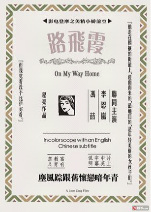

# ＜天璇＞淮海中路走九遍 ——《霞飞路》

**其实真的很少有人是读懂上海的。如果将她比作一名带着神秘感的摩登女郎，那么她有黑夜和白天两种面貌，她有乖巧酥嗲的声音，也有孟浪叛逆的一面。就像《神女》里面，阮玲玉穿着蜿蜒起伏的旗袍，却弓着背抽烟；也似陈淑芸在白天里素衣翩然，却在夜晚穿吊带裙，脚踩复古凉鞋标志性地嗒嗒声，在阳台一遍遍地吞云吐雾。她在冯喆的身后换裳，犹如这城市，有一天你发现她远不是清晨的豆浆油条那么缓慢，远不是黑板报对面的夹竹桃那样清澈，她其实裹挟着没有边际的欲望、虚浮、欺诈……你终有一天会发现她从单纯，变为妖娆。而所谓的爱是，别人斥责她fickle bitch，而你心疼她在午夜的倦容。但是，当然，你救不了她……**  

# 淮海中路走九遍

# ——《霞飞路》

## 文/吴燕凌（中国地质大学（北京））

这城市满地的纸屑， 风一刮像你的妩媚。 ——动力火车 

 一. 

房产软文写多了，随便一个项目，动辄冠以“城市之心”、“城市精神”的名号，以舒开发商之菊花，固然为了生活所迫，一笑置之，但回头想想，对于什么是上海这座城市的心，已然日渐无语。

一直以为，上海人是个乡愁感很淡的群体。一方面上海人不怎么出去，所以很少会谈论到“乡愁”。另一方面，可承载“乡愁”的物质，也相对稀少，因为变化太快了，所以每一种在记忆中都铭刻得不深。

高中时因为不能再坐同校初中的班车，都写过一篇周记抱怨世事无常，还被语文老师大叹“老师理解你的心情”，可如今面对上海那为人称颂的车水马龙、日新月异，也只能姑妄听之。

所以在看到《宅男电台》，有人竟这样去拍摄复兴公园的时候，惊讶了。

从天涯歌女、外白渡桥，到东方明珠、田子坊，世人谈起上海，总是捡拾那些符号。上海滩也好，王家卫也罢，运用自己的想象，扩展了故去的传奇，可王安忆之后，当我们想看一遍故乡，竟只能到力波啤酒的广告片里去找寄托。

因此，那个舍浮华而取道复兴公园的人，必是有着同样过往的。

于是知道了导演程亮，他出过一本书《复兴公园》，鲜绿的封面，一只白色的木马。只有懂复兴公园的人，才能做出这样的封面。

继而知道他是我的中学校友，另有一部片，叫《霞飞路》。

《霞飞路》所言之物，更是我熟悉得不能再熟悉。片子就是在我们的母校向明中学取的景，那教室与楼道的气息，那课桌的质感……就连老师的面孔，都是亲眼在课堂上见过的，那训诫的话语，都是亲耳听闻过的。

一直对淮海路有着别样的情感，而这个拍出我心目中复兴公园的人，是否也拍出了我心目中的淮海路呢？便不能不看了。

二. 

片子由高三开始，那又是个记忆深刻的梦魇。韩寒、教育制度、高考压力……都倍感亲切。片子总体还是粗糙的，并没有细追向明中学的美，倒是把国泰电影院、淮海路雕塑、陕南村补课这些都涉及了。而这些，又恰是懂淮海中路的人，才会去拍的。

淮海中路是一条极具魅力的马路。也许外人不明白程亮为什么不拍其他马路，而来来回回只在淮海中路。为什么冯喆由西而东追踪女神，路过伊势丹、妇女用品商店，和那座天桥。

我曾经也不懂，在瑞金二路上了7年学，我都不知道瑞金路淮海路口那家店名叫美特斯邦威，可是当北上念大学后的第一个寒假，回沪后第一件事就是去把淮海中路来回走了一遍。

这就是乡愁吧，是只有在异乡才能明白的东西。

程亮是北影学生，同样该饱受思乡的困扰。片里女神补课提前闪人时，装进书包的最后一本书是《城市季风》，讲京沪双城的文化差异。而“季风”二字本身，也暗指了季风书店，那同样是淮海中路的重要坐标。

后来每次寒暑假回家，我都会去把淮海中路走上很多遍。从146车站，到眼镜店，到食品店、南昌路、三联书店、瑞金路、丰裕生煎、美特斯邦威、屈臣氏、莉莲蛋挞、古今、国泰电影院、巴黎春天、季风书园、太平洋百货，此时连我这种对品牌和购物中心十分不感冒的人，也能这样报下一串，可知此种眷恋之情。

我也曾在中学楼顶的升旗台，俯瞰整个校园。那是高中三年最美好的时光之一。我也曾在夏日的教室里听窗外的蝉鸣，趴在窗口看大株的广玉兰，抑或午饭时间买一两生煎后去季风看书，同样惬意。

所以如果要说，怀念的上海究竟是什么……

是回忆么？是自己的青春么？是熟悉的日子么？是看书时摩挲纸张、吃完蛋挞舔舔手指、是在古今里试内衣、在弄堂面馆里吃辣肉面，以及在食品一店里购置猪肉铺么……

任何其他地方，人民广场、南京路、陆家嘴、徐家汇，要么过于快速，要么过于精致，都不如淮海中路，在写字楼与商场之外，还有闲适的生活感，最喜欢雨后的夏日傍晚，坐环卢湾区的146路公交车，去淮海路走一圈。这座城市，总是肾上腺素太旺，过于喧闹，却很少像此刻那样，兼具丰盛和娴静。

城市之心，还是在于生活。金融区里没有生活，写字楼里没有生活，高科技开发区里没有生活。但是淮海路有。有我无感的商场、我无感的品牌专卖店，有我爱的生煎，我爱的书店 ，我爱的面馆，我爱的磁带店，我爱的公园草坪，我不爱的马列像，我不爱的补课老师家，还有我爱的学校，和我爱的夹竹桃……

三. 

霞飞路，淮海路的旧称。给片子取这名字，意蕴也就了然了。

此刻，霞飞路无疑犹如一名女神，使人沉醉和想往。

蔓延开去，霞飞路的意义外延，可以是上海整个城市。

其实真的很少有人是读懂上海的。如果将她比作一名带着神秘感的摩登女郎，那么她有黑夜和白天两种面貌，她有乖巧酥嗲的声音，也有孟浪叛逆的一面。就像《神女》里面，阮玲玉穿着蜿蜒起伏的旗袍，却弓着背抽烟；也似陈淑芸在白天里素衣翩然，却在夜晚穿吊带裙，脚踩复古凉鞋标志性地嗒嗒声，在阳台一遍遍地吞云吐雾。

她在冯喆的身后换裳，犹如这城市，有一天你发现她远不是清晨的豆浆油条那么缓慢，远不是黑板报对面的夹竹桃那样清澈，她其实裹挟着没有边际的欲望、虚浮、欺诈……你终有一天会发现她从单纯，变为妖娆。而所谓的爱是，别人斥责她fickle bitch，而你心疼她在午夜的倦容。但是，当然，你救不了她……

四. 

家乡是什么，只有到了异乡才明白。

只有重新回到上海时，才会发现，淮海中路的美，是我所想要的上海的美。丰腴的故土的气味，在此处最为芬芳。

程亮撷取的那些意象，在我这里能达成共鸣。关于对家乡的眷恋、无奈、和疼惜……

如果比起来，可能别人的青春比我疯狂，别人的乡愁比我浓郁，别人的生命体验都比我更具有审美性……

别人想家时有那些个青山绿水，喊一下有无限的回声，有瀑布，有梯田，有大片的麦地和宽阔的蓝天，也有村头扎辫子的姑娘，哦不，应该是扎红头巾的魁梧汉子。

可是我还是会像冯喆一样，在淮海中路走九遍，在国泰电影院门口的人潮中对自己说——可我觉得，没有一个比她好看。

忠孝东路走九遍 穿过陌生人潮搜寻你的脸 有人走的匆忙 有人爱的甜美 谁会在意擦肩而过的心碎 ——动力火车 

（采编：何凌昊；责编：何凌昊）

 
