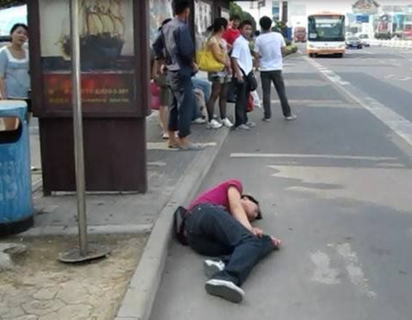

# ＜开阳＞从被碾儿童无人相救，空想一下新宪政架构下对司法权力的管理

**所以理论上说，即便一个联邦基层法官总是判错案件被上诉法院多次推翻，也不构成弹劾要件——其实这个后果并不是什么严重的司法危机，顶多是浪费了一些 时间和纳税人的金钱而已，因为有上诉法院会伸张正义；反过来，如果法官只是因为判案被上诉法院推翻较多就要被弹劾，这才是真正值得担心的问题，因为这意味 着基层法官没有足够的空间去自由裁量、受到过多干扰。**  

# 从被碾儿童无人相救，空想一下新宪政架构下

# 对司法权力的管理

## 文/ 黄陀（Yale University）

 

小悦悦在车轮下被碾，路人怕承担责任拒绝出手相救。不可否认的是，这场野蛮的惨剧令人们想起几年前震惊国人良心的彭宇案，该案对社会道德激励机制的恶劣作用，此处无需赘述（文后附维基百科列举的、被公开报道的部分案件）。

彭宇案未经二审就调解撤诉，一审判决仍旧对社会观念造成了冲击。即便彭宇案的主审法官后来被降职、调离，公众对法律的认识已经被彻底地改变。我们不得不意识 到，在大陆法体系下，判决先例即便未必有正式法律效力，但其对社会中激励机制(incentive structure)的先验(ex ante)影响仍旧是不可忽略的。在大陆法系和普通法趋于合流的大背景下，必需重视法官个人素质、个体案件裁判水平，法官不能被认为只是文职、官僚系统的 一部分。法官也是人，不是神。我国新的宪政架构必须正视对法院系统的管理和对司法权力的制约。司法独立是必不可少的，但管理不善的司法体系，不仅有损司法 威严，而且无助司法独立。

假如彭宇案发生在法制健全的国家，会怎样？

首先，对基层法院的法官的严格遴选将是减少此类明显谬误 判决的第一道屏障。美国的联邦地区法院法官（基层法官）与最高法院法官一样，均由总统提名。（注：美国联邦法院系统基本结构为：各州至少设置一个联邦地区 法院（大州会有很多个）；地区法院的案件上诉到该州所在的巡回区的上诉法院，全国共有十二个按地理划分的巡回上诉区；此外还有各种专门法院如税法法院、外 贸法院和专管专利等案件的联邦巡回区上诉法院；上诉法院之上则是设在首都的最高法院。）

根据惯例，担任某州内联邦法官的人选需要经过该州联 邦参议员（该州在联邦参议院中的代表）的同意或建议，总统提名后经联邦参议院质询、投票核准(confirmation)。如果该法官资历不足、风评不好 或不够中立，那么很难通过冗长的参议院确认过程，其个人和职业历史上芝麻绿豆大的事情都会被媒体和反对党议员挖出来大肆攻击。反对党存在的其中一个意义就 是提出批评，尽管这种批评未必是有建设性的，但会在相当程度上逼迫执政党、总统和被提名人把问题交代清楚。在严格遴选之下，联邦法院法官素质普遍较高。

但从处理案件数量和法官队伍规模来看，联邦法院毕竟不是美国司法系统的主力，绝大多数案件尤其是与人民生活息息相关的多 数偷抢扒拿、杀人放火、合同纠纷、滑倒跌伤、伤害赔偿、离婚抚养、争夺遗产等案件都是由各州的州法院系统处理。各州法官任命的方式不尽相同，有的州采取直 接选举的方式（如伊利诺伊）；但即便在某些有法官选举的州，由于多数民众对法官选举关注度不高，法官任命的主要方式仍然是州长提名、州参议院确认，然后法 官再在选举中（不出意料地）连任。

虽然同样有各种政治上的平衡、制约和审查，由于普通民众对本地政治的漠不关心（美国政治的一个普遍现象就 是关注总统大选的人远远多于关注市长选举的人）滋生裙带关系和政治交易空间，再加上州法院任务繁重、案件繁多、法官数目较多但仍然明显人手不够，州法院最 基层法官的素质有良莠不齐的现象。

中国幅员辽阔，人口众多，故也无法保证所有的基层法官素质都是最一流的。但从美国实践中的经验和不足之处来看，以下措施会从一定程度上有助提升基层法官素质：

1、加大司法预算投入、裁撤法院行政官僚，确保法官人数足够、薪资水平至少与律师在一个数量级上，确保能留住司法人才。美国各州法院常有法官辞职回去做律师的事情，盖因不堪重负、薪水微薄、荣誉又不及联邦法官耀眼。

2、 尽量从资深律师（包括检察官，即代表政府的律师）中遴选法官。法官如果本人没有实践经验的话，不但对复杂的法律问题缺乏经验，而且未必会对双方律师在庭上 的一些看似恼人的举动给予充分的理解（比如经常打断对方律师的陈述或发言、提出反对(objection)，或在法官本人作出决定后表示反对并提起上 诉）。法官只有自己做过律师，才能充分理解律师尽忠为客户服务的举动而不对律师个人产生偏见和厌恶，从而从侧面上保证司法裁决的公正。另外，美国联邦法院 系统极少有法官辞职回去做律师赚钱，除了因为联邦法官荣誉耀眼、地位尊贵外，与联邦法官多为在法律界已经干了很多年的资深人士、并不十分看重金钱薪水也有 关系。

但不管怎样，以中国十几亿的人口计算，需要的基层法官数目估计至少有数万人甚至十万人。（美国三亿人，联邦加地方法官总数大约有一万 人；但美国初审案件一般只有一名法官，中国法律制度下除简单案件外一般由三名法官组成合议庭）。如此庞大的基层法官队伍显然不能如美国联邦基层法院法官那 样通过由总统提名、联邦参议院核准的方式进行，提名、选拔权力可能需要下放到各邦／省／自治区，也无法保证不出现良莠不齐的现象。这就需要第二道屏障—— 完善的上级法院设置和法院系统的垂直管理。

如能确保初审法官的素质，那么彭宇案的一审裁决就难以发生。但若真的发生了呢？如此明显的错误，在健全的法制系统下，即便发生了，也很快会被上诉法院纠正，所以被冤枉的一方不需接受任何不能近乎完全伸张其主张的调解。

从节约司法资源的角度讲，两审终审制是比较合理的，因此上诉法院（相当于中国目前架构下的省高院）作为绝大多数案件的终审法院，地位相当重要。以之前的估计为基础推断，上诉法院的法官数目大约可以控制在数千人，每年需要补充的法官只有几十人，小于行政院／内阁各部会的任命人数，故可以通过总统或行政院长（总 理）提名，参议院公开质询、核准的方式进行高标准遴选。

除了对上诉法院法官的严格遴选外，给予上诉法院和最高法院真正的垂直管理权同样是必 不可少的。用通俗的语言说，就是下级法院除了服从上级法院之外，谁说话都不听，全面杜绝地方行政势力的干预，各级法院法官薪资由国会统一拨款给付。这就需 要破除当前的中国《宪法》政治架构下（具体说是《中华人民共和国宪法》第九十六条、第一百零一条）各级法院对本地人大（实际上是党委和政府）负责的结构。

最后，对司法体系管理的终极武器是法官的弹劾机制。之所以称之为“终极武器”，自然是因为不能随意动用，否则有干预司法独立之嫌疑。美国一般联邦法官除非叛 国、受贿或犯有其他重罪，不得被撤职。弹劾案须经众议院发起、参议院开庭审理后以三分之二多数（称为“大多数”，以区别于二分之一多数即简单多数）赞同弹 劾。所以理论上说，即便一个联邦基层法官总是判错案件被上诉法院多次推翻，也不构成弹劾要件——其实这个后果并不是什么严重的司法危机，顶多是浪费了一些 时间和纳税人的金钱而已，因为有上诉法院会伸张正义；反过来，如果法官只是因为判案被上诉法院推翻较多就要被弹劾，这才是真正值得担心的问题，因为这意味 着基层法官没有足够的空间去自由裁量、受到过多干扰。

那么，既然美国的联邦基层法官一般不会因为判错案子被弹劾（除非因为受贿而故意错判等 严重违法情节），那么他们为什么还要努力作出正确的判决？首先，法官本人仍然是本地社区的一员（上面提到，联邦法官的任命仍需本州的联邦参议员同意），虽 然其代表的是联邦司法权力。这种情况下，法官本人自然需要注意自己在本地的形象和声誉。另外，由于很多上诉法官由基层法官选拔而来，如果一个基层法官总是 判错案子、被上诉法院训斥，那么他／她基本上绝无可能被擢升为上诉法官。所以基层法官为自己仕途计，也会努力作出正确判决。故在通常情况下，其实不需要动 用弹劾机制，也可以迫使法官克尽职守。但弹劾这个机制还是必须有的，否则如果完全无法将侥幸通过遴选的不适任之人或腐败分子清除，那么就完全失去了对司法 权力的制约。

（当然，最后还剩下一个问题就是司法权力作为一个整体在宪政架构中的地位问题，而这就是一个极为宽泛、各派见仁见智的宪法学问题了，而且与普通民众日常生活关系不大、不直接，故此处不作讨论。）

总之，彭宇案的恶劣后果，是对中国司法体制的又一记棒喝。中国的宪政问题固然需要全局的政治变革，但反过来说，对全局的政治变革的思考，不应该忽视诸如法院系统建设之类的细节。

＝＝＝＝＝＝附彭宇案事件影响及类似事件＝＝＝＝＝＝＝ [http://zh.wikipedia.org/wiki/%E5%8D%97%E4%BA%AC%E5%BD%AD%E5%AE%87%E6%A1%88](http://zh.wikipedia.org/wiki/%E5%8D%97%E4%BA%AC%E5%BD%AD%E5%AE%87%E6%A1%88) 

（采编：尹桑；责编：陈轩）

 
