# ＜开阳＞图解欧债危机

**2010年4月，希腊正式寻求IMF和欧盟的援助。6个月后，爱尔兰也步其后尘。再6个月后，葡萄牙成为第三个受害者。随后，多米诺倒下的速度猛然加快。2011年6月，希腊在接受援助一年后再次面临着无法偿还到期债务的窘境；7月，西班牙和意大利的国债收益率迅速接近危机临界点；8月，法国银行业股票遭大幅抛售，法国的AAA信用评级岌岌可危。一场由欧元区小国希腊引发的债务危机正席卷整个货币联盟，并直接威胁到欧元区的核心国家德国和法国。**  

# 图解欧债危机

## 文 / 周宇（纽约大学）

 

_“__希特勒经常在面对我时给我信心，我将会用我自己的力量报答他，他会在报纸上见到我攻占希腊的新闻。__”_

—贝尼托·墨索里尼

1940年6月，德军在西线战场所向披靡，其战果之辉煌令墨索里尼嫉妒不已。为显示意大利的武力，墨索里尼决定入侵希腊。10月，当时控制阿尔巴尼亚的意军进攻希腊，战争开始三个星期后，希腊军队打出国门，占领了阿尔巴尼亚南部山区。1941年3月，意大利发起反攻，一个星期后，墨索里尼决定停战并撤出阿尔巴尼亚，德军被迫介入。29个德军师2个月内荡平巴尔干半岛。但是，大规模的军队调动使得巴巴罗萨计划被迫延期至少一个月，对二战的进程产生了决定性的影响。希特勒说：“如果意大利人没有进攻希腊及需要我们的帮助，战争的进程将大为不同，我们可以在俄罗斯寒冬到来前攻占列宁格勒及莫斯科，更没有之后的斯大林格勒战役。”

70年后，希腊和意大利再次影响着德国，欧洲，乃至世界的命运。从希腊开始蔓延，并已持续两年的欧债危机仍在发酵。在爱尔兰和葡萄牙相继倒下后，欧元区第三大经济体– 意大利也面临着信任危机，一旦其倒下，所引发的连锁效应足以摧毁欧洲银行业，并导致欧元区的解体以及世界经济的再度衰退。在经过6天6夜的讨价还价后，10月26日，欧元区领导人宣布了一系列决议：同意对希腊政府债券进行减值，使私人投资者承担相当于面值50%的损失；要求欧洲银行业明年6月前提高资本充足率；以及通过杠杆化，将欧洲金融稳定基金(EFSF) 的有效规模扩大至约1万亿欧元。市场对此欢欣鼓舞，全球股指强劲反弹，交易员们开始憧憬这一计划能为欧债危机画上一个句号。可惜好景不长，两天后，随着希腊政府宣布公投救助计划，全球市场再次陷入动荡。事实上，尽管欧元区领导人们在危机处理上已经迈进了一大步，但最新的方案仍没有解决欧元区的根源问题，且其无论在设计上以及执行上都面临着重重困难，欧元区的警报还远未解除。

#### **La Vita**** ****è**** ****Bella (****美丽人生****)**

要说清楚事情的来龙去脉，就要从2001年开始。那年，希腊正式加入欧元区。在统一的货币制度下，欧元区的边缘国家受益于核心国家德国和法国的信誉和经济实力，享受着与自身实力不符的低利率。从2001年到2007年，欧猪五国(葡萄牙、爱尔兰、意大利、希腊、与西班牙) 的10年期国债与德国国债的息差一直保持在50个基点(0.5%) 以下（见图1）。

低利率刺激了信贷和消费，促进了边缘国家经济的强劲增长，使得欧猪国家的人民享受着收入高、干活少、福利好的美丽人生。例如，在退休福利方面，希腊，西班牙及意大利的男性退休后所领取退休金约为人均年收入的10倍以上，远高于英美等国，更无论还有提前退休领取退休金的选择（见图2）。

[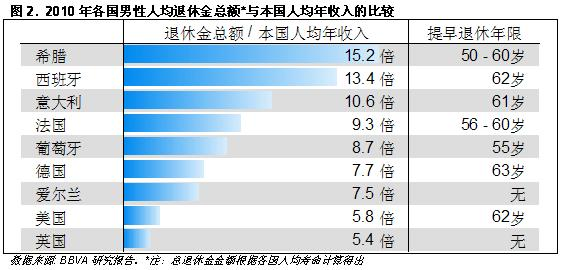](459353dd-fc25-4712-8e7c-3c36d5c3fd1a.jpg)

#### **A Cada Cerdo le Llega su San Martín**** ****（每只猪都会有被屠宰的一天）**

天下没有免费的午餐。美好的生活伴随着是劳动成本的上升，生产效率的下降，以及飞升的债务。单位劳动成本是一个衡量劳动报酬与生产效率的比值，在强大的工会力量和福利社会伴随的少工作，低产出下，欧猪五国在过去10年内的单位劳动成本的增长比德国快了近1/4（见图3）。

[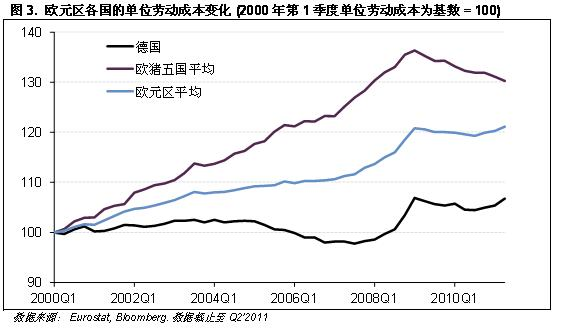](73ccdadf-0565-446f-bed1-a877a4e3f2de.jpg)

从某种程度上说，福利社会有助于刺激国内消费需求。的确，强大的消费需求是欧猪五国（除爱尔兰）的主要经济增长驱动力。但是，福利社会带来的收入上的提高并不足以支撑家庭的消费欲望，低利率引发的借贷消费才是主要原因。从1998年至2008年，西班牙、意大利的私人部门负债率翻了近一倍（见图4）。

[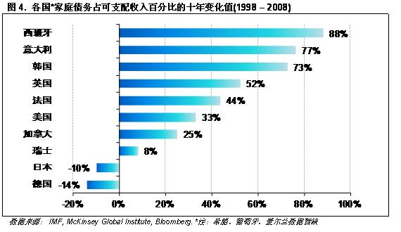](dcba925c-3c4f-4cee-a6aa-653099492f01.jpg)

而政府部门的债务负担更加沉重。欧元区公约《Maastricht Treaty》里规定，各成员国的负债不应超过GDP的60%，政府赤字不应超过GDP的3%。但由于缺乏有效的约束力，欧元区的主要国家们，为了满足选民们的福利要求，基本都已经远远超过的了警戒线，反倒是不属于欧元区的中国，目前来看似乎是最守规矩的典范（见图5）。

当经济尚好时，累积的债务和财政赤字被强劲的增长所掩盖。实际上，欧猪五国的经济增长在08年全球危机之前基本表现稳定。以希腊为例，在加入欧元区后到08年前，其年平均经济增长率为4.2%，远高于德国同期的1.4%。但是，亮丽的GDP反映的是严重依赖于借贷消费的经济结构，在2007年，希腊的家庭消费占了GDP总额的90%，远高于公认的内需之王– 美国(70%)。当全球衰退来临，银行收紧信贷，消费者不得不通过削减开支来偿还债务。而消费的缩减进一步恶化了经济。从金融危机结束至今，欧猪五国的经济恢复远逊于德国及欧元区平均水平。（见图6）。

[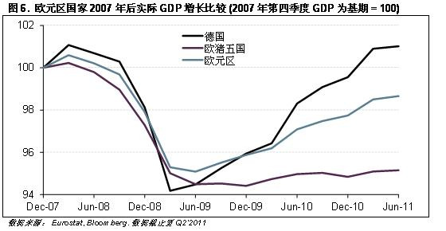](95fe0043-619c-4e9e-9424-8fea2229f0f3.jpg)

经济的持续恶化敲响了欧猪五国被屠宰的丧钟。从09年10月起，市场开始质疑希腊的长期偿债前景。随着评级机构一系列的降级报告，希腊国债的收益率如火箭般窜升。政府匆忙开始削减开支。然而，在家庭部门持续去杠杆化的环境下，政府的财政紧缩进一步削弱了总需求。在另一方面，攀升的收益率意味着持续上升的国内资金成本，从而压制了投资增长。在希腊政府无法通过贬值欧元以提振出口的情况下，经济陷入了恶性循环。作为接受援助计划的条件，希腊政府今年不得不大幅消减开支。讽刺的是，财政紧缩加剧了衰退。由于经济恶化，政府税收减少，救济支出进一步增加，导致了资金缺口进一步扩大，从而进一步恶化偿债能力。(见图7)。

[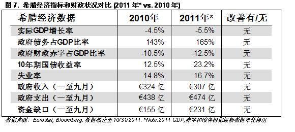](7840639a-fb9a-4beb-9fc7-290262b909ee.jpg)

由此，评级机构继续下调评级，国债收益率持续上升。这种死亡螺旋的结果就是国债收益率的不断攀升，最终当收益率高得令政府无法通过继续发债来偿还到期债务时，欧猪们就要面临一个艰难的选择：要么宣布违约，要么向其他国家寻求资金援助（见图8）。

[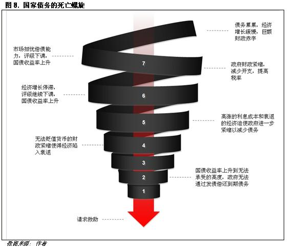](ba865459-b70f-4485-9efe-0ab377d45a73.jpg)

2010年4月，希腊正式寻求IMF和欧盟的援助。6个月后，爱尔兰也步其后尘。再6个月后，葡萄牙成为第三个受害者。随后，多米诺倒下的速度猛然加快。2011年6月，希腊在接受援助一年后再次面临着无法偿还到期债务的窘境；7月，西班牙和意大利的国债收益率迅速接近危机临界点；8月，法国银行业股票遭大幅抛售，法国的AAA信用评级岌岌可危。一场由欧元区小国希腊引发的债务危机正席卷整个货币联盟，并直接威胁到欧元区的核心国家德国和法国。

#### **The Butterfly Effect**

制造这一切传导的是欧元区紧密相连的银行业。欧元区经济一体化的进程为欧洲银行在各成员国的快速扩张提供了便利。与之伴随的则是各银行不断增持欧元区国家的债券。在年景好时，持有相对高息的欧猪债券是笔不错的买卖，但当欧猪陷入困境时，银行家们发现手中的债券顿时成了烫手的山芋。

在银行的资产负债表中，所持有的证券根据持有目的可划分至三类账户。一类以短期交易为目的(Held for Trading)，一类以持有到期为目的(Held to Maturity)，以及介于两者之间的可卖证券(Available for Sale)。在一般会计准则下，位于交易账户的证券价值随着市场价值而变化(Mark to Market)，其损益直接计入当期盈亏，而后两类账户的证券，其价值在被卖出或持有到期前则不被当前市场价值所影响。

欧洲银行业所持有的大多数欧猪债券（约90%）位于后两类账户中。因此，尽管欧猪债券的市场价格已大幅缩水，银行业所持有大多数债券在账面上仍按照购买成本计价。然而，一旦欧猪违约，银行业所持有的违约国政府债券届时将不得不大幅减值造成大幅亏损。

让我们来按照下图（见图9）演示一下，假设希腊宣布违约，债务减值50%，首当其冲的是持有相当于核心资本36%希腊债券的葡萄牙银行业。随后，遭到冲击的葡萄牙银行业将继续恶化葡萄牙的偿债能力，使葡萄牙陷入债务死亡螺旋，加剧其违约可能。而西班牙银行持有大量的葡萄牙债务，一旦葡萄牙宣布违约，西班牙银行将陷入危机。当西班牙面临违约时，法国和德国银行将被拖下水，而一旦意大利无法偿债，则德国、法国以及整个欧洲区将万劫不复。

[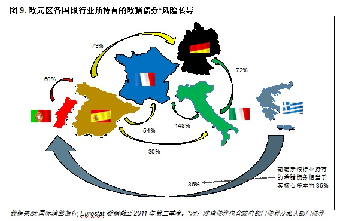](487508ea-0731-44d3-a55e-35801ad63743.jpg)

另一种传导方式则更加无序。2008年Lehman破产后造成的挤兑，险些在数天内造成整个金融系统的崩溃。所有的银行都是绑在一条绳上的蚂蚱。事实上，世界上没有一家银行（中央银行除外）能够独立应付大规模挤兑。当市场对银行失去信心，客户短时间内将资金从银行里大规模提出时，流动性危机将使银行迅速破产。而一家重要银行的破产，将使得其它银行失去了交易对手，造成大量短期借款、票据、乃至CDS无法交割，从而使整个系统陷入无序违约的恐慌。从债务持有量来看，法国和德国的银行业的风险已经堪比07年危机以前的美国银行业（见图10）。

[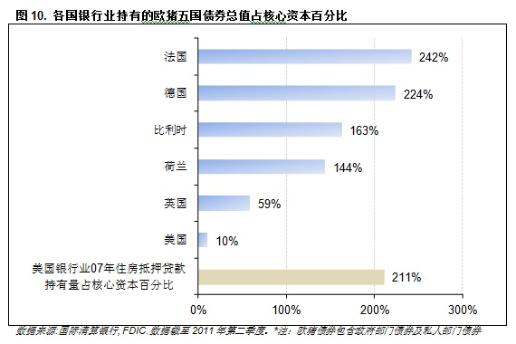](2d29efe7-0c4d-45f8-a8be-cd6180ebd190.jpg)

#### **Das Leben Der Anderen (****别人的生活****)**

尽管如此，希腊对欧盟的实际领导人 – 德国总理Merkel和法国总统Sarkozy的求援，依然引发了德法两国人民的愤怒。不了解金融业的国会议员们慷慨激昂的怒斥领导人，这是别人的生活，与我们何干？当我们在节衣缩食时，为什么纳税人的血汗钱要被用来救助这些南欧懒汉们？

迫于国内强大的政治阻力，欧盟区领导人们在危机处理上一直被现实推着走，而没有实施前瞻性的决策来阻止危机的蔓延。在希腊初陷危机时，他们袖手旁观，任由市场推高希腊国债收益率；当希腊hold不住时，他们拒绝让其破产重组，他们和IMF一起以高额利息和财政紧缩为条件向希腊提供贷款避免其立即违约；他们心怀侥幸期望希腊能起死回生重新赢得市场信任，但是如上篇所言，经济在财政紧缩下加剧恶化以至于需要第二次援助；在第一次援助希腊后，他们强调希腊只是个例，而放任市场攻击爱尔兰和葡萄牙；当三国相继倒下后，他们坚持三个小国的问题不会影响欧元区总体的稳定，却不愿出资巩固本国银行业...就这样，他们的拖延战术错过了一次次彻底解决问题的机会，使得市场的信心不断丧失。

时至今日，他们对希腊，爱尔兰和葡萄牙进行了四次救助，总金额约4000亿欧元（包括最新一轮对希腊的1300亿援助，细节尚未宣布)，其成本已超过当初一劳永逸地解决希腊问题（希腊总债务约3500亿欧元)。他们对救助的犹豫，非但没有取悦选民们，反而随着希腊问题如雪球般越滚越大（见图11），救助资金需求的持续上升，加大了国内的反对声浪。今年以来，Merkel的党派已经输掉了大多数选区的选举，而Sarkozy的民调也不断下滑，明年连任的前景岌岌可危。

[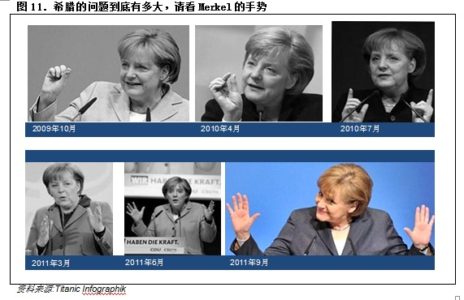](bdfd193c-36dd-44c7-beca-c8870e2ffd75.jpg)

另一方面，欧猪国家的领导人面临着更大的灾难。希腊、爱尔兰和葡萄牙都被告知救助款的分期发放取决于大规模财政紧缩的实施。公共部门裁员，降低福利，削减养老金，延长退休年龄，提高税率，过惯了好日子的选民们上街示威，将怒火对准了执政党。政府在议会无法推行财政紧缩，于是领导人或辞职重组政府或面临无法获得救助款的风险。于是就有了希腊公投的闹剧。在2011年，爱尔兰、葡萄牙、希腊、意大利的领导人相继下台，本月底西班牙的选举也极可能如此，尽管上台的新政府别无选择也将被迫继续推行紧缩政策。

内外交困的政治家们把目光投向了欧洲央行，希望其能开动印钞机慷慨解囊。然而，在法国人Jean-Claude Trichet任下的欧洲央行强硬地坚持其扼制通胀的立场，不愿过多介入国家间的财政问题。尽管Trichet是法国人，但欧洲央行事实上是欧元诞生前的德国央行最忠实的继承人。与世界上多数央行控制通胀并兼顾经济的职责不同，欧洲央行的职责只有控制通胀。欧洲央行或德国央行对通胀的强硬立场自二战后从未改变，究其原因是由于，在一战后，德国帝国银行(德国央行)通过滥印钞票以支付战争赔款，造成物价飞涨（见图12），加速了当时的魏玛共和国的崩溃以及纳粹的上台，从而发动了二战。这一噩梦在一代代的德国人的脑海中挥之不去。不出意外，德国国内对欧洲央行印钞救助也有着强烈的抵制。

今年年初，为应对能源和食物价格的上涨，欧洲央行宣布加息。欧洲央行反通胀的强硬立场使得欧元在危机中相对保持强势。但强势的欧元对处于财政紧缩的欧猪来说无异于雪上加霜。缺乏统一的财政政策，货币政策的有效性也大打折扣。业内常用泰勒公式，以通胀率和失业率为变量，来衡量所谓的最优利率。根据泰勒公式的计算，欧洲央行的利率，对于处于经济衰退的欧猪国家来说过高，而对于德国来说又不足以抑制通胀（见图13）。

当然，欧洲央行并没有完全袖手旁观。迄今为止，欧洲央行在应对危机上主要做了两件事，其一是通过开放贴现窗口，对陷入困境的银行提供贷款；其二是通过从二级市场购买欧猪国债，以防止收益率迅速上扬。在过去6个月内，欧洲央行的总资产增加了约4700亿欧元，绝大多数来自于上述两项政策（见图14、15）。

两项措施在短期内为欧猪提供了喘息之机，但是，也使得欧洲央行面临着越来越大的困境。随着危机的陆续爆发，希腊、葡萄牙的多数银行已经失去了市场的信任，无法从银行间拆借获得短期融资。欧洲央行持续的提供融资，所获得的抵押品主要是借款人所在国的政府债券。换句话说，欧洲央行对银行业的流动性支持，使得自身的资产负债表逐渐成为一个堆满欧猪国债的垃圾场。而从二级市场购买国债则更是两难，买得少了，于事无补，买得多了，更加速了堆积垃圾的过程。一旦欧猪违约，欧洲央行所持有的国债也将大幅减值，从而使央行蒙受大幅损失。因此，欧洲央行屡次以停止债券购买相威胁，强烈反对债务重组和减值，加大了解决问题的难度。

#### **“There is Blood in the Water, Let’s Go and Kill Someone”**

债台高筑的政府、脆弱的银行业、以及瘫痪的领导决策，对于嗜血的做空者们来说，是个绝好的获利机会。通过散布流言放大基本面的问题引发信心危机，是做空者屡试不爽的手段。每天在交易大厅里，都流传着各种好笑的和不好笑的流言，如中国在大举购买欧债，希腊秘密协商退出欧元区，法国德国评级被下调等。媒体也在一旁煽风点火。CNBC，继3年前成功陆续整垮Bear Sterns和Lehman后，再次上演《下一个是谁》的剧本。几个妆扮放荡的美女，与一些不相干的前官员，交易员，和学者一起，对欧债危机信口开河，让市场人心惶惶。

此外，评级机构所扮演的角色也令人生疑。评级机构对实施财政紧缩的欧猪国家屡次下调评级，从短期看无可厚非，因为经济将持续恶化。但政府债券的评级，直接影响着金融系统对该债券的接受度。一次评级的下调，就可能产生交易所上调交易保证金，银行要求借款人提供更多的抵押，或基金由于评级过低而无法购买的情况，从而引发市场的抛售，引发另一轮恶性循环。

8月份，市场疯传法国AAA主权评级被下调的流言，法国银行被天量卖空。法国三大银行BNP,SocGen和Credit Agricole单天跌幅超过15%。而后流言虽止，市场已经惊弓之鸟。法国银行基本丧失从美国货币市场获得美元融资的渠道。幸得欧洲央行再次出手，通过与美联储货币互换向法国银行业注入美元，暂解燃眉之急。持续不断的流言和欧洲政局的瘫痪使得银行业不得不挥泪斩仓，不顾成本的大量卖出所持有的欧猪国债，尤其是损失相对较少的意大利国债。与此同时，清算所提高了交易意大利国债所需的保证金，引发了进一步的抛售。意大利国债收益率飞速突破关键心理关口7%，欧债危机终于到了最关键的时候。（见图16)

[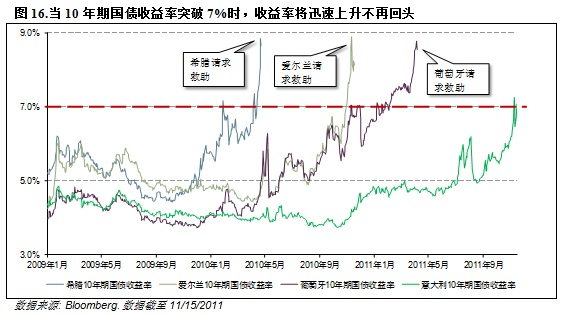](2b776db0-8686-4680-89cc-a2cdac5bb654.jpg)

#### **Why Italy Can Screw the Whole World**

在解释意大利为什么是关键前，让我们先点评一下最新的欧债救助方案：对私人部门持有希腊国债减值50%，并提供1300亿救助资金。通过杠杆化将欧洲金融稳定基金(EFSF)扩容至1万亿欧元。要求欧洲银行业在明年6月前提高资本充足率。比起先前几次的计划，最新的方案显示领导人们终于承认了希腊的破产，认识到了银行业的脆弱，并朝着正确的方向去提高救助基金的规模。只可惜，力度还不够，并且可能已经太晚了。

50%的私人持有者的减值并不能使希腊立即摆脱困境。由于相当部分希腊国债已由非私人机构（如欧洲央行）所持有，减值后的政府债务占GDP比值最乐观也仍将在2020年以前保持在120%左右，即意大利当前的规模。希腊在数年后还可能需要持续的救助。

提高对银行业的资本要求是维持市场信心，防止危机蔓延的重要举措。但是政府拒绝用纳税人的钱救助银行家（不难想象），而要求银行自筹资本。银行的对策不是增发股票寻找巴菲特等私人投资者，而是大规模收紧信贷，变卖资产，削减开支以充实资本。银行业的去杠杆化使得实体经济无法顺利借贷，将导致欧元区各国陆续陷入衰退。

当经济陷入衰退时推行财政紧缩，就将重复希腊一年前的悲剧（见上篇），使情况不断恶化。从偿债能力分析，决定债务占GDP百分比的主要有三个因素，财政赤字、债券利率以及经济增长。其中，经济增长最为重要。以意大利为例，根据JP Morgan的分析，经济增长停滞伴随着6.5%债券利率足以抵消财政紧缩的努力，使意大利债务比重持续上升而最终破产(见图17)。

因此，意大利想要摆脱危机的出路只有一条，就是在推行财政紧缩的同时保持经济增长。遗憾的是，意大利经济已处于衰退的边缘或已陷入衰退。制造业经理人采购指数(PMI)被广为引用作为一个宏观经济的先行指标，当PMI小于50时，意味着制造业活动的收缩。意大利制造业PMI从7月起跌破50并持续下探，其GDP在第三季度或第四季度衰退几乎板上钉钉（见图18）。意大利凭自己已经无法摆脱危机。

[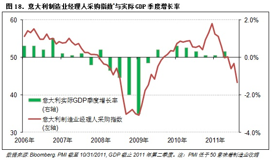](41f54775-8091-497a-bae2-0beea3a8556e.jpg)

在另一方面，意大利经济面临着严重的结构性问题。从2001年至今，几乎其每一个季度的经济增长率都低于欧元区平均值。在过去10年，意大利的经济增长率在全球仅高于海地与津巴布韦。造成这一切的主要原因在于混乱的政治，低效的公共部门以及高企的劳动成本。而根源是意大利的民族性格。意大利人深受马基雅维利主义影响，外表浮夸，长于雄辩，善于钻营，但缺乏脚踏实地的吃苦精神。为避免过于主观，我不便展开。但有心人回想欧债危机（上）的开篇，再查阅一下其二战表现不难有共鸣。而刚下台的贝卢斯科尼，作为全世界的笑话，却能屹立国内政坛20余年不倒亦可说明问题。如今新政府上台，能否顺利推行紧缩计划仍是未定之数，因为多数紧缩措施细节至今尚未敲定。

然而，意大利是真正意义上的太大而不能倒(Too Big to Fail)。意大利政府部门债务约为1.6万亿欧元，仅次于美国和日本，是世界第三大债务国。其债务相当于70%的中国外汇储备。意大利的违约，通过德法两国银行业对其的巨额敞口(见图19)足以使欧元区银行系统崩溃。当政府试图救助银行时，其数额之巨大亦足以使德法两国步欧猪后尘陷入债务危机。而银行间的大规模违约，挤兑和倒闭，将更甚于2008年Lehman破产后的惨状。届时，无论是纽约、伦敦，还是香港、东京都难逃一劫。

[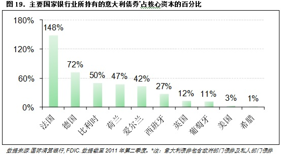](1e69149e-51a2-4a24-8700-df25c36c9a75.jpg)

可是，意大利又太大了而救不了(Too Big to Save)。假设意大利陷入危机，市场利率过高使其在未来三年内无法发新债偿还到期债务，则当前的EFSF远不能满足意大利的融资需求（见图20）。即使是杠杆化后的EFSF，且不论其杠杆化细节尚未敲定，也不论中国等国家是否能出资加入EFSF，即使一切顺利，1万亿的规模也无法使市场相信其足以挽救意大利。

[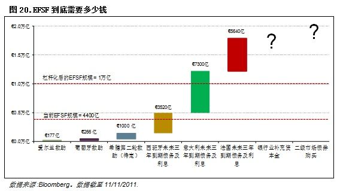](de51f7f6-0b51-4df0-8444-a0098331c1e8.jpg)

#### **C’est La Vie (****这就是生活****)**

欧债危机至此，已没有别的出路。随着意大利陷入危机，核心国家由于政治压力和自身债务，已没有余力继续增加救助资金。通过违约以摆脱债务负担，则将重创欧洲银行业，引发新一轮的全球金融危机。而有关于欧猪国家退出欧元区的设想，操作起来困难重重。尽管恢复本国货币后可以通过贬值提高竞争力以拉动经济，但贬值后的本币加大了偿还欧元债务的难度，而EFSF将无法救助非欧元区的国家，因此短期内违约风险反而加大。另一方面，离开欧元区改用本国货币的决定一旦宣布，居民将试图取出欧元存款，引发大规模的银行挤兑，其结果是一场立即的金融危机和社会动荡。

正如Merkel所言，欧债危机是多年的错误政策的累积，不是一朝一夕就可以解决的。长期以来，为讨好选民，政治家们不断提高福利待遇，国民通过借贷享受着与工作不相符的美好生活，与之相伴的，是全面落后于世界的竞争力（见图21）。

[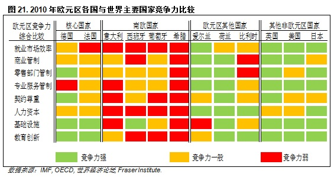](559ae71d-fecd-4bd8-8d52-a9c591759f20.jpg)

为了彻底摆脱债务危机，欧猪们该做的，是继续的财政紧缩，辅以大规模的结构性改革以重振经济，恢复竞争力。当然在短期内，我们会继续见证不断恶化的经济，评级机构下调评级，以及永无休止的做空谣言。照当前趋势，在未来1年内，甚至更短时间，意大利，西班牙，比利时，和法国都可能陷入危机。在没有其它资金可以救助意大利等大国时，欧洲央行最终将承担借款人的身份。在意大利人Mario Draghi成为新一任行长后，欧洲央行在面对全球金融系统崩溃的威胁下，将不得不摒弃德国央行的教条，开动印钞机，为欧元区国家提供资金支持。具体的方案可参考美国2008年财政部的Troubled Assets Relief Program (TARP)计划，大量地购买问题债券、向银行注资、或者为EFSF提供担保，进一步扩大其可用资金。也许，欧洲央行的救助计划可以被叫做Credit Restraint Alleviation Program (CRAP)...

然而，欧元区的隐患不会随着欧洲央行出手而结束。随着欧洲央行打开通胀的魔盒，欧元区的居民将长期面对一个高通胀，低增长的去杠杆化过程。历时2年的欧债危机，已经在欧元区成员国之间产生了难以弥补的裂痕。政治家们乐于将责任推卸给邻国，使边缘国家的人民将要求财政紧缩的德国总理与纳粹相提并论，而德国人民则对边缘国家的懒惰、散漫及不负责任亦深恶痛绝。彼此之间的嘲笑，指责，不信任，使得欧元区所谓的共同财政政策、欧元债券的设想如同镜中花、水中月，可望而不可及。

二战结束后的，满面疮痍的欧洲大陆诞生了欧盟/欧元区的前身 – 欧洲煤钢共同体。其初衷就是为了通过控制工业产能以防止战争再度兴起。在过去60余年，几代欧洲人致力于通过国家民族间的认同与融合，以期最终实现一个和平繁荣的大欧洲的梦想。可是，危机已将国家融合的进程中止，甚至倒转。欧元区的解体，从长期来看，已不再是不可想象的事情。只是一旦大欧洲的梦想成为泡影，这片数百年来战火不断的土地的命运，又将如何呢？

过去的美好日子已经一去不复返，而彼此间的伤害将一直保留下去，这就是生活。（完）

 

（采编：尹桑；责编：尹桑）

 
