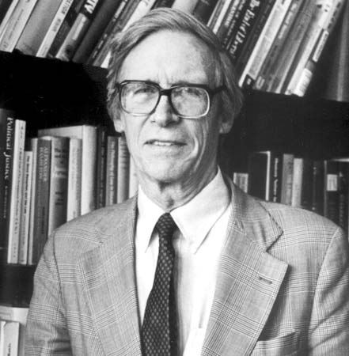

# ＜开阳＞自由主义及其副现象

**自由主义立足于义务伦理学所支持的自律-自我决定的个人形象，其权利概念同样仅作为个人合理行动之空间而得到阐明，在此限定之下，其政治行动的谓词只可能为“消极的”或“非干涉的”。进一步而言，一方面，人们必须服从于权利制度，但另一方面，自由政制本身并不诉诸于任何善观念，也即，人们并不会被要求变得“宽容”或“尊重他人”，尽管这些伦理一般来说会受到鼓励。**  

# 自由主义及其副现象

## 文/韩乾（南京师大）

 

何为政治事务，或者说，何为政治理论所应当处理的事务？长久以来，对这一问题的回答都建立在对以下两个概念的混淆上：“人所处的制度”与“人所过的生活”。古代哲人曾声言，由于人生而群居，人的生活内容就应该由一种关于社会-制度的整全性构想决定，也即，“政治”这一词项就涵盖了所有的人类事务。然而，鉴于人的生活总被种种善观念所填充，政制因此就必须深涉价值领域。这样一种结果在古代世界当然不成为问题，因为一个城邦即是一个典型的同质化社会，在这样的小型共同体之中，并不存在真正有威胁的道德疑难；因而，制度服从于德性的境况在彼时不仅是可能的，而且是普遍的。

但是，古代哲人并未虑及这样一种可能性：小型城邦瓦解，统一的、跨共同体的大型国家取而代之。很快，罗马对欧洲的征服就制造了此种处境，而这直接颠覆了制度与德性的经典关系：显然，特定善观念仅为共同体内部所接受，但制度或者说法律所关心的是普遍的、直接的人类行动；后者所提供的规范，一方面高于任何具体的价值立场，一方面又必须避免与之发生冲突——事实上，罗马万民法正具有这一特征。换言之，上述条件所要求的即是将政制置于一种价值无涉的地位：它仅是承载诸种善观念的框架，而不是实现任何伦理目的——譬如亚里士多德之“幸福”——的工具。

政制与善观念的分离同时也应该被理解为现代性的核心取向：小型共同体的消失从根本上瓦解了德性的优先地位，因而自罗马之后，任何一种试图恢复古代政制的现代努力最终都失败了。在此值得注意的是，自由主义由古至今的伟大传统同样伴随着美德观念逐渐淡化的过程：在贝克莱、洛克与穆勒的论著中我们尚可见到相当成分的德性视野之内的叙述，而在休谟提出事实/价值二分之怀疑论之后，善观念才有可能从政治构想中被清除出去；也正是在这样的前提下，康德的再奠基的政治哲学或者说义务伦理学才成为现实。因此，近世思想史依然可以被粗略地、后验地描述为线性的：属于现代的自由主义观念在古今过渡过程中出现并最终完善，而属于古代的美德政治观则逐渐消失，这最终一击由休谟与康德携手完成。

按照上述理解，善观念在政治理论中的地位，就立即成为一个关键问题。围绕着当代自由主义的争议多集于此：一种“纯粹的”——可以被完备地还原为价值中立之用语的——权利制度是否可能？另一方面，一种反至善论的政制是否有走向相对主义甚或虚无主义的危险？前一疑问由社群主义者提出，而后者则为以列奥·施特劳斯为代表的保守主义者所持有。作为自由主义的论敌，这两类论者共享了古代政治的基本精神：善优先于正当、优先于平等权利；政治理论不应该回避美德维度。更可虑的是，即使在许多自由主义者那里，这一论题也绝非清楚——其常见论述往往集中于以下含糊的结论：良好的政治秩序依然诉诸于一些基本的良善价值，如“宽容”或“平等待人”等等。一个典型例子是：罗尔斯在《政治自由主义》中显明地指出，公平正义的核心理念同样是一种“政治道德”；现代世界的理性多元境况本身就是一种善。尽管罗尔斯特地强调：政治自由主义所主张的善观念绝非出自任何先验立场、而仅仅是现实的偏好，但无论如何，他并不赞同对正当与善乃至政治与美德的彻底区分。

既然美德依然未被理论家们抛弃，那么审视社群主义或保守主义与罗尔斯式的“德性自由主义”之间的差异就显得格外重要。两者最易见的区别集中于善与正当的优先性论题上：归根到底，比起那种意图使政治重新服从于某一道德序列的主张，德性自由主义依然属于一种现代政治理论：其典型表现即是，在回应其论敌时，罗尔斯通过对公共领域（市民社会之文化领域）与政治领域的严格区隔，拒绝了任何完备性学说对后者的侵犯。但是，在这种毫不妥协的立场背后，对于与自由主义政制自身紧密相关的一些善观念，罗尔斯的态度却令人大惑不解：如果容许任何“政治道德”的存在，进一步而言，如果将某些善观念视为为政制证成的理由或政治事务之实质标准的组成部分，我们就很难理解：自由主义如何能够一方面不放弃德性标准，一方面又自洽地坚持政治中立命题。

德性自由主义所遭遇的上述困难出自一种深刻的范畴错误，它关系于如何看待价值语词在自然语言中的地位，准确地说，即怎样理解事实/价值二分论题：与常见观念不同，接受此一命题并不意味着我们能够在语言运用之中完全地将事实判断与价值判断区分开来。正如希拉里·普特南所指出的，存在着大量既适用于事实判断又适用于价值领域的“混杂性的”（thick）概念，如“冷酷”“温暖”等等；再者，即使在经验科学语句中也不存在纯粹的事实判断，如一份实验报告之所以会包含载玻片而不包含空气中的灰尘，正是因为前者更具有科学价值。统而言之，所谓“单独的”事实陈述或价值陈述完全是一个神话；甚至可以不无道理地说，语词之意义本身就是一个价值问题。

看起来，如果接受上述理解，我们就立即陷入了困境。事实与价值时时刻刻缠结在一起的结论难道不是对该二分法的正面反驳吗？或者说，如果区分事实与价值是不可能的，提出这一命题还有什么意义呢？然而，休谟的意图并不在于指示我们进行实际的区分工作。的确，任何价值判断都立足于事实之上，抽象的善恶概念并不存在；但在知识论上，这样一种区分显然有其重要作用。必须看到：恰恰因为知识论上的划分是可能的，“混杂性的”这一语汇才有可能得到合理的使用；假若这一命题不具有任何意义，我们就根本无从指认语言运用上的混杂现象。换言之，混杂现象的大量存在并不意味着我们只能止步于概念的混杂意义。不幸的是，德性自由主义在此犯下了同样的错误：当行动与对行动的价值判断不可避免地混杂在一起时，理论家们便误以为后者必然构成了支持或反对前者的理由。但是，显明的逻辑是：善观念在政治领域中的存在并不意味着对政制构想的证成必定依赖于对该种善观念的采认；譬如，我们说一种政制构想具有某种“良善价值”，不等于说该价值、该善观念构成了它成立的必要条件，更不等于说这一构想积极地支持这些价值、这些善观念。

罗尔斯对现代“理性多元”社会的阐述为上述范畴错误提供了绝佳的案例。在《政治自由主义》中，人类社会多元观念共存的境况被认定为理性的产物，因而，它不能为任何政治思考所简单地忽视甚或否定；任何有说服力的政制构想都应该以承认这一境况的牢不可摧为前提。对此，罗尔斯曾给出了完全正确的阐述：它正是“宪政民主体制下自由制度的构架”的运作结果。关键就在于，它既然仅是自由制度之结果，就没有理由成为政治思考的起点。显然，罗尔斯在此给多元秩序赋予了一种良善价值——多元本身被当作一种普遍的善。但问题是，我们完全可以想象：在一个较小规模的自由社会中，未必存在真正的多元秩序；若按罗尔斯的论述而将之称为不合理性的，则纯属自相矛盾。因此，这里的疑难是，即使为自由制度所引发并维续的多元秩序果真是一种善，也不意味着自由制度需求这种善的支撑。不甚严格地说，对自由主义施行结果的正面价值判断，仅可以被视为一种“副现象”（epiphenomenon，在此借用心灵哲学的语汇），而远不足以构成为自由制度证成的理由。

如上文所言，犯下了上述范畴错误的似是而非的论断往往具有以下形式：由于某种政制之实践结果具备某种良善价值、符合某种善观念，该政制便主张人们应当认肯该善观念；进而，其政治行动必定以该善观念为理据；最后，该政制的证立必然以该善观念为必要条件。这一连串的谬误，皆源于理论家不能区分“附带的”与“直接诉诸的”或“积极支持的”，也即不能明确：在未经充分申说之前，此种价值判断仅属于政治行动之副现象。自由主义立足于义务伦理学所支持的自律-自我决定的个人形象，其权利概念同样仅作为个人合理行动之空间而得到阐明，在此限定之下，其政治行动的谓词只可能为“消极的”或“非干涉的”。进一步而言，一方面，人们必须服从于权利制度，但另一方面，自由政制本身并不诉诸于任何善观念，也即，人们并不会被要求变得“宽容”或“尊重他人”，尽管这些伦理一般来说会受到鼓励。无论如何，这些道德观念都只能作为自由政制的伴随产物而被严格排拒于政治领域之外。这据说令人遗憾；但也正因为此，自由主义才能保持智识与实践上的生命力——这既出自它的光荣传统，也是其理论的自我要求。

 

（采编：佛冉 责编：黄理罡）

 
