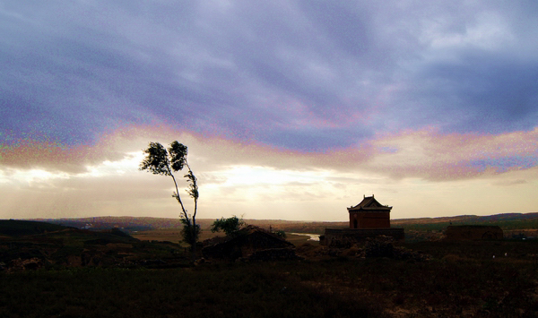

# ＜摇光＞時間，時機

**試想你打開一段視頻，永遠以千百倍的速度快進，能得到什麼東西！而你要把這眼花繚亂稱為真實，又是多麼可怕——烏坎村的村民，不是祗在你看新聞的時候與防暴警察抗爭；丈夫那快要腐爛卻不被允許放入冰櫃的屍體，將是妻子終其一生揮之不去的夢魘！汶川地震三年半了，因為校舍坍塌而失學的倖存兒童，他們中的每一個，得到完整的心理治療了嗎？那些孤寡老人，在已經來臨的第四個冬天裡，吃得飽、穿得暖、偶爾能出門走走嗎？**

# 時間，時機

## 饶欣子（Universität Heidelberg）

俺曾見金陵玉殿鶯啼曉，秦淮水榭花開早，誰知道容易冰消。

眼看他起朱樓，眼看他宴賓客，眼看他樓塌了。

這青苔碧瓦堆，俺曾睡風流覺，將五十年興亡看飽。

那烏衣巷不姓王，莫愁湖鬼夜哭，鳳凰臺棲梟鳥。

殘山夢最真，舊境丟難掉，不信這輿圖換稿。

謅一套哀江南，放悲聲唱到老。

——[清] 孔尚任 《[桃花扇 / 餘韻](http://rrurl.cn/dOQWw4)》

**宏大的歷史與（也許）渺小的個人** 我們對時間的概念並不客觀，床頭那本《全球通史》，從西方殖民地擴張，到工業革命，到兩次世界大戰，到冷戰，還要兼顧亞非拉各洲——這千五年的歷史集中在五六百頁的書裡；闔上書時我想起兩會，五年一次，次次報紙排版都沒有多少變化，成為網民笑談——在我們親身經歷的這個年代，時間不再像《全球通史》般濃縮凝聚，而是以一天、一月、一年慢慢累積，習慣了寫論文時第一章節氣勢恢弘的背景介紹，再看看這個現實的世界，時間，彷彿一顆在葉尖怎麽也滴不下來的露珠。 轉念一想我們似乎已經走了很遠，那场学潮時我才半歲還不記事，「九一一」時我剛上初一，汶川地震時是高考前夕；想來這些事情以後都會被寫進歷史書裡，當我們的孩子、孩子的孩子讀起，也許祗同我們讀鴉片戰爭、文化大革命的感覺類似——雖然厚重，卻也輕巧。兩三個單元的課本，哪怕小學、中學、大學各講一遍，應起試來，能記住的無非是事情發生的年份、導火索、參與者和最「重要」的影響。這是沒有辦法的事情，除了歷史課，孩子們還有好多別的事情要做，建立這份對歷史的基本框架意識，也確實必不可少；可這也是我們不能忽視的地方，試想你打開一段視頻，永遠以千百倍的速度快進，能得到什麼東西！而你要把這眼花繚亂稱為真實，又是多麼可怕——烏坎村的村民，不是祗在你看新聞的時候與防暴警察抗爭；丈夫那快要腐爛卻不被允許放入冰櫃的屍體，將是妻子終其一生揮之不去的夢魘！汶川地震三年半了，因為校舍坍塌而失學的倖存兒童，他們中的每一個，得到完整的心理治療了嗎？那些孤寡老人，在已經來臨的第四個冬天裡，吃得飽、穿得暖、偶爾能出門走走嗎？在我們還記得「老吾老以及人之老，幼吾幼以及人之幼」的時候，心中不僅該有宏大的歷史觀，還要有具體而實在的人文關懷——記得汶川地震不久，《新聞日日睇》聯合廣州本地企業，自組車隊給受災婦女送上衛生巾，這是迄今我印象最深刻的捐贈，並直接接導致每每出現自然災害，我都會擔心，女人們是否有衛生巾可用。這些或觸目或溫暖的片段，同樣發生在南京大屠殺的倖存者和上山下鄉的知識青年身上。歷史，不祗是彈指一揮間的興衰成敗，還是成千上萬有血有肉的靈魂一生的枯榮浮沉！ 於是有人寫回憶錄或傳記。上週看完《巨流河》，之前有印象的還包括《往事並不如煙》和《八十年代訪談錄》，算上自己幾週前徹夜瘋狂的拙作《食物記憶》（待續）——這些個人的歷史，想來還不該忘記《Steve Jobs》。一個人在有生之年能寫出五六百頁自我解讀，把那些念念不忘的人和事一一曝光，著實是件幸事。這些漂在台灣的遊子、被批鬥的官員，經歷了五千年中動盪的七八十年——實際上，哪怕是文景之治或貞觀之治也沒有超過這個年數。反觀自身，有時我們並不是不知道自己活在現實生活裡，祗是我們過得太現實，現實太緩慢，緩慢到麻木了。戀愛中的男女等待對方的企盼，是多麼漫長；到分手之後才又發現，多年的感情轉瞬即逝。時間很公平，歷史也許有規律，別看著他人就人生如戲，而以為自己還在那太平盛世的白日夢裡！ 

 **七十億人的時間線與遇到對的你** 如果說上半篇文章我想強調宏大的歷史觀與具體生活的統一，那麼下半篇我想在此基礎上把時間的維度從一維上升到七十億維。所謂一維，可以指從自我出發（我眼中的世界），也可以指從社會規範出發（大眾眼中的世界）。前者自然很清晰，你所感知即是你的真實；後者則較為模糊，畢竟所謂的「大眾」，也不過是「符合你定義的大眾」，歸根到底，依舊是從自我出發罷了。無論是哪一種，一維的想法都是較單一而不為他人設想的。 別忘了，當她站在舞台中央，做著自己那齣戲的主角的時候，齊邦媛筆下的那個張大非，不能比她少女時代的一個配角更多；哪怕是她自己，發表的也就是她眼中願意闡釋給公眾看的那個形象。這固然比群體雕像要具體實在得多，但當你知道蓋茨他媽跟國會議員有交情，巴菲特之所以能小小年紀參觀證券交易所跟他爸的人脈不無關係的時候，你就知道人類學家為什麼這麼執著於做 participant observation，那麼執著於 grasp the native point of view 了（語出英國人類學家 Malinowski）。同樣的道理，暴斂徵地固然是引發烏坎村民上街遊行的導火索，但每個村民在事件中有不同的表現和立場（即使最後表現形式是有數千人遊行）的背後，是他們各自不同的人生軌跡，七十億條人生軌跡。 不論最後是否寫成文字被記錄下來，每個人都擁有一條祗屬於自己時間線。很多時候一些人的行為讓人難以理解，是因為他人並沒有了解那些人的過去的願望，或者能力。當你發現那個成天板著臉的語文老師，幾個月前經歷了喪子之痛的時候；當你發現那些身患被害妄想症的敏感人群，幼年家庭生活並不和睦的時候；當你發現藥家鑫馬加爵的「罪惡」祗是表象，那些令人扼腕的社會不公一如羅素所言「the unbearable pity of mankind」才是根本原因的時候——停止惡意的猜測和膚淺的解讀，用更寬廣的心胸去包容、去理解、去愛他們吧。世界那麼大，人那麼多，生命那麼短，我們不可能知曉每個人的時間線，萍水相逢已是緣分，無罪推斷才是真理。 除了以人為單位各自分析，這些時間線縱橫交錯，把人際關係網織得細細密密。祗要生命還會繼續，這七十億條時間線就有可能相遇——也許是直線和直線相交，越走越近，然後又各奔東西；也許是三角函數與 x 軸的關係，聚散總有期；還有可能，像我和他的時間線，曾在七年以前重疊，陰錯陽差，他記得當年穿著背心的我，而我祗能望著他一張張陌生的 profile pic 嘆氣。相遇，分離，偶爾提起。直到七年後，彷若天意，兩條時間線似乎又有了交集。不知道未來在哪裡，但我固執地以為，這是在對的時間，遇到了對的你——在聖誕前夕，我感謝上帝。 

（采编：黄理罡 责编：黄理罡）

