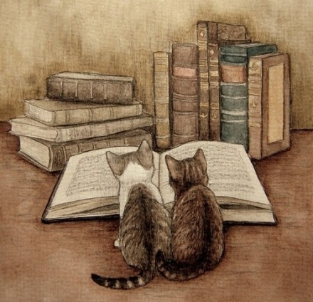

# ＜摇光＞谁是谁眼里的西施

**其实，爱情是感性和理性的混合体，明白一些道理并不会使你就秋水共长天一色，但至少不至于让你总是想要人生若只如初见。谁也不会是谁眼里永远的西施，谁也不会是谁永远的perfect guy。我在成长，你也在成长，经历了愉快、悲伤、争吵、和解以后，看着对方苍老很多却不曾察觉的脸，发现我还在你身边，你也还在我身边，不是人间最美的诗吗？**

# **谁是谁眼里的西施**

## **文/布川Winbert (中国传媒大学)**

 

“情人眼里出西施”我想应该是爱情里最无厘头，却恰又是最美好的逻辑。

故事的开始总是你好、我好、你情深、我意浓，而故事的后来却只有非黑即白的结局，其实没有谁是谁永远的西施。就像吴灭之后，很多人都愿意相信是范蠡带着她隐去，从此泛舟五湖，白发满鬓，也像勇士拯救公主之后童话就戛然而止，所有美好的故事都会结束在最皆大欢喜的一幕。

可是，生活并不是这样。

其貌不扬的黄西在脱口秀里曾经说个这样一个笑话：他听说美国的离婚率有50%，感到非常惊讶，竟然有一半的人能够让婚姻走到最后！常常听到、看到各种关于爱情结束的总结，什么细节打败爱情、距离打败爱情、时间打败爱情、金钱打败爱情、小三打败爱情……似乎没有什么不可以打败爱情，难道爱情真的是一块薄薄的石墨，一碰就碎。

美国有一位我很欣赏的心理学家斯腾伯格提出了爱情的三角理论，他认为：爱情由“激情”、“亲密”、“承诺”三个部分构成，而根据排列组合可以构成7种不同的状态，任何一个部分或者两个部分的缺失都会导致爱情关系的非良性发展。当然这只是一种理论，并不是所谓爱情的真理，况且叫做“爱情”的这个东西被世人讨论分析了千年，也无法说透，因为整体并不是部分简单的组合。

这个理论是从两者相互关系的角度去分析的，而我更喜欢从个人需求的角度来看到一段关系，因为虽然很多人不愿意承认，但爱情从某种角度上来说确实是一种交换关系，只不过超越了简单的“看得见的东西”的交换，有一些交换的部分是无法量化比较的。

我认为在爱情里人的需求有“情欲发泄”、“生活陪伴”、“灵魂交流”。而在我思考和观察的过程中，发现的最可怕的事情是，这三个需求在现代人身上是可以独立出来的。能唤醒你身体的、能给你生活温暖的人、能触碰你灵魂深处的人可以是三个、甚至更多个人。

当遇到一个爱情失败的故事的时候，我总是会不自觉的去套这三个需求。比如现在社会上所存在二奶，从道德角度来说当然是会义愤填膺，将其骂的体无完肤。可如果你真的和一个当二奶的人聊过天，你会发现她们其实是一种身在江湖的处境，这个世界上无法自拔的除了爱情和牙齿，还有欲望。再比如中年危机、小年轻闪婚闪离等等现象都可以用这个需求较好的解释。

爱情在开始的时候其实并不是爱上对方，而是一种心理投射，比如你理想的女人是黑直长发，面容清秀、性格温和、知书达理、懂得生活情趣、明事理、轻物质……那么当你遇到一个黑直长发、面容清秀的女生，并产生初步好感的时候，你就会不自觉的把后面所有特点也默认为她所具有的特质。反之，女生亦然。

开始的一段时间，是在和你幻想出来的恋爱交往，说白了，也就是你TM自己和自己在谈恋爱。当共同经历了一段时间以后，你脑海中想象的她和真实的她会产生很多碰撞、摩擦，也就是你的心理图式在不停的受到冲击。

提到“心理图式”要说明一下，这是著名的儿童心理学家皮亚杰所提出的观点，简单的说就像每个人心理都有一块模板，但不是那种很准确的。当你实地考察以后，发现有出入，这时候有三个情况会发生：改变图式、改变环境、逃离环境。

但是在实际情况中，你不可能改变对方，所以剩下的选择就是改变自己的看法或者分手，当走到这一步的时候，大多数人不愿意接受对方是这样的人，却又没有办法改变对方，于是就只有分手，这就是为什么三个月左右分手的情侣很多。

在实际生活中，能够符合图式里恋人模样的人其实很少，我们所谓的合不合适指的其实就是符合图式的程度问题，而符合图式的程度就可以从我所发现的三个需求方面来看。

写到这，我先申明一下，这三个需求也是我自己想出来的理论，仅具有参考价值，不是标准，如果有任何因此而造成的分手、离婚，本人概不负责……如由此促成的恋爱、结婚，欢迎你们来找我拍婚礼纪实。

到此，西施不西施的问题被具化为双方是否能互相满足这三个需求的问题。“情欲发泄”、“生活陪伴”、“灵魂交流”这三个需求可以看做是由下而上的，最下面的是最容易满足的，中难之，上可贵。

当我想出这个东西以后的某段时间，我陷入了爱情观崩塌的状态，因为“情欲发泄”可以通过一夜情、找小姐搞定，“生活陪伴”可以找无数个人暧昧搞定，“灵魂交流”反正也没遇到过几次，可以通过看书、旅行缓解。那么，爱情是什么呢？

后来有一天下午，我坐在屋里晒着太阳喝着茶，想起乔布斯说过愿意用所有的科技去换和苏格拉底相处的一个下午，就突然想到了柏拉图，就突然悟到或许柏拉图所描绘的爱情就是这三个需求体现在同一个人身上。

其实在短时间内，比如三两年内，三个需求体现在同一个人身上并不是太难的事儿，难的是人是会变的，当双方都改变的时候，需求关系就产生变化。最好的变化当然是两个人都变了，可是相互需求依然能够满足。这个结论让我想起了《少有人走的路》中对爱的定义：爱，是为了促进自我和他人心智的成熟，而具有的一种自我完善的意愿。

提取一下定义的主干，其实是：爱是一种自我完善的意愿。就是说，如果你床上活越来越好了，生活上越来越会照顾对方了，精神上也能够与对方成长同步了，脑袋被门挤了的人才会甩你啊。可是就像跑步，总有快慢之分，所以其实不同步是必然，这就引出了另外一个问题：爱人的选择是否是优胜劣汰？

大学的时候，看过一篇文章，写的是一个爱情心理学家深入研究了爱情以后，对世人说：“爱情其实是一种信仰，相信对方是好的，相信你们是会永远在一起的。”当时我正失恋，觉得这话很扯，而正是因为觉得很扯，所以我记住了，现在想来，真是没文化真可怕啊。

当双方都有这样的信念以后，跑步快慢问题就有了解决方法：你今天来大姨妈跑的慢，我等等你，明天我蛋疼跑的慢了，你等等我。至于旁边刚好跑的和你一样快的帅哥，难说是被你套圈的。而这里的“愿意等”，在我看来，就是爱情最温暖的地方。

那么，你的知道你的三个需求具体是什么吗？

这就来到了自我认知的领域，蒙田说：“在认识自己这个问题上，大多数人都显得信心满满。”其实两人关系的破裂和无法继续，与其说是对方不好、不符合你的要求、巴拉巴拉……不如看作是你不够清楚你的需求，就是你根本不知道自己要什么，别人不就怎么做都坑爹么？

最著名的一个案例就是：一个男生和一个女生去吃饭，男生问，你想吃什么啊，女生说随便。男生点了一个什么，女生说我不想吃这个，男生又问，那你想吃什么，女生说随便……然后就随随便便无穷尽也。

吃饭是小问题，大不了多点几个菜，大不了换个地方吃，可是人生选择，比如城市、工作、生活方式的选择，任何一个随便都可能造成分手。最让人气愤的就是，这时候“缘分不够”就被搬出来了，缘分你妹啊，这本质上就是点了一个菜她不喜欢吃，她却说是缘分不够！

所以，想要很好的维持一段关系，靠的不是“情人眼里出西施”，而是你充分的认识自己，懂得自己的需求，并且找一个同样对自己有认知度，知道自己需求，并且你俩需求能像瞌睡遇到枕头的人。

当然，如果你觉得找到这样一个势均力敌的爱人是一件不可能的任务，要把三个需求分开搞定的话，我也理解，因为人生苦短，等待却像微笑的蒙娜丽莎。

在你认识自己和认识自己需求的时候，希望你时常提醒自己这两句话：

1.人们对爱情的要求很多时候远远大过了爱情本身。

2.每个人都在为自己的欲望搜集可以证明它合理性和正确性的理由。

其实，爱情是感性和理性的混合体，明白一些道理并不会使你就秋水共长天一色，但至少不至于让你总是想要人生若只如初见。谁也不会是谁眼里永远的西施，谁也不会是谁永远的perfect guy。我在成长，你也在成长，经历了愉快、悲伤、争吵、和解以后，看着对方苍老很多却不曾察觉的脸，发现我还在你身边，你也还在我身边，不是人间最美的诗吗？

 

(采编；何凌昊 责编： 尹桑)

 
